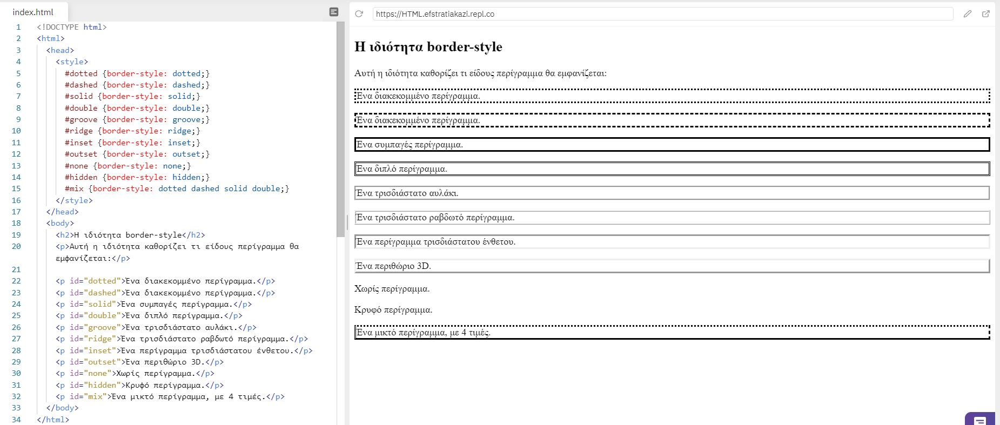
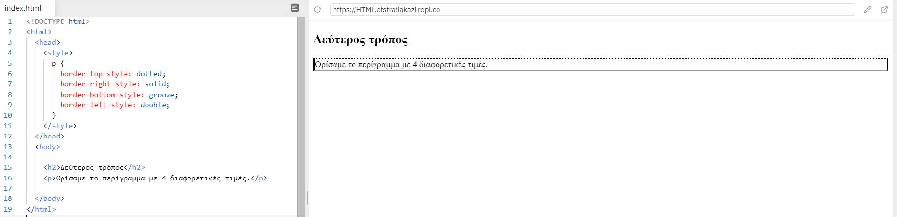
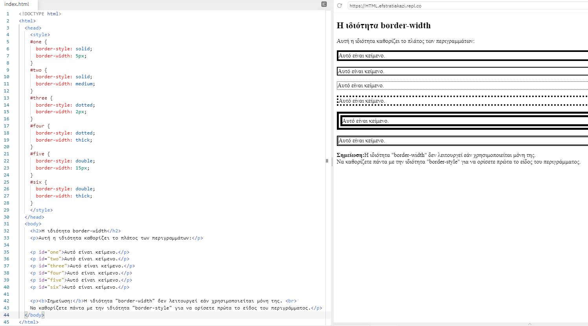
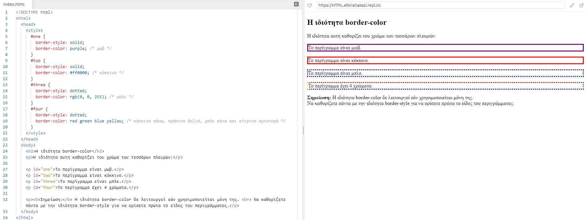
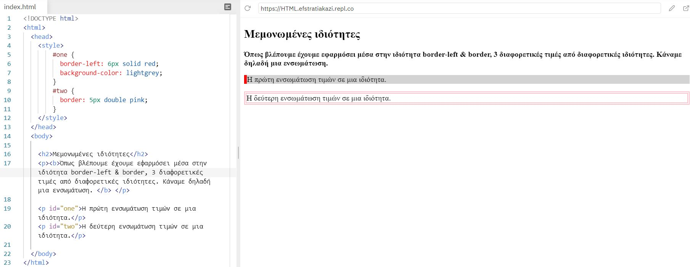
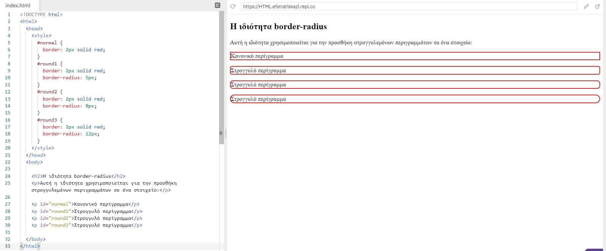

# Σύνορα CSS (borders)

Οι ιδιότητες borders μας επιτρέπoυν να καθορίσουμε το στυλ, το πλάτος και το χρώμα του περιγράμματος ενός στοιχείου.

Οι ιδιότητες συνολικά είναι 4 και είναι οι εξής:

1. ```border-style```, καθορίζει τι είδους περίγραμμα θα εμφανίζεται.
2. ```border-width```, καθορίζει το πλάτος των τεσσάρων πλευρών.
3. ```border-color```, χρησιμοποιείται για τον καθορισμό του χρώματος των τεσσάρων πλευρών.
4. ```border-radius```, χρησιμοποιείται για την προσθήκη στρογγυλεμένων περιγραμμάτων σε ένα στοιχείο.

---

## 1. border-style

Η ιδιότητα ```border-style``` όπως αναφέρθηκε καθορίζει τι είδους περίγραμμα θα εμφανίζεται.

Επιτρέπονται 10 τιμές (βλ. πίνακα) για αυτήν την ιδιότητα και μπορεί να έχει από μία έως τέσσερις τιμές (για το επάνω περίγραμμα, το δεξί περίγραμμα, το κάτω περίγραμμα και το αριστερό περίγραμμα).

|Τιμή|Εξήγηση|
|:-:|:-:|
|dotted|ορίζει ένα διακεκομμένο περίγραμμα|
|dashed|ορίζει ένα διακεκομμένο περίγραμμα (υπάρχει διαφορά με την τιμή dotted)|
|solid|ορίζει ένα σταθερό περίγραμμα|
|double|ορίζει ένα διπλό περίγραμμα|
|groove|ορίζει ένα τρισδιάστατο αυλάκι. Το αποτέλεσμα εξαρτάται από την τιμή χρώματος περιγράμματος|
|ridge|ορίζει ένα τρισδιάστατο ραβδωτό περίγραμμα. Το αποτέλεσμα εξαρτάται από την τιμή χρώματος περιγράμματος|
|inset|ορίζει ένα περίγραμμα τρισδιάστατου ένθετου. Το αποτέλεσμα εξαρτάται από την τιμή χρώματος περιγράμματος|
|outset|ορίζει ένα περιθώριο 3D εκκίνησης. Το αποτέλεσμα εξαρτάται από την τιμή χρώματος περιγράμματος|
|none|δεν ορίζει κανένα περίγραμμα|
|hidden|ορίζει ένα κρυφό περίγραμμα|

Όταν ορίζουμε 4 διαφορετικές τιμές η πρώτη τιμή αντιστοιχεί στο πάνω περίγραμμα, η δεύτερη τιμή αντιστοιχεί στο δεξί περίγραμμα, η τρίτη τιμή αντιστοιχεί στο κάτω περίγραμμα και η τέταρτη τιμή αντιστοιχεί στο αριστερό περίγραμμα (βλ. εικόνα)

Στο παρακάτω παράδειγμα εμφανίζονται όλες οι τιμές:



Στο παραπάνω παράδειγμα για να ορίσουμε 4 τιμές σε ένα περίγραμμα τα θέσαμε 4 τιμές στην ιδιότητα ```border-style```. Υπάρχει και ακόμη ένας τρόπος όπου η ιδιότητα διαμορφώνεται ανάλογα με την πλευρά που επιθυμούμε να αλλάξουμε (βλ. εικόνα)



---

## 2. border-width

H ιδιότητα ```border-width``` όπως προαναφέρθηκε καθορίζει το πλάτος των τεσσάρων συνόρων.

Το πλάτος μπορεί να οριστεί ως συγκεκριμένο μέγεθος (σε px, pt, cm, em, κ.λπ.) ή χρησιμοποιώντας μία από τις τρεις προκαθορισμένες τιμές:

- thin
- medium
- thick



Όπως και η ιδιότητα ```border-style``` έτσι και η ```border-width``` μπορεί να έχει από μία έως τέσσερις τιμές πλάτους (για το επάνω περίγραμμα, το δεξί περίγραμμα, το κάτω περίγραμμα και το αριστερό περίγραμμα).


**Προσοχή**
Η ιδιότητα ```border-width``` δε λειτουργεί εάν χρησιμοποιείται μόνη της. Να καθορίζετε πάντα με την ιδιότητα ```border-style``` για να ορίσετε πρώτα τo είδος του περιγράμματος.

## border-color

H ιδιότητα ```border-color``` όπως προαναφέρθηκε χρησιμοποιείται για τον καθορισμό του χρώματος των τεσσάρων πλευρών.

Το χρώμα μπορεί να ρυθμιστεί από:

- όνομα του χρώματος, όπως "red"
- μια τιμή HEX, όπως "# ff0000"
- μια τιμή RGB, όπως "rgb (255,0,0)"
- μια τιμή HSL, όπως "hsl (0, 100%, 50%)"

Η ```border-color``` ιδιότητα μπορεί να έχει από μία έως τέσσερις τιμές (για το επάνω περίγραμμα, το δεξί περίγραμμα, το κάτω περίγραμμα και το αριστερό περίγραμμα)



**Προσοχή**
Η ιδιότητα ```border-color``` δε λειτουργεί εάν χρησιμοποιείται μόνη της. Να καθορίζετε πάντα με την ιδιότητα ```border-style``` για να ορίσετε πρώτα τo είδος του περιγράμματος.

---

### ΣΗΜΑΝΤΙΚΗ ΣΗΜΕΙΩΣΗ

Για να συντομεύσετε τον κώδικα, είναι επίσης δυνατό να καθορίσετε όλες τις μεμονωμένες ιδιότητες περιγράμματος σε μία ιδιότητα. Δηλαδή όλες οι ιδιότητες να φαίνοντα σα μια ιδιότητα και να μπουν οι αντίστοιχες τιμές, όπως στο παρακάτω παράδειγμα.



---

## 4. border-radius

H ιδιότητα ```border-radius``` όπως προαναφέρθηκε χρησιμοποιείται για την προσθήκη στρογγυλεμένων περιγραμμάτων σε ένα στοιχείο.

Όπως φαίνεται στο παρακάτω παράδειγμα οι γωνίες του περιγράμματος σχηματίζουν μια καμπύλη και δίνουν την αίσθηση ενός κύκλου.



---

### Όλες οι ιδιότητες περιγράμματος CSS

|Ιδιότητες|Εξήγηση|
|:-:|:-:|
|border|ορίζει όλες τις ιδιότητες περιγράμματος μόνο με μία δήλωση|
|border-bottom|ορίζει όλες τις ιδιότητες μόνο στην κάτω πλευρά του περιγράμματος μόνο με μία δήλωση|
|border-bottom-color|ορίζει το χρώμα της κάτω πλευράς του περιγράμματος|
|border-bottom-style|ορίζει το στυλ της κάτω πλευράς του περιγράμματος|
|border-bottom-width|ορίζει το πλάτος του κάτω περιγράμματος|
|border-color|ορίζει το χρώμα των τεσσάρων πλευρών|
|border-left|ορίζει όλες τις ιδιότητες της αριστερής πλευράς του περιγράμματος μόνο με μία δήλωση|
|border-left-color|ορίζει το χρώμα της αριστερής πλευράς του περιγράμματος|
|border-left-style|ορίζει το στυλ της αριστερής πλευράς του περιγράμματος|
|border-left-width|ορίζει το πλάτος της αριστερής πλευράς του περιγράμματος|
|border-radius|ορίζει την προσθήκη στρογγυλεμένων περιγραμμάτων σε ένα στοιχείο:|
|border-right|ορίζει όλες τις ιδιότητες της δεξιάς πλευράς του περιγράμματος μόνο με μία δήλωση|
|border-right-color|ορίζει το χρώμα της δεξιάς πλευράς του περιγράμματος|
|border-right-style|ρίζει το στυλ της δεξιάς πλευράς του περιγράμματος|
|border-right-width|ορίζει το πλάτος της δεξιάς πλευράς του περιγράμματος|
|border-style|ορίζει το στυλ των τεσσάρων πλευρών|
|border-top|ορίζει όλες τις ιδιότητες μόνο στην πάνω πλευρά του περιγράμματος μόνο με μία δήλωση|
|border-top-color|ορίζει το χρώμα της πάνω πλευράς του περιγράμματος|
|border-top-style|ορίζει το στυλ της πάνω πλευράς του περιγράμματος|
|border-top-width|ορίζει το πλάτος του πάνω περιγράμματος|
|border-width|ορίζει το πλάτος των τεσσάρων πλευρών|
