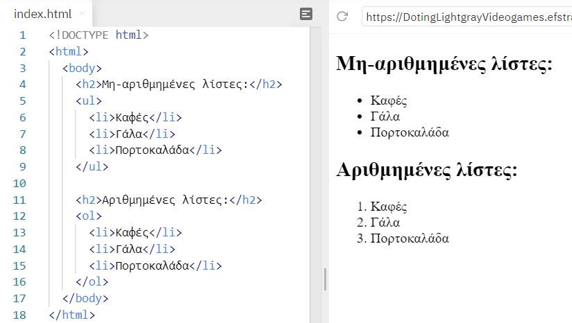
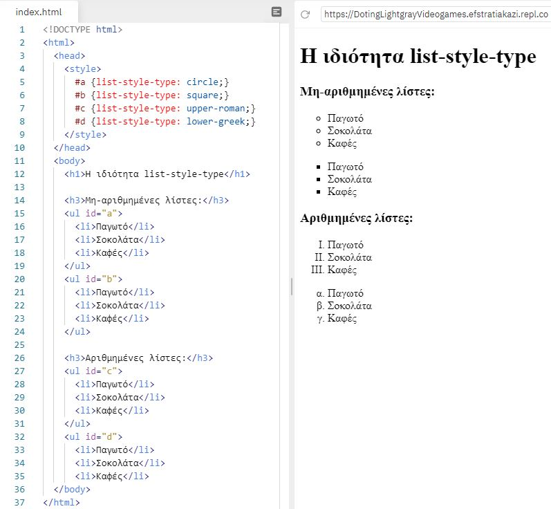
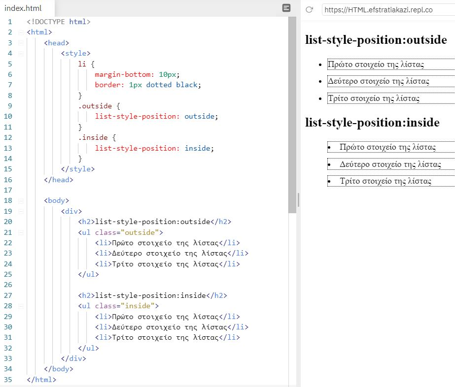

# Λίστες CSS (lists)

Στο HTML, υπάρχουν δύο κύριοι τύποι λιστών:

- Μη-αριθμημένες λίστες(```<ul>```) - τα στοιχεία της λίστας επισημαίνονται με κουκκίδες.
- Αριθμημένες λίστες (```<ol>```) - τα στοιχεία της λίστας επισημαίνονται με αριθμούς ή γράμματα.



## Η ιδιότητα list-style

Η ιδιότητα list-style είναι συντομογραφία των τριών ιδιοτήτων μορφοποίησης μιας λίστας, oι τρεις ιδιότητες είναι οι εξής:

- list-style-type,
- list-style-position,
- list-style-image

1. Με την ιδιότητα **list-type-style** μπορούμε να ορίσουμε διαφορα στυλ για το bullet μιας λίστας. Οι τιμές που μπορεί να πάρει η ιδιότητα αυτή διοφέρουν όταν πρόκειται για αριθμημένες και μη-αριθμημένες λίστες.
2. Με την ιδιότητα **list-style-position** ορίζουμε το σημείο που θα τοποθετούνται τα bullets των επιλογών μέσα στην λίστα.
3. Με την ιδιότητα **list-style-image** μπορούμε να ορίσουμε μια εικόνα που θα εμφανίζεται στην θέση των bullets κάθε επιλογής μιας λίστας.

## list-type-style

Οι τιμές που μπορεί να πάρει η ιδιότητα list-type-style ανάλογα τη λίστα είναι:

|Μη-αριθμημένες λίστες|Εξήγηση|Αριθμημένες λίστες|Εξήγηση|
|:-:|:-:|:-:|:-:|
|none|αφαιρεί τα bullets από όλες τις επιλογές της λίστας|decimal|τα bullets είναι αριθμημένα με τη μορφή: 1. 2. 3.|
|disc|είναι η αρχική τιμή, τα bullets είναι με τη μορφή αυτής της κουκίδας: •|decimal-leading-zero|τα bullets είναι αριθμημένα με τη μορφή: 01. 02. 03.|
|circle|τα bullets είναι με τη μορφή αυτής της κουκίδας: ○|lower-roman|τα bullets επισημαίνονται με τη μορφή: i. ii. iii.|
|square|τα bullets είναι με τη μορφή αυτής της κουκίδας: ▀|upper-roman|τα bullets επισημαίνονται με τη μορφή: I. II. III|
|-|-|lower-alpha|τα bullets επισημαίνονται με τη μορφή: a. b. c.|
|-|-|upper-alpha|τα bullets επισημαίνονται με τη μορφή: A. B. C.|
|-|-|lower-greek|τα bullets επισημαίνονται με τη μορφή: α. β. γ. |
|-|-|lower-latin|τα bullets επισημαίνονται με τη μορφή: a. b. c.|


Στην παρακάτω παράδειγμα φαίνονται κάποιες τιμές από την ιδιότητα list-type-style:



---

## list-style-position

Η ιδιότητα **list-style-position** μπορεί να πάρει δύο τιμές:

1. ```outside```: Eίναι η αρχική τιμή εμφανίζει τις επιλογές της λίστας έξω από το περιεχόμενο της ```<ul>``` ή ```<ol>```

2. ```inside```: εμφανίζει τις επιλογές της λίστας μέσα στο περιεχόμενο της ```<ul>``` ή ```<ol>```



Στο παραπάνω παράδειγμα πραγματοποιήθηκε και με τις δύο τιμές (```outside``` και ```inside``` ). Αυτό που παρατηρούμε είναι ότι με την τιμή ```inside``` έχουμε εσοχές και εισέρχεται μέσα στο μάυρο πεδίο που δημιουργήσαμε. Το παράδειγμα έγινε με τα tags ```ul``` το ίδιο μπορεί να γίνει και με το ```οl```

---

## list-type-image
