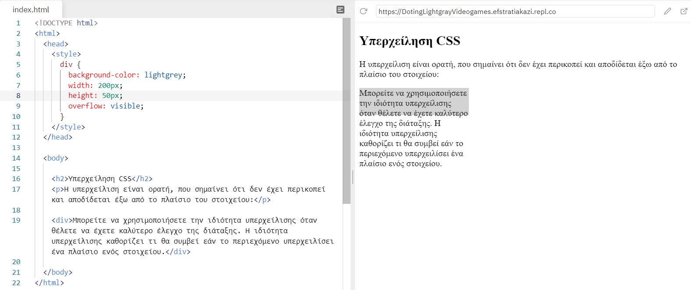
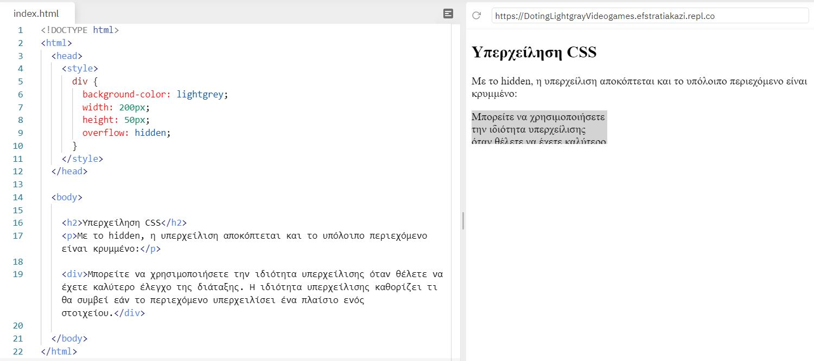
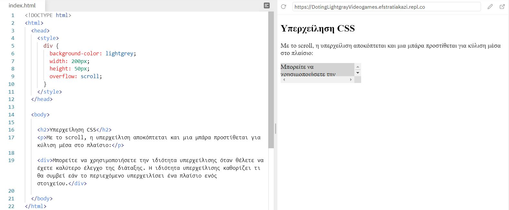
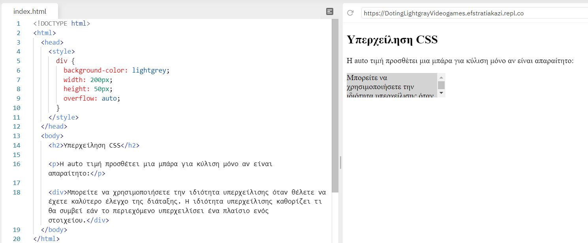
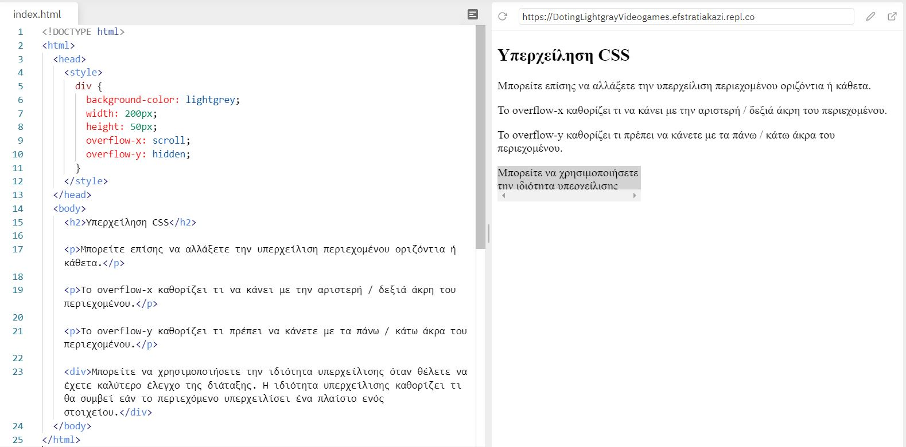

# Υπερχείληση CSS (overflow)

Η overflow ιδιότητα καθορίζει εάν θα περικοπεί το περιεχόμενο ή θα προσθέσει γραμμές κύλισης όταν το περιεχόμενο ενός στοιχείου είναι πολύ μεγάλο για να χωρέσει στην καθορισμένη περιοχή.

Η overflow ιδιότητα έχει τις ακόλουθες τιμές:

- visible- Προκαθορισμένο. Η υπερχείλιση δεν έχει περικοπεί. Το περιεχόμενο αποδίδεται έξω από το πλαίσιο του στοιχείου
- hidden - Η υπερχείλιση περικόπτεται και το υπόλοιπο περιεχόμενο δεν θα είναι ορατό
- scroll - Η υπερχείλιση περικόπτεται και προστίθεται μια γραμμή κύλισης για να δείτε το υπόλοιπο περιεχόμενο
- auto - Παρόμοια με scroll, αλλά προσθέτει γραμμές κύλισης **μόνο όταν είναι απαραίτητο**.

---

## 1. Visible

Όπως διαπιστώνουμε το κείμενο δεν έχει περικοπεί και αποδίδεται έξω από το πλαίσιο του στοιχείου.

---

## 2. Hidden

Με τo hidden, η υπερχείλιση αποκόπτεται και το υπόλοιπο περιεχόμενο είναι κρυμμένο.

---

## 3. Scroll

H υπερχείλιση περικόπτεται και μια μπάρα προστίθεται για κύλιση μέσα στο πλαίσιο. Σημειώστε ότι αυτό θα προσθέσει μια γραμμή κύλισης οριζόντια και κάθετα (**ακόμα κι αν δεν τη χρειάζεστε**):

---

## 4. Αuto

H auto τιμή είναι παρόμοια με το scroll, αλλά προσθέτει γραμμές κύλισης μόνο όταν είναι **απαραίτητο**. Όπως παρατηρούμε στον άξονα x δεν υπάρχει μπάρα, διότι δεν ήταν απαραίτητο να μπει.

## 5. Overflow-x και overflow-y

Το overflow-x και to overflow-y είναι ιδιότητες που καθορίζουν εάν θα αλλάξει την υπερχείλιση περιεχομένου μόνο οριζόντια ή κάθετα (ή και τα δύο):

- Το overflow-x καθορίζει τι να κάνετε με την αριστερή / δεξιά άκρη του περιεχομένου.
- Το overflow-y καθορίζει τι πρέπει να κάνετε με τα πάνω / κάτω άκρα του περιεχομένου.

Στο παραπάνω παράδειγμα βλέπουμε ότι μόνο στον άξονα x  έχει scroll και στον άξονα y έχει hidden.
