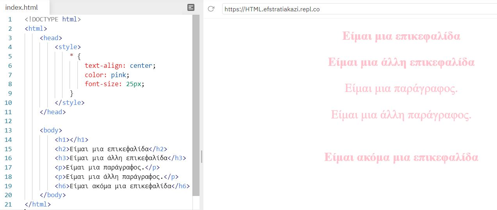

# Επιλογείς CSS

Οι επιλογείς CSS χρησιμοποιούνται για την επιλογή των στοιχείων HTML που θέλετε να διαμορφώσετε.

<!--
Μπορούμε να χωρίσουμε τους επιλογείς CSS σε πέντε κατηγορίες:
-->

- Απλοί επιλογείς (επιλέξτε στοιχεία βάσει ονόματος, ταυτότητας(id), κλάσης(class))

<!--
- Επιλογείς συνδυασμού (επιλέξτε στοιχεία με βάση μια συγκεκριμένη σχέση μεταξύ τους)
- Επιλογείς ψευδο-κατηγορίας (επιλέξτε στοιχεία με βάση μια συγκεκριμένη κατάσταση)
- Επιλογείς ψευδο-στοιχείων (επιλέξτε και στυλ ενός μέρους ενός στοιχείου)
- Επιλογείς χαρακτηριστικών (επιλέξτε στοιχεία με βάση ένα χαρακτηριστικό ή μια τιμή χαρακτηριστικού)
-->

## 1. Απλοί επιλογείς

---

### 1.1 Επιλογέας στοιχείων βάσει ονόματος


Το στοιχείο που επιλέξαμε να εφαρμόσουμε στυλ είναι το ```p```. Όπως διαπιστώνουμε από το παράδειγμα η εφαρμογή έγινε **μόνο** σε όσα κείμενα ανήκαν στις ετικέτες ```<p> </p>```. To ```h1``` δεν επηρεάστηκε.

Εάν θέλουμε να κάνουμε όμοιες αλλαγές σε περισσότερα από ένα tags καλό είναι τα ομαδοποιούμε και να τα χωρίζουμε με κόμμα **','**


Στο παραπάνω παράδειγμα ομαδοποιήσαμε τα στοιχεία που θέλουμε να κάνουμε τη διαμόρφωση και όπως προαναφέρθηκε επείδη ήταν περισσότερο από ένα τα χωρίσαμε με κόμμα. Η εφαρμογή δεν έγινε στο ```h3``` γιατί δεν το όρισαμε.

---

### 1.2 Επιλογέας στοιχείων βάσει id

- Ο επιλογέας id χρησιμοποιεί το χαρακτηριστικό id ενός στοιχείου HTML για να επιλέξει **ένα** συγκεκριμένο στοιχείο.
- Το αναγνωριστικό ενός στοιχείου είναι **μοναδικό** σε μια σελίδα, οπότε ο επιλογέας αναγνωριστικών χρησιμοποιείται για την επιλογή ενός μοναδικού στοιχείου!
- Για να εφαρμόσουμε συγκεκριμένες ετικέτες που έχουν τον επιλογέα id **πρέπει** να τοποθετείτε το σύμβολο **#** ακολουθόμενο απο την τιμή της id που θέλουμε να εφαρμοστεί το στυλ.


Στo tag με **id** την τιμή **para1** θα εφαρμοστεί το στυλ που ορίσαμε. Όπως διαπιστώνουμε από το παράδειγμα η εφαρμογή έγινε **μόνο** στο κείμενο πού είχε το id= "para1".

---

### 1.3 Επιλογέας στοιχείων βάσει class

Έχει την ίδια λογική με το id με τη μόνη διαφορά ότι δε μιλάμε για μοναδικά στοιχεία, δηλαδή μπορεί να χρησιμοποιηθεί  από περισσότερο από ένα στοιχείο και για να εφαρμόσουμε συγκεκριμένες ετικέτες που έχουν τον επιλογέα class **πρέπει** να τοποθετείτε το σύμβολο **.** ακολουθόμενο απο την τιμή της κλάσης που θέλουμε να εφαρμοστεί το στυλ.


Στα στοιχεία με **class** την τιμή **klasi** θα εφαρμοστεί το στυλ που ορίσαμε. Όπως διαπιστώνουμε από το παράδειγμα η εφαρμογή έγινε **μόνο** στα tag πού είχε το class= "klasi".

Στην περίπτωση που πολλά tags έχουν την ίδια κλάση, μπορούμε να επιλέξουμε να γίνει σε ένα συγκεκριμένο η διαμόρφωσή του.


Στο παραπάνω παράδειγμα την ίδια κλάση την έχουν τα tags ```p``` και ```h1```. Πριν την τελεία ορίσαμε ότι η εφαρμογή θέλουμε να γίνει **μόνο** στις παραγράφους που έχουν class με το όνομα klasi.

---

### 1.4 Γενικός επιλογέας

Ο γενικός επιλογέας, επιλέγει όλα τα στοιχεία της HTML, δηλαδή όλα τα tags εφαρμόζονται με ένα συγκεκριμένο στυλ. Ο γενικός επιλογέας ορίζεται με το σύμβολο αστεράκι (*).



Στο παραπάνω παράδειγμα εφαρμόστηκε σε όλα τα στοιχεία το ίδιο στυλ επείδη δεν ορίσαμε κάποιο συγκεκριμένο στοιχείο, αλλά **όλα** (*).
