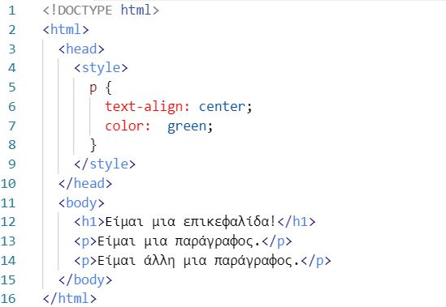
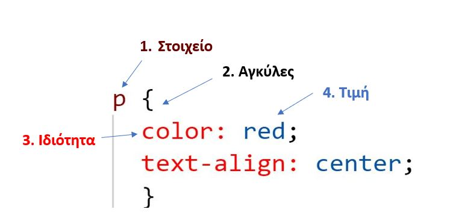
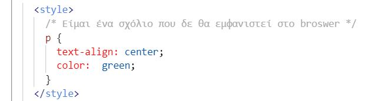

# Σύνταξη των στυλ



Η σύνταξη ενός στυλ αποτελείται από τρία βασικά στοιχεία ανάμεσα στις ετικέτες ```<style> </style>```:

- Στοιχείο
- Ιδιότητα
- Τιμή της ιδιότητας

a. Το στοχείο *συνήθως* είναι μια ή περισσότερες ετικέτες (tags) της HTML στην οποία θέλουμε να εφαρμόσουμε το στυλ (π.χ. ```h1```, ```p``` κ.λπ.). Δηλαδή μας "δείχνει" σε ποιες ετικέτες θα εφαρμοστεί το στυλ.
b. Οι ιδιότητες της CSS οι οποίες προσθέτουν διάφορα χαρακτηριστικά στις ετικέτες τις οποίες εφαρμόζονται τα στυλ.
c. Η τιμή της ιδιότητας είναι η τιμή που περιγράφει τον τρόπο χειρισμού(επεξεργασίας) του στοιχείου ή των στοιχείων που έχουν επιλεχθεί.



1. Επιλέγουμε το στοιχείο που θέλουμε να επεξεργαστούμε. Στο παράδειγμα θα διαμορφωθούν όλα τα κείμενα που είναι περιορισμένα στις ετικέτες ```p```. (βλ. εικόνα)
2. H επεξεργασία με τις ιδίοτητες και τις τιμές γίνεται ανάμεσα στις αγκύλες **{ }**
3. Ορίζουμε την ιδιότητα ή τις ιδιότητες με τις οποίες θέλουμε να διαμορφώσουμε το στυλ. **Ο διαχωρισμός με την τιμή γίνεται με την ανώ-κάτω τελεία ':'** Στο παράδειγμα οι ιδιότητες είναι το color *(καθορίζει το χρώμα της γραμματοσειράς)* και το text - aling *(καθορίζει τη στοίχηση του κειμένου)*.
4. Ορίζουμε την τιμή της ιδιότητας, δηλαδή το χαρακτηριστικό που θέλουμε να εφαρμόσει η ιδιότητα. **Στο τέλος πάντα το ερωτιματικό ';'**. Στο παράδειγμα η τιμή της ιδιότητας color είναι το red *(δηλαδή το χρώμα της γραμματοσειράς θα γίνει κόκκινο)* και η τιμή της ιδιότητας text - aling είναι το center *(δηλαδή η στοίχηση του κειμένου θα είναι στο κέντρο)*.

**Μη ξεχνάμε ότι οι διαμορφώσεις θα γίνονται μόνο στο στοιχείο ή στα στοιχεία που ορίσαμε (πριν τις αγκύλες)**. Στο παράδειγμα το στοιχείο που ορίσαμε είναι το ```p```.

---

## Σχόλια

Ένα σχόλιο CSS τοποθετείται ανάμεσα στο ```<style> </style>``` και ξεκινά με ```/*``` και τελειώνει με ```*/```. Τα σχόλια αγνοούνται από τα προγράμματα περιήγησης.


