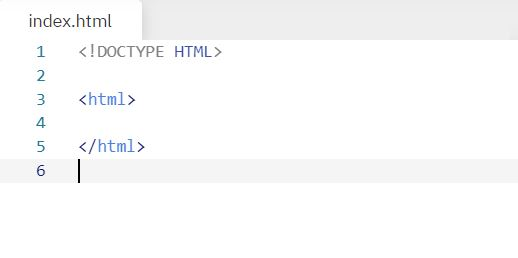
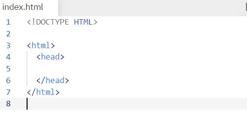
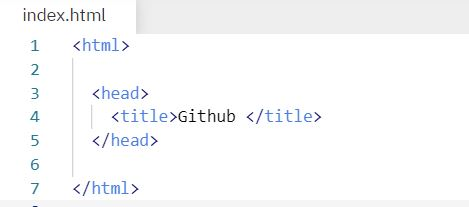
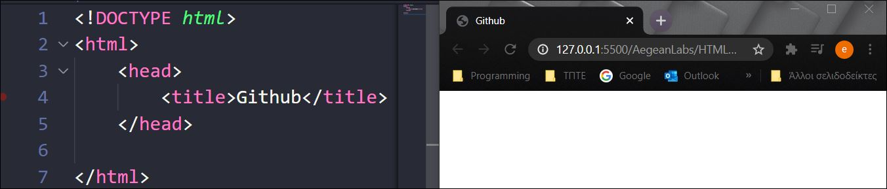

# Δομή HTML

## Βασικές ετικέτες

- ```<!DOCTYPE HTML>```
Aυτό το tag είναι το πρώτο που μπορούμε να χρησιμοποιήσουμε στο έγγραφο μας και γράφεται πριν την ετικέτα ```<html>```. Η ```<!DOCTYPE>``` λέει στον Browser ποιο πρότυπο της HTML ή της XHTML θα χρησιμοποιηθεί στο έγγραφο.

- ```<html> </html>```
Ένα αρχείο **HTML** αρχίζει πάντα με την ετικέτα ```<html>``` και τελειώνει με την ετικέτα ```</html>```. Oι ετικέτες αυτές ενημερώνουν τον Βrowser ότι το περιεχόμενο της σελίδας είναι γραμμένο σε HTML κώδικα και τοποθετείται κάτω απο την ```<!DOCTYPE>```.



## Βασικές ενότητες

### Ενότητα head

Η πρώτη ενότητα μιας HTML σελίδας ονομάζεται **head** και ορίζεται με την ανοιχτή ετικέτα ```<head>``` και την κλειστή ετικέτα ```</head>```.Υπάρχουν μόνο λίγες ετικέτες που γράφονται στην μέσα στην ενότητα αυτή. Οι ετικέτες(tags) αυτές, αποτελούν τον *πρόλογο* για την HTML σελίδα, δηλαδή παρέχουν πληροφορίες στον Βrowser. **ΠΡΟΣΟΧΗ** Ο Browser δεν εμφανίζει στην οθόνη ότι είναι γραμμένο μέσα στο head.



Ποιες ετικέτες γράφονται μέσα στην ενότητα head;

- ```<title> </title>```

Oρίζει τον τίτλο μιας HTML σελίδας

Kώδικας:


Eμφάνιση


- ```<meta>```
Η ετικέτα ```<meta>``` περιέχει μετα-πληροφορίες (meta-information) για το HTML έγγραφο όπως ο συγγραφέας, η περιγραφή του εγγράφου, λέξεις κλειδιά που διαβάζονται από τις μηχανές αναζήτησης κτλ. Eίναι μια σειρά πρακτικών για να γίνει μια ιστοσελίδα περισσότερο φιλική στις μηχανές αναζήτησης, δηλαδή βοηθάει να βρίσκεται μια ιστοσελίδα όσο πιο ψηλά γίνεται στα αποτελέσματα των μηχανών αναζήτησης. ***Δεν έχει κλειστή ετικέτα***

### Ενότητα body

Η δεύτερη ενότητα μιας HTML σελίδας ονομάζεται **body** και ορίζεται με την ανοιχτή ετικέτα ```<body>``` και την κλειστή ετικέτα ```</body>```.

Το ζευγάρι των ετικετών ```<body> </body>``` ορίζει το ***κυρίως περιεχόμενο*** της σελίδας, περιέχει όλα τα περιεχόμενα ενός εγγράφου HTML, όπως επικεφαλίδες, παραγράφους, εικόνες, υπερσυνδέσμους, πίνακες, λίστες κ.λπ. (Αναλυκότερα [εδώ](tags.md))

### Σημείωση

Όταν ένας browser διαβάζει ένα HTML έγγραφο, αγνοεί τα διαδοχικά κενά διαστήματα, τα tabs και τις αλλαγές γραμμών που βρίσκονται στον πηγαίο κώδικα HTML. Απλά αν υπάρχουν διαδοχικά κενά διαστήματα, τα tabs και τις αλλαγές γραμμών φαίνεται πιο ομοιόμορφο.
