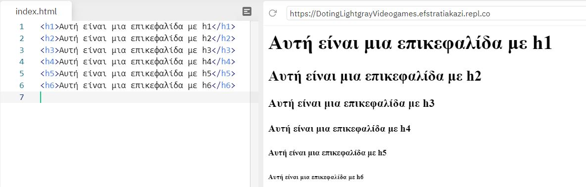
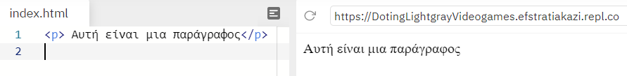
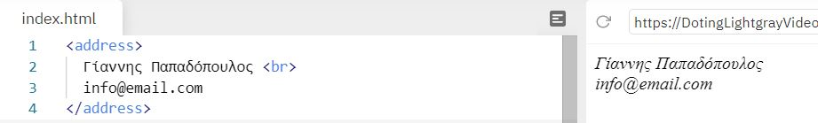
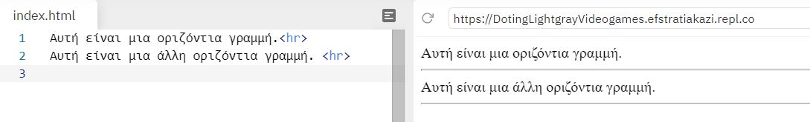
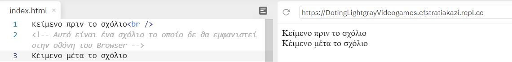
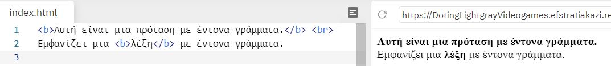
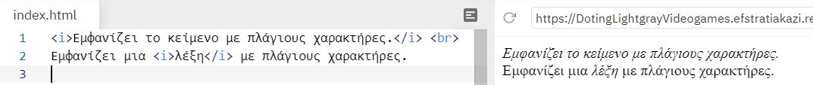
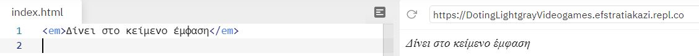
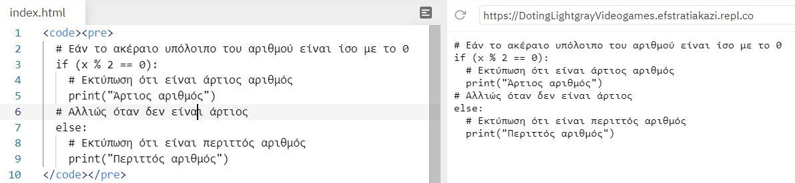

# Ετικέτες(Tags)

## Πώς λειτουργεί μια ετικέτα μέσα σε ένα HTML αρχείο

Ένα ζευγάρι ετικετών καθορίζει την μορφή ενός κειμένου ή μιας και μόνο λέξης.

- ```<h1> </h1>``` εώς ```<h6> </h6>```
Οι HTML επικεφαλίδες είναι κείμενο που εμφανίζεται με μεγάλα γράμματα. H γραμματοσειρά ορίζέται από τις ετικέτες ```<h1>, <h2>, <h3>, <h4>, <h5> και <h6>```. Με την ```<h1>``` ορίζουμε την *μεγαλύτερη* ετικέτα ενώ με την ```<h6>```την *μικρότερη* (πριν και μετά την επικεφαλίδα εισάγεται αυτόματα στον Browser μια κενή γραμμή).



- ```<p> </p>```
Oμαδοποιεί το κείμενο που βρίκεται μέσα στις ετικέτες αρχής και τέλους σε μια παράγραφο, αφήνοντας αυτόματα μια κενή γραμμή πριν την αρχή της παραγράφου και μια μετα το τέλος αυτής.



- ```<br/>```
Ένα από τα tags που το χρησιμοποιούμε όταν θέλουμε να τελειώσουμε μια γραμμή κειμένου και να αρχίσουμε μια καινούργια. ***Δεν έχει κλειστή ετικέτα***



- ```<hr/>```
  Mε αυτό το tag τοποθετούμε μια οριζόντια γραμμή στην σελίδα μας για να **σηματοδοτήσουμε** την αλλαγή του περιεχομένου της. Η οριζόντια γραμμή είναι ένα απλό γραφικό που μπορούμε να χρησιμοποιήσουμε στην σελίδα μας (κυρίως σαν διαχωριστικό). ***Δεν έχει κλειστή ετικέτα***



- ```<!-- -->```
Αυτό το tag χρησιμοποιείται για τα  σχόλια, δηλαδή για να γράφουμε σημειώσεις μέσα στον πηγαίο κώδικα για να διευκολύνουμε την επεξεργασία και την συντήρηση του αρχείου. **Τα σχόλια δεν εμφανίζονται στην οθόνη του Βrowser**.



- ```<b> </b>``` & ```<strong> </strong>```
Και οι δύο ετικέτες μπορούν να χρησιμοποιθούν ώστε να εμφανίζει το κείμενο ή μια λέξη με έντονη μορφή.
Για υπενθύμιση: το **b** είναι το πρώτο γράμμα από την λέξη **bold**



- ```<i> </i>```
Eμφανίζει το κείμενο ή τη λέξη με πλάγιους χαρακτήρες.
Για υπενθύμιση το *i* είναι το πρώτο γράμμα από την λέξη *italics*



- ```<em> </em>```
Eμφανίζει το κείμενο με πλάγιους και κάπως αχνά γραμμένους χαρακτήρες.



- ```<code> </code>```
Eμφανίζει το κείμενο και το παρομοιάζει ως κώδικα μιας γλώσσας προγραμματισμού.


