# Τags (ετικέτες)

## Πώς λειτουργεί ένα ή περισσότερα tags μέσα σε ένα HTML αρχείο

Ένα ζευγάρι tags καθορίζει την μορφή ενός κειμένου ή μιας και μόνο λέξης.

- Tα tags ```<h1>...</h1>``` εώς ```<h6>...</h6>```

Οι HTML επικεφαλίδες είναι κείμενο που εμφανίζεται με μεγάλα γράμματα. H γραμματοσειρά ορίζέται από τα tags ```<h1>, <h2>, <h3>, <h4>, <h5> και <h6>```. Με την ```<h1>``` ορίζουμε το *μεγαλύτερο* tags ενώ με την ```<h6>```το *μικρότερο* (πριν και μετά την επικεφαλίδα εισάγεται αυτόματα στον Browser μια κενή γραμμή).


- Tα tags ```<p>...</p>```
  
Oμαδοποιούν το κείμενο που βρίκεται μέσα στα tags αρχής και τέλους σε μια παράγραφο, αφήνοντας αυτόματα μια κενή γραμμή πριν την αρχή της παραγράφου και μια μετα το τέλος αυτής.


- Tο tag ```<br>```
  
Ένα από τα tags που το χρησιμοποιούμε όταν θέλουμε να τελειώσουμε μια γραμμή κειμένου και να πάμε στην επόμενη σειρά. ***Δεν έχει κλειστο tag***.


- Tο tag ```<hr>```

Mε αυτό το tag τοποθετούμε μια οριζόντια γραμμή στην σελίδα μας για να **σηματοδοτήσουμε** την αλλαγή του περιεχομένου της. Η οριζόντια γραμμή είναι ένα απλό γραφικό που μπορούμε να χρησιμοποιήσουμε στην σελίδα μας (κυρίως σαν διαχωριστικό). ***Δεν έχει κλειστο tag***.


- Tο tag ```<!-- ... -->```

Αυτό το tag χρησιμοποιείται για τα  σχόλια, δηλαδή για να γράφουμε σημειώσεις μέσα στον πηγαίο κώδικα για να διευκολύνουμε την επεξεργασία και την συντήρηση του αρχείου. **Τα σχόλια δεν εμφανίζονται στην οθόνη του Βrowser**.


- Tα tags ```<b>...</b>``` & ```<strong>...</strong>```

Και τα δύο tags μπορούν να χρησιμοποιθούν ώστε να εμφανίζουν το κείμενο ή μια λέξη με έντονη μορφή.
Για υπενθύμιση: το **b** είναι το πρώτο γράμμα από την λέξη **bold**.


- Tα tags ```<i>...</i>```
  
Eμφανίζουν το κείμενο ή τη λέξη με πλάγιους χαρακτήρες.
Για υπενθύμιση το *i* είναι το πρώτο γράμμα από την λέξη *italics*.


- Tα tags ```<em>...</em>```

Eμφανίζουν το κείμενο ή τη λέξη με πλάγιους και κάπως αχνά γραμμένους χαρακτήρες.


- Tα tags ```<pre>...</pre>```

Το κείμενο θα εμφανίζεται ακριβώς όπως γράφεται στον πηγαίο κώδικα HTML.

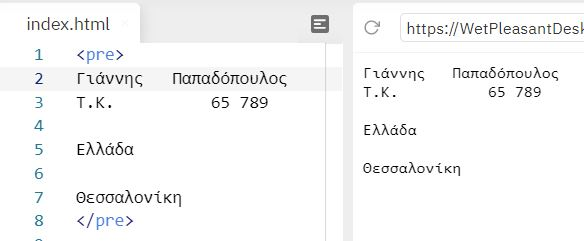

- Tα tags ```<code>...</code>```

Eμφανίζουν το κείμενο και το παρομοιάζουν ως κώδικα μιας γλώσσας προγραμματισμού.


- Tα tags ```<a>...</a>``` &rarr; ιδιότητες: ```href``` και ```target```
  
Με αυτήν τα tags δημιουργούμε εναν σύνδεσμο (link) προς μια άλλη σελίδα χρησιμοποιώντας την ιδιότητα href. Οι πιο σημαντικές ιδιότητες των tags είναι η href η οποία ορίζει το URL του συνδέσμου και η target η οποία ορίζει που θα ανοίξει το URL (στο ίδιο tab ή σε νέο tab).

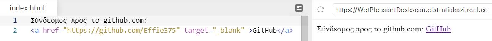

- Tα tags ```<button>...</button>```
  
Με τα tags αυτά εισάγουμε ένα κουμπί στην σελίδα μας. Μέσα στα tags μπορούμε να προσθέσουμε περιεχόμενο, όπως κείμενο ή εικόνες.

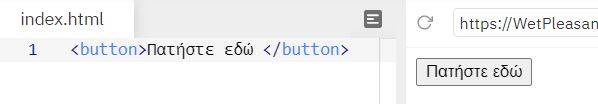

- Tα tags ```<dl>...</dl>``` σε συνδιασμό με τα tags  ```<dt>...</dt>``` και τα tags ```<dd>...</dd>```
  
Mε τα tags ```<dl>...</dl>``` ορίζουμε μια λίστα περιγραφής σε συνδιασμό με τα tags ```<dt>...</dt>``` ορίζουμε όρους/ονόματα και με συνδιασμό τα tags ```<dd>...</dd>``` περιγράφουμε κάθε όρο/όνομα.

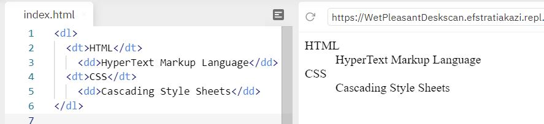

- Tα tags ```<del>...</del>```
  
Eμφανίζουν το κείμενο διαγραμμένο, δηλαδή με μια γραμμή επάνω από το κείμενο.

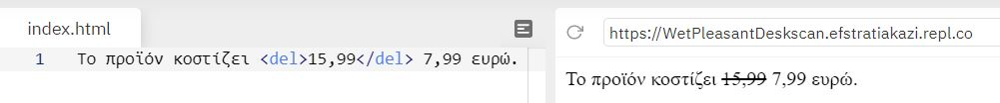

- Tα tags ```<ins>...</ins>```
  
Oρίζουμε ένα κείμενο σαν προστιθέμενο και το εμφανίζει υπογραμμισμένο. Χρησιμοποιήστε το μαζί με το tag ```<del>``` για να περιγράφετε ενημερώσεις και αλλαγές στο περιεχόμενο.

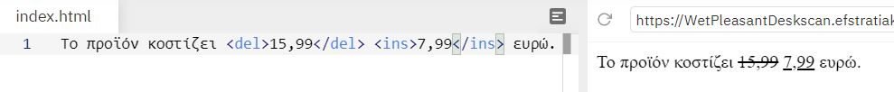

- Tα tags ```<ol>...</ol>``` σε συνδιασμό με τα tags  ```<li>...</li>```

Το tag ```<ol>``` καθορίζει μια λίστα με σειρά. Μια λίστα με σειρά μπορεί να είναι αριθμητική ή αλφαβητική. Το tag ```<li>``` χρησιμοποιείται για τον καθορισμό κάθε στοιχείου λίστας.

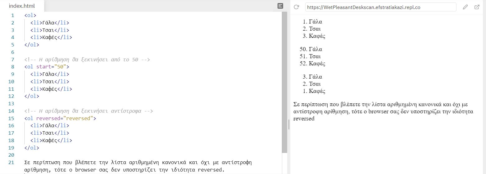

- Tα tags ```<ul>...</ul>``` σε συνδιασμό με τα tags ```<li>...</li>```

Mε το tags ```<ul>``` εισάγουμε μια λίστα με κουκίδες. Το tag ```<li>``` χρησιμοποιείται για τον καθορισμό κάθε στοιχείου λίστας.

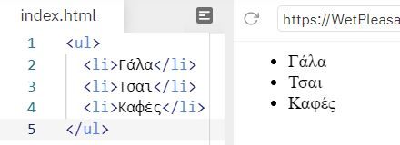

- Tα tags ```<mark>...</mark>```
Mε τα tags αυτά ορίζουμε ένα κείμενο ή λέξη που πρέπει να επισημανθεί.

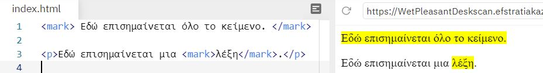

- Tα tags ```<sub>...</sub>```
  
Tα tags αυτά εμφανίζουν το κείμενο ή τη λέξη κάτω από την κανονική γραμμή σα μαθηματική βάση και μερικές φορές αποδίδεται σε μικρότερη γραμματοσειρά. Το κείμενο του δείκτη μπορεί να χρησιμοποιηθεί για χημικούς τύπους.

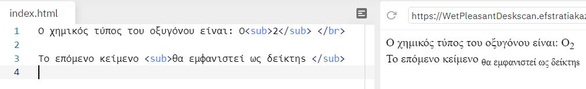

- Tα tags ```<sup>...</sup>```
  
Tα tags αυτά εμφανίζουν το κείμενο σα μαθηματικό εκθέτη, δηλαδή σε ψηλότερο σημείο απ' ότι βρίσκεται το υπόλοιπο κείμενο.

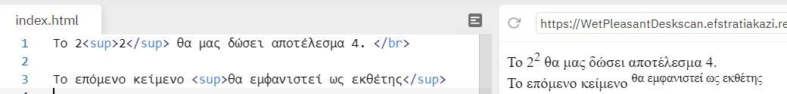

- Tα tags ```<small>...</small>```

Tα tags αυτά εμφανίζουν το κείμενο με μικρούς χαρακτήρες.

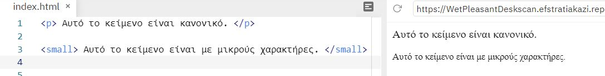

- Tα tags ```<abbr title = " ">...</abbr>```
  
Το tag αυτό υποδεικνύει μια συντόμευση, όπως, "GR", "π.χ.". Τη χρησιμοποιούμε για να χαρακτηρίσουμε μια λέξη σαν συντόμευση, δίνουμε χρήσιμες πληροφορίες στον browser, στις μηχανές αναζήτησης, σε προγράμματα ελέγχου ορθογραφίας, ή σε κάποιο πρόγραμμα μετάφρασης. *Στους περισσότερους browsers, όταν αφήνουμε για λίγο τον δείκτη του ποντικιού μας επάνω στην συντόμευση, εμφανίζεται το περιεχόμενο της ιδιότητας title.*

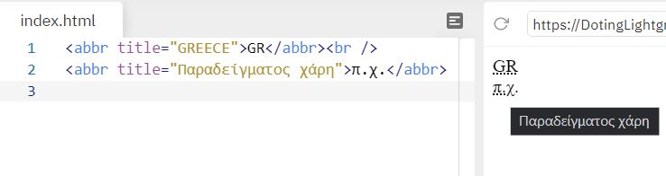

- Tα tags ```<table> </table>``` σε συνδιασμό με τα tags  ```<tr>...</tr>```, ```<td>...</td>``` και με τα tags ```<th>...</th>```
  
Με το tag ```<table>``` εισάγουμε έναν πίνακα στην σελίδα μας. Το ζεύγος των tags ```<tr>...</tr>``` ορίζει μια γραμμή του πίνακα, ενώ το ζεύγος των tags ```<td>...</td>``` ορίζουν ένα κελί στην γραμμή του πίνακα. Με το tag ```<th>``` ορίζουμε μια επικεφαλίδα σε μια στήλη του πίνακα. Το κείμενο που βρίσκεται μέσα στα tags ```<th> και </th>``` εμφανίζεται με **bold** χαρακτήρες. Τα tags ```<th>...</th>``` τοποθετούνται μέσα στα tags ```<tr> </tr>``` όπως τα tags ```<td>...</td>``` Η ιδιότητα **border** του tag ```<table>``` ορίζει το πάχος του περιγράμματος του πίνακα.

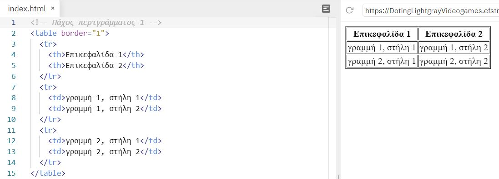

- Tα tags ```<thead>...</thead>``` σε συνδιασμό με τα tags ```<tfoot>...</tfoot>``` και τα tags ```<tbody>...</tboty>```

Με το tag ```<thead>``` ορίζουμε την επικεφαλίδα του πίνακα
Με το tag ```<tfoot>``` ορίζουμε το υποσέλιδο του πίνακα.
Με το tag ```<tbody>``` ορίζουμε τις γραμμές που βρίσκονται μέσα στα tags ```<tbody>``` και ```</tbody>``` ως το κυρίως περιεχόμενο του πίνακα.
*Τα tags ```<thead>``` ```<tfoot>``` και ```<tbody>``` μας δίνουν την δυνατότητα να ομαδοποιήσουμε τις γραμμές ενός πίνακα. Όταν δημιουργούμε έναν πίνακα, συνήθως έχουμε στην αρχή μια γραμμή που τοποθετούμε τις επικεφαλίδες του πίνακα (header), έπειτα κάποιες γραμμές με δεδομένα (body, το κυρίως μέρος του πίνακα) και στο τέλος μια γραμμή με τα συνολικά αποτελέσματα (footer, υποσέλιδο του πίνακα). Με αυτή την διαίρεση του πίνακα o browser μπορεί να κάνει scrolling στις γραμμές όπου βρίσκεται το κυρίως περιεχόμενο του πίνακα (το οποίο ορίζεται με το tag ```<tbody>```) ανεξάρτητα από το header του πίνακα (το οποίο ορίζεται με το tag ```<thead>```), και το footer (το οποίο ορίζεται με το tag ```<tfoot>```). Επίσης όταν εκτυπώνουμε μεγάλους πίνακες που επεκτείνονται σε περισσότερες από μια σελίδες, η γραμμές header και footer των πινάκων θα τυπώνονται σε κάθε σελίδα. Σε περίπτωση που θέλουμε να ομαδοποιήσουμε τις γραμμές του πίνακα μας με τον παραπάνω τρόπο, δεν μπορούμε να χρησιμοποιήσουμε μόνο ένα ή δύο από τα tags ```<thead>``` ```<tfoot>``` και ```<tbody>```. Πρέπει να τις χρησιμοποιούμε όλες και με την συγκεκριμένη σειρά : ```<thead>``` ```<tfoot>``` ```<tbody>```. Αν και το tag ```<tfoot>``` τοποθετείται πριν το tag ```<tbody>``` στην οθόνη του browser εμφανίζονται πρώτα οι γραμμές που ορίζουν τα tags ```<tbody>``` και ```</tbody>``` και μετά εμφανίζεται η γραμμή που ορίζουν τα tags ```<tfoot>``` και ```</tfoot>```.*

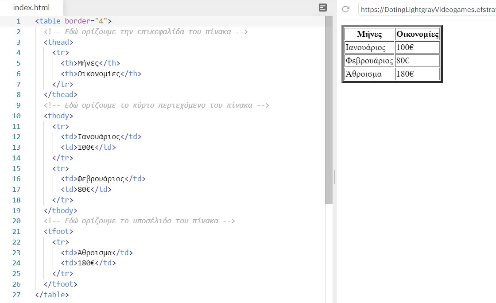

- Tα tags ```<kbd>...</kbd>```

Yποδεικνύουν το κείμενο που πρέπει να πληκτρολογήσει ο χρήστης.

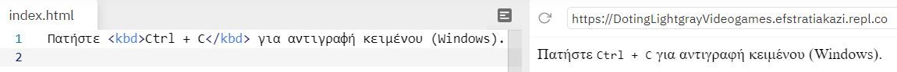

- Tα tags ```<var>...</var>```

Αυτα τα tags χρησιμοποιούνται για να ορίσουμε μια μεταβλητή στον προγραμματισμό ή σε μια μαθηματική έκφραση. Το περιεχόμενο μέσα εμφανίζεται συνήθως με πλάγια γραφή.

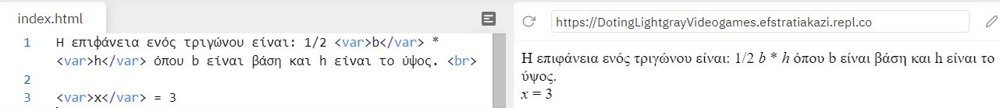

- Tα tags ```<samp>...</samp>```

Τα tags αυτά χρησιμοποιούνται για τον καθορισμό του δείγματος εξόδου από ένα πρόγραμμα υπολογιστή, δηλαδή προσδιορίζει αποτέλεσμα ενός κώδικα.

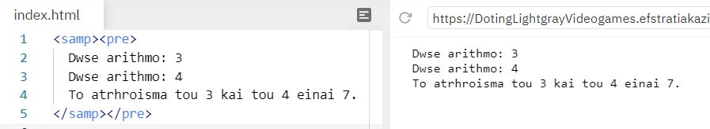

- Tα tags ```<blockquote>...</blockquote>```

Το tag ```<blockquote>``` πρέπει να χρησιμοποιείται μόνο όταν θέλουμε να εμφανίσουμε κείμενο από εξωτερική πηγή. Eμφανίζει το κείμενο αρχίζοντας από δεξιότερη εσοχή απ' ότι το υπόλοιπο κείμενο.

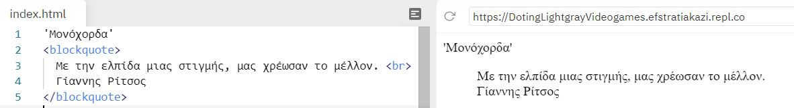

- Tα tags ```<q>...</q>```
  
Aυτα τα tags ορίζουν ένα κείμενο σαν σύντομο απόσπασμα (quote) χωρίς όμως να αλλάζει παράγραφό. Συμπεριφέρεται ακριβώς το ίδιο με το tag ```<blockquote>``` με την διαφορά ότι δεν αφήνει κενή γραμμή πάνω και κάτω από το κείμενο που βρίσκεται μέσα στα tags αρχής και τέλους. Το κείμενο εμφανίζεται μέσα σε εισαγωγικά.

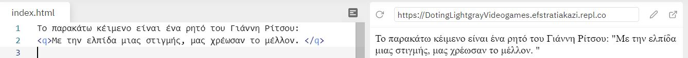

- Tα tags ```<address>...</address>```
  
Με αυτά τα tags ορίζουμε μια ειδική μορφή εμφάνισης. Συνήθως την χρησιμοποιούμε όταν θέλουμε να γράψουμε διευθύνσεις, υπογραφές, πληροφορίες σχετικά με τον συγγραφέα, γενικά τα στοιχεία επικοινωνίας.Τα γράμματα ανάμεσα στα tags αυτές εμφανίζονται με πλάγιους χαρακτήρες (italics) και αφήνουν κενή γραμμή πριν και μετά το κείμενο.

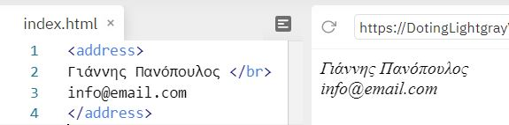

- Tα tags ```<bdo>...</bdo>```

Το tag  ```<bdo>``` χρησιμοποιείται για να αλλάξουμε την κατεύθυνση του κειμένου. Δύο είναι οι κατευθύνσεις του κειμένου:

1) Αριστερά προς τα δεξιά Left-To-Right (ltr): Με λένε Έφη
2) Δεξιά προς τα αριστερά Right-To-Left (rtl): ηφΈ ενέλ εΜ

Η default κατεύθυνση είναι η Left-To-Right, οπότε προσθέτουμε αυτά τα tags μόνο αν θέλουμε να χρησιμοποιήσουμε την κατεύθυνση Right-To-Left.

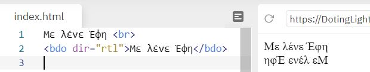

- Tα tags ```<cite>...</cite>```

Το ```<cite>``` tag ορίζει τον τίτλο ενός δημιουργικού έργου (π.χ. ένα βιβλίο, ένα ποίημα, ένα τραγούδι, μια ταινία, μια ζωγραφική, ένα γλυπτό κ.λπ.). Παραθέτει  δηλαδή μια αναφορά. Το κείμενο συνήθως εμφανίζεται με πλάγια γράμματα.

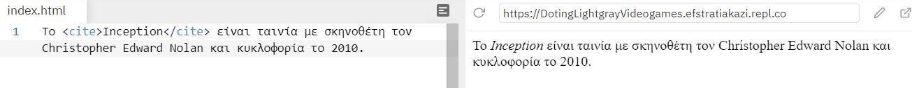

- Tο tag ``````

Με το tag αυτό εισάγουμε μια εικόνα στην σελίδα μας. Το tag `````` ***δεν έχει tag τέλους***, οπότε βάζουμε τον χαρακτήρα / πριν τον χαρακτήρα >. Έχει δύο απαιτούμενα χαρακτηριστικά:

1. src - Καθορίζει τη διαδρομή προς την εικόνα.
2. alt - Καθορίζει ένα εναλλακτικό κείμενο για την εικόνα, εάν η εικόνα για κάποιο λόγο δεν μπορεί να εμφανιστεί.

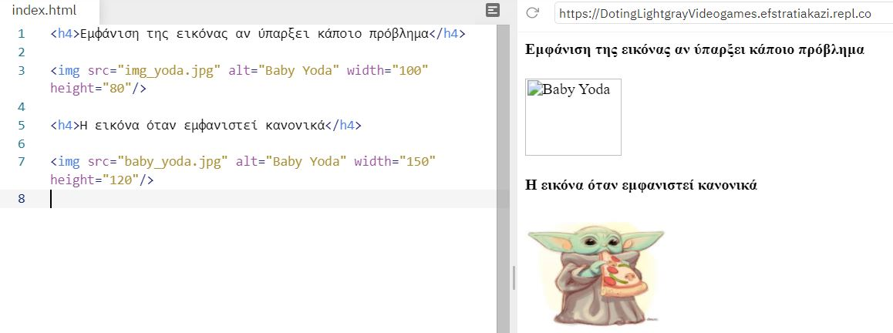

- Tα tags ```<div>...</div>```

Το tag ```<div>``` ορίζει ένα τμήμα στο HTML έγγραφο. Ένα τμήμα ομαδοποιεί τα περιεχόμενα που είναι μέσα στα tags ```<div>...</div>``` ώστε να μπορούμε να ορίζουμε ένα ενιαίο στυλ (χρώμα, γραμματοσειρά, στοίχιση) με την ιδιότητα style και διαμορφώνεται με CSS ή χειρίζεται με JavaScript.**Χρησιμοποιείται πάρα πολύ συχνά στην HTML.**

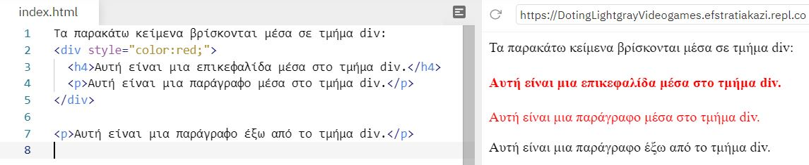

- Tα tags ```<span>...</span>```

Το ```<span>``` tag χρησιμοποιείται για τη σήμανση ενός μέρους ενός κειμένου ή ενός μέρους ενός εγγράφου. Διαμορφώνεται πιο εύκολα με CSS ή χειρίζεται με JavaScript χρησιμοποιώντας το χαρακτηριστικό class ή id. Το ```<span>``` tag μοιάζει πολύ με το στοιχείο ```<div>``` , αλλά το ```<div>``` χρησιμοποιείται για την ομαδοποίηση μεγαλύτερων κομματιών κώδικα και ```<span>``` χρησιμοποιείται για ένα μικρό κομμάτι HTML μέσα σε μια γραμμή (όπως μέσα σε μια παράγραφο).


