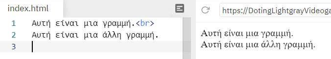
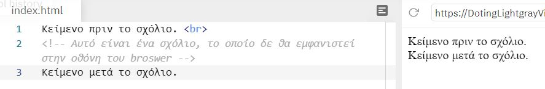
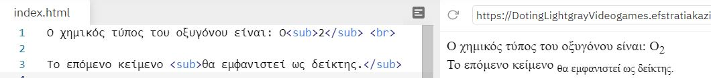

# Ετικέτες(Tags)

## Πώς λειτουργεί μια ετικέτα μέσα σε ένα HTML αρχείο

Ένα ζευγάρι ετικετών καθορίζει την μορφή ενός κειμένου ή μιας και μόνο λέξης.

- ```<h1> </h1>``` εώς ```<h6> </h6>```
Οι HTML επικεφαλίδες είναι κείμενο που εμφανίζεται με μεγάλα γράμματα. H γραμματοσειρά ορίζέται από τις ετικέτες ```<h1>, <h2>, <h3>, <h4>, <h5> και <h6>```. Με την ```<h1>``` ορίζουμε την *μεγαλύτερη* ετικέτα ενώ με την ```<h6>```την *μικρότερη* (πριν και μετά την επικεφαλίδα εισάγεται αυτόματα στον Browser μια κενή γραμμή).


- ```<p> </p>```
Oμαδοποιεί το κείμενο που βρίκεται μέσα στις ετικέτες αρχής και τέλους σε μια παράγραφο, αφήνοντας αυτόματα μια κενή γραμμή πριν την αρχή της παραγράφου και μια μετα το τέλος αυτής.


- ```<br/>```
Ένα από τα tags που το χρησιμοποιούμε όταν θέλουμε να τελειώσουμε μια γραμμή κειμένου και να αρχίσουμε μια καινούργια. ***Δεν έχει κλειστή ετικέτα***.



- ```<hr/>```
  Mε αυτό το tag τοποθετούμε μια οριζόντια γραμμή στην σελίδα μας για να **σηματοδοτήσουμε** την αλλαγή του περιεχομένου της. Η οριζόντια γραμμή είναι ένα απλό γραφικό που μπορούμε να χρησιμοποιήσουμε στην σελίδα μας (κυρίως σαν διαχωριστικό). ***Δεν έχει κλειστή ετικέτα***.


- ```<!-- -->```
Αυτό το tag χρησιμοποιείται για τα  σχόλια, δηλαδή για να γράφουμε σημειώσεις μέσα στον πηγαίο κώδικα για να διευκολύνουμε την επεξεργασία και την συντήρηση του αρχείου. **Τα σχόλια δεν εμφανίζονται στην οθόνη του Βrowser**.



- ```<b> </b>``` & ```<strong> </strong>```
Και οι δύο ετικέτες μπορούν να χρησιμοποιθούν ώστε να εμφανίζει το κείμενο ή μια λέξη με έντονη μορφή.
Για υπενθύμιση: το **b** είναι το πρώτο γράμμα από την λέξη **bold**.


- ```<i> </i>```
Eμφανίζει το κείμενο ή τη λέξη με πλάγιους χαρακτήρες.
Για υπενθύμιση το *i* είναι το πρώτο γράμμα από την λέξη *italics*.


- ```<em> </em>```
Eμφανίζει το κείμενο με πλάγιους και κάπως αχνά γραμμένους χαρακτήρες.


- ```<code> </code>```
Eμφανίζει το κείμενο και το παρομοιάζει ως κώδικα μιας γλώσσας προγραμματισμού.


- ```<a> </a>``` &rarr; ιδιότητες: ```href``` και ```target```
Με αυτήν την ετικέτα δημιουργούμε εναν σύνδεσμο (link) προς μια άλλη σελίδα χρησιμοποιώντας την ιδιότητα href. Οι πιο σημαντικές ιδιότητες της ετικέτας είναι η href η οποία ορίζει το URL του συνδέσμου και η target η οποία ορίζει που θα ανοίξει το URL (στο ίδιο tab ή σε νέο tab).


- ```<button> </button>```
Με την ετικέτα αυτή εισάγουμε ένα κουμπί στην σελίδα μας. Μέσα στις ετικέτες μπορούμε να προσθέσουμε περιεχόμενο, όπως κείμενο ή εικόνες.


- ```<dl> </dl>``` σε συνδιασμό με  ```<dt> </dt>``` και ```<dd> </dd>```
Mε τα tags ```<dl> </dl>``` ορίζουμε μια λίστα περιγραφής σε συνδιασμό με τα tags ```<dt> </dt>``` ορίζουμε όρους/ονόματα και με συνδιασμό τα tags ```<dd> </dd>``` περιγράφουμε κάθε όρο/όνομα.


- ```<del> </del>```
Eμφανίζει το κείμενο διαγραμμένο, δηλαδή με μια γραμμή επάνω από το κείμενο.


- ```<ins> </ins>```
Oρίζουμε ένα κείμενο σαν προστιθέμενο και το εμφανίζει υπογραμμισμένο. Χρησιμοποιήστε το μαζί με την ετικέτα ```<del>``` για να περιγράφετε ενημερώσεις και αλλαγές στο περιεχόμενο.


- ```<ol> </ol>``` σε συνδιασμό ```<li> </li>```
Η ετικέτα ```<ol>``` καθορίζει μια λίστα με σειρά. Μια λίστα με σειρά μπορεί να είναι αριθμητική ή αλφαβητική. H ετικέτα ```<li>``` χρησιμοποιείται για τον καθορισμό κάθε στοιχείου λίστας.


- ```<ul> </ul>``` σε συνδιασμό ```<li> </li>```
Mε την ετικέτα ```<ul>``` εισάγουμε μια λίστα με κουκίδες. H ετικέτα ```<li>``` χρησιμοποιείται για τον καθορισμό κάθε στοιχείου λίστας.


- ```<mark> </mark>```
Mε την ετικέτα αυτή ορίζουμε ένα κείμενο ή λέξη που πρέπει να επισημανθεί.


- ```<pre> </pre>```
Το κείμενο θα εμφανίζεται ακριβώς όπως γράφεται στον πηγαίο κώδικα HTML.


- ```<sub> </sub>```
Tα tags αυτά εμφανίζουν το κείμενο ή τη λέξη κάτω από την κανονική γραμμή σα μαθηματική βάση και μερικές φορές αποδίδεται σε μικρότερη γραμματοσειρά. Το κείμενο του δείκτη μπορεί να χρησιμοποιηθεί για χημικούς τύπους.



- ```<sup> </sup>```
  
Tα tags αυτά  εμφανίζουν το κείμενο σα μαθηματικό εκθέτη, δηλαδή σε ψηλότερο σημείο απ' ότι βρίσκεται το υπόλοιπο κείμενο.


- ```<small> </small>```
Tα tags αυτά εμφανίζουν το κείμενο με μικρούς χαρακτήρες.


