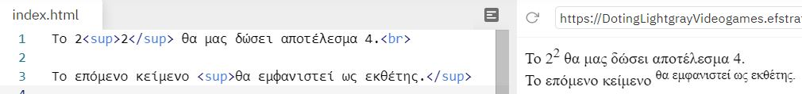
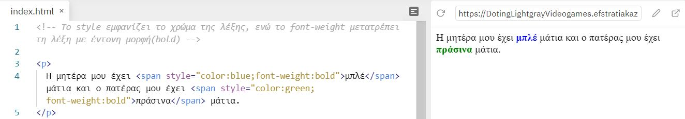

# Ετικέτες(Tags)

## Πώς λειτουργεί μια ετικέτα μέσα σε ένα HTML αρχείο

Ένα ζευγάρι ετικετών καθορίζει την μορφή ενός κειμένου ή μιας και μόνο λέξης.

- ```<h1> </h1>``` εώς ```<h6> </h6>```

Οι HTML επικεφαλίδες είναι κείμενο που εμφανίζεται με μεγάλα γράμματα. H γραμματοσειρά ορίζέται από τις ετικέτες ```<h1>, <h2>, <h3>, <h4>, <h5> και <h6>```. Με την ```<h1>``` ορίζουμε την *μεγαλύτερη* ετικέτα ενώ με την ```<h6>```την *μικρότερη* (πριν και μετά την επικεφαλίδα εισάγεται αυτόματα στον Browser μια κενή γραμμή).


- ```<p> </p>```
  
Oμαδοποιεί το κείμενο που βρίκεται μέσα στις ετικέτες αρχής και τέλους σε μια παράγραφο, αφήνοντας αυτόματα μια κενή γραμμή πριν την αρχή της παραγράφου και μια μετα το τέλος αυτής.


- ```<br>```
  
Ένα από τα tags που το χρησιμοποιούμε όταν θέλουμε να τελειώσουμε μια γραμμή κειμένου και να αρχίσουμε μια καινούργια. ***Δεν έχει κλειστή ετικέτα***.


- ```<hr>```

Mε αυτό το tag τοποθετούμε μια οριζόντια γραμμή στην σελίδα μας για να **σηματοδοτήσουμε** την αλλαγή του περιεχομένου της. Η οριζόντια γραμμή είναι ένα απλό γραφικό που μπορούμε να χρησιμοποιήσουμε στην σελίδα μας (κυρίως σαν διαχωριστικό). ***Δεν έχει κλειστή ετικέτα***.


- ```<!-- -->```

Αυτό το tag χρησιμοποιείται για τα  σχόλια, δηλαδή για να γράφουμε σημειώσεις μέσα στον πηγαίο κώδικα για να διευκολύνουμε την επεξεργασία και την συντήρηση του αρχείου. **Τα σχόλια δεν εμφανίζονται στην οθόνη του Βrowser**.


- ```<b> </b>``` & ```<strong> </strong>```

Και οι δύο ετικέτες μπορούν να χρησιμοποιθούν ώστε να εμφανίζει το κείμενο ή μια λέξη με έντονη μορφή.
Για υπενθύμιση: το **b** είναι το πρώτο γράμμα από την λέξη **bold**.


- ```<i> </i>```
  
Eμφανίζει το κείμενο ή τη λέξη με πλάγιους χαρακτήρες.
Για υπενθύμιση το *i* είναι το πρώτο γράμμα από την λέξη *italics*.


- ```<em> </em>```

Eμφανίζει το κείμενο ή τη λέξη με πλάγιους και κάπως αχνά γραμμένους χαρακτήρες.


- ```<pre> </pre>```
Το κείμενο θα εμφανίζεται ακριβώς όπως γράφεται στον πηγαίο κώδικα HTML.


- ```<code> </code>```

Eμφανίζει το κείμενο και το παρομοιάζει ως κώδικα μιας γλώσσας προγραμματισμού.


- ```<a> </a>``` &rarr; ιδιότητες: ```href``` και ```target```
  
Με αυτήν την ετικέτα δημιουργούμε εναν σύνδεσμο (link) προς μια άλλη σελίδα χρησιμοποιώντας την ιδιότητα href. Οι πιο σημαντικές ιδιότητες της ετικέτας είναι η href η οποία ορίζει το URL του συνδέσμου και η target η οποία ορίζει που θα ανοίξει το URL (στο ίδιο tab ή σε νέο tab).


- ```<button> </button>```
  
Με την ετικέτα αυτή εισάγουμε ένα κουμπί στην σελίδα μας. Μέσα στις ετικέτες μπορούμε να προσθέσουμε περιεχόμενο, όπως κείμενο ή εικόνες.


- ```<dl> </dl>``` σε συνδιασμό με  ```<dt> </dt>``` και ```<dd> </dd>```
  
Mε τα tags ```<dl> </dl>``` ορίζουμε μια λίστα περιγραφής σε συνδιασμό με τα tags ```<dt> </dt>``` ορίζουμε όρους/ονόματα και με συνδιασμό τα tags ```<dd> </dd>``` περιγράφουμε κάθε όρο/όνομα.


- ```<del> </del>```
  
Eμφανίζει το κείμενο διαγραμμένο, δηλαδή με μια γραμμή επάνω από το κείμενο.


- ```<ins> </ins>```
  
Oρίζουμε ένα κείμενο σαν προστιθέμενο και το εμφανίζει υπογραμμισμένο. Χρησιμοποιήστε το μαζί με την ετικέτα ```<del>``` για να περιγράφετε ενημερώσεις και αλλαγές στο περιεχόμενο.


- ```<ol> </ol>``` σε συνδιασμό ```<li> </li>```

Η ετικέτα ```<ol>``` καθορίζει μια λίστα με σειρά. Μια λίστα με σειρά μπορεί να είναι αριθμητική ή αλφαβητική. H ετικέτα ```<li>``` χρησιμοποιείται για τον καθορισμό κάθε στοιχείου λίστας.


- ```<ul> </ul>``` σε συνδιασμό ```<li> </li>```

Mε την ετικέτα ```<ul>``` εισάγουμε μια λίστα με κουκίδες. H ετικέτα ```<li>``` χρησιμοποιείται για τον καθορισμό κάθε στοιχείου λίστας.


- ```<mark> </mark>```
Mε την ετικέτα αυτή ορίζουμε ένα κείμενο ή λέξη που πρέπει να επισημανθεί.


- ```<sub> </sub>```
  
Tα tags αυτά εμφανίζουν το κείμενο ή τη λέξη κάτω από την κανονική γραμμή σα μαθηματική βάση και μερικές φορές αποδίδεται σε μικρότερη γραμματοσειρά. Το κείμενο του δείκτη μπορεί να χρησιμοποιηθεί για χημικούς τύπους.


- ```<sup> </sup>```
  
Tα tags αυτά  εμφανίζουν το κείμενο σα μαθηματικό εκθέτη, δηλαδή σε ψηλότερο σημείο απ' ότι βρίσκεται το υπόλοιπο κείμενο.



- ```<small> </small>```
Tα tags αυτά εμφανίζουν το κείμενο με μικρούς χαρακτήρες.


- ```<abbr title = " "> </abbr>```
  
Η ετικέτα αυτή υποδεικνύει μια συντόμευση, όπως, "GR", "π.χ.". Τη χρησιμοποιούμε για να χαρακτηρίσουμε μια λέξη σαν συντόμευση, δίνουμε χρήσιμες πληροφορίες στον browser, στις μηχανές αναζήτησης, σε προγράμματα ελέγχου ορθογραφίας, ή σε κάποιο πρόγραμμα μετάφρασης. *Στους περισσότερους browsers, όταν αφήνουμε για λίγο τον δείκτη του ποντικιού μας επάνω στην συντόμευση, εμφανίζεται το περιεχόμενο της ιδιότητας title.*


- ```<table> </table>``` σε συνδιασμό με ```<tr> </tr>```, ```<td> </td>``` και με ```<th> </th>```
  
Με την ετικέτα ```<table>``` εισάγουμε έναν πίνακα στην σελίδα μας. Το ζεύγος των ετικετών ```<tr> </tr>``` ορίζει μια γραμμή του πίνακα, ενώ το ζεύγος των ετικετών ```<td> </td>``` ορίζουν ένα κελί στην γραμμή του πίνακα. Με την ετικέτα ```<th>``` ορίζουμε μια επικεφαλίδα σε μια στήλη του πίνακα. Το κείμενο που βρίσκεται μέσα στις ετικέτες ```<th> και </th>``` εμφανίζεται με **bold** χαρακτήρες. Η ετικέτες ```<th> </th>``` τοποθετούνται μέσα στις ετικέτες ```<tr> </tr>``` όπως οι ετικέτες ```<td> </td>``` Η ιδιότητα **border** της ετικέτας ```<table>``` ορίζει το πάχος του περιγράμματος του πίνακα.


- ```<thead> </thead>``` σε συνδιασμό με ```<tfoot> </tfoot>``` και ```<tbody> </tboty>```

Με την ετικέτα ```<thead>``` ορίζουμε την επικεφαλίδα του πίνακα
Με την ετικέτα ```<tfoot>``` ορίζουμε το υποσέλιδο του πίνακα.
Με την ετικέτα ```<tbody>``` ορίζουμε τις γραμμές που βρίσκονται μέσα στις ετικέτες ```<tbody>``` και ```</tbody>``` ως το κυρίως περιεχόμενο του πίνακα.
*Οι ετικέτες ```<thead>``` ```<tfoot>``` και ```<tbody>``` μας δίνουν την δυνατότητα να ομαδοποιήσουμε τις γραμμές ενός πίνακα. Όταν δημιουργούμε έναν πίνακα, συνήθως έχουμε στην αρχή μια γραμμή που τοποθετούμε τις επικεφαλίδες του πίνακα (header), έπειτα κάποιες γραμμές με δεδομένα (body, το κυρίως μέρος του πίνακα) και στο τέλος μια γραμμή με τα συνολικά αποτελέσματα (footer, υποσέλιδο του πίνακα). Με αυτή την διαίρεση του πίνακα o browser μπορεί να κάνει scrolling στις γραμμές όπου βρίσκεται το κυρίως περιεχόμενο του πίνακα (το οποίο ορίζεται με την ετικέτα ```<tbody>```) ανεξάρτητα από το header του πίνακα (το οποίο ορίζεται με την ετικέτα ```<thead>```), και το footer (το οποίο ορίζεται με την ετικέτα ```<tfoot>```). Επίσης όταν εκτυπώνουμε μεγάλους πίνακες που επεκτείνονται σε περισσότερες από μια σελίδες, η γραμμές header και footer των πινάκων θα τυπώνονται σε κάθε σελίδα. Σε περίπτωση που θέλουμε να ομαδοποιήσουμε τις γραμμές του πίνακα μας με τον παραπάνω τρόπο, δεν μπορούμε να χρησιμοποιήσουμε μόνο μια ή δύο από τις ετικέτες ```<thead>``` ```<tfoot>``` και ```<tbody>```. Πρέπει να τις χρησιμοποιούμε όλες και με την συγκεκριμένη σειρά : ```<thead>``` ```<tfoot>``` ```<tbody>```. Αν και η ετικέτα ```<tfoot>``` τοποθετείται πριν την ετικέτα ```<tbody>``` στην οθόνη του browser εμφανίζονται πρώτα οι γραμμές που ορίζουν οι ετικέτες ```<tbody>``` και ```</tbody>``` και μετά εμφανίζεται η γραμμή που ορίζουν οι ετικέτες ```<tfoot>``` και ```</tfoot>```.*


- ```<kbd> </kbd>```

Yποδεικνύει το κείμενο που πρέπει να πληκτρολογήσει ο χρήστης.


- ```<var> </var>```

Αυτή ετικέτα χρησιμοποιείται για να ορίσει μια μεταβλητή στον προγραμματισμό ή σε μια μαθηματική έκφραση. Το περιεχόμενο μέσα εμφανίζεται συνήθως με πλάγια γραφή .


- ```<samp> </samp>```

H ετικέτα χρησιμοποιείται για τον καθορισμό του δείγματος εξόδου από ένα πρόγραμμα υπολογιστή, δηλαδή προσδιορίζει αποτέλεσμα ενός κώδικα.


- ```<blockquote> </blockquote>```

Η ετικέτα ```<blockquote>``` πρέπει να χρησιμοποιείται μόνο όταν θέλουμε να εμφανίσουμε κείμενο από εξωτερική πηγή. Eμφανίζει το κείμενο αρχίζοντας από δεξιότερη εσοχή απ' ότι το υπόλοιπο κείμενο.


- ```<q> </q>```
  
Aυτή η ετικέτα ορίζει ένα κείμενο σαν σύντομο απόσπασμα (quote) χωρίς όμως να αλλάζει παράγραφό. Συμπεριφέρεται ακριβώς το ίδιο με την ετικέτα```<blockquote>``` με την διαφορά ότι δεν αφήνει κενή γραμμή πάνω και κάτω από το κείμενο που βρίσκεται μέσα στις ετικέτες αρχής και τέλους. Το κείμενο εμφανίζεται μέσα σε εισαγωγικά.


- ```<address> </address>```
  
ΜΕ αυτή την ετικέτα ορίζουμε μια ειδική μορφή εμφάνισης. Συνήθως την χρησιμοποιούμε όταν θέλουμε να γράψουμε διευθύνσεις, υπογραφές, πληροφορίες σχετικά με τον συγγραφέα, γενικά τα στοιχεία επικοινωνίας.Τα γράμματα ανάμεσα στις ετικέτες αυτές εμφανίζονται με πλάγιους χαρακτήρες (italics) και αφήνουν κενή γραμμή πριν και μετά το κείμενο.


- ```<bdo> </bdo>```

Η ετικέτα ```<bdo>``` χρησιμοποιείται για να αλλάξουμε την κατεύθυνση του κειμένου. Δύο είναι οι κατευθύνσεις του κειμένου:

1) Αριστερά προς τα δεξιά Left-To-Right (ltr): Με λένε Έφη
2) Δεξιά προς τα αριστερά Right-To-Left (rtl): ηφΈ ενέλ εΜ

Η default κατεύθυνση είναι η Left-To-Right, οπότε προσθέτουμε αυτήν την ετικέτα μόνο αν θέλουμε να χρησιμοποιήσουμε την κατεύθυνση Right-To-Left.


- ```<cite> </cite>```

Η ```<cite>``` ετικέτα ορίζει τον τίτλο ενός δημιουργικού έργου (π.χ. ένα βιβλίο, ένα ποίημα, ένα τραγούδι, μια ταινία, μια ζωγραφική, ένα γλυπτό κ.λπ.). Παραθέτει  δηλαδή μια αναφορά. Το κείμενο συνήθως εμφανίζεται με πλάγια γράμματα.


- ``````

Με την ετικέτα αυτή εισάγουμε μια εικόνα στην σελίδα μας. Η ετικέτα `````` δεν έχει ετικέτα τέλους, οπότε βάζουμε τον χαρακτήρα / πριν τον χαρακτήρα >. Έχει δύο απαιτούμενα χαρακτηριστικά:

1. src - Καθορίζει τη διαδρομή προς την εικόνα.
2. alt - Καθορίζει ένα εναλλακτικό κείμενο για την εικόνα, εάν η εικόνα για κάποιο λόγο δεν μπορεί να εμφανιστεί.


- ```<div> </div>```

Η ετικέτα ```<div>``` ορίζει ένα τμήμα στο HTML έγγραφο. Ένα τμήμα ομαδοποιεί τα περιεχόμενα που είναι μέσα στις ετικέτες ```<div> </div>``` ώστε να μπορούμε να ορίζουμε ένα ενιαίο στυλ (χρώμα, γραμματοσειρά, στοίχιση) με την ιδιότητα style και διαμορφώνεται με CSS ή χειρίζεται με JavaScript.**Χρησιμοποιείται πάρα πολύ συχνά στην HTML.**


- ```<span> </span>```

Η ```<span>``` ετικέτα χρησιμοποιείται για τη σήμανση ενός μέρους ενός κειμένου ή ενός μέρους ενός εγγράφου. Διαμορφώνεται πιο εύκολα με CSS ή χειρίζεται με JavaScript χρησιμοποιώντας το χαρακτηριστικό class ή id. Η ```<span>``` ετικέτα μοιάζει πολύ με το στοιχείο ```<div>``` , αλλά το ```<div>``` χρησιμοποιείται για την ομαδοποίηση μεγαλύτερων κομματιών κώδικα και ```<span>``` χρησιμοποιείται για ένα μικρό κομμάτι HTML μέσα σε μια γραμμή (όπως μέσα σε μια παράγραφο).


