# Κείμενο CSS (text)

Εδώ θα δούμε τι μορφοποιήσεις μπορούμε να υλοποιήσουμε πάνω στο κείμενο. Οι διαμορφώσεις που μπορούμε να κάνουμε αντιστοιχούν:

1. Στο χρώμα του κειμένου και του φόντου
2. Στην ευθυγράμμιση του κειμένου
3. Στη διακόσμηση του κειμένου
4. Στο μετασχηματισμό του κειμένου
5. Στο διάστημα του κειμένου και
6. Στη σκιά του κειμένου

## 1. Χρώμα κειμένου και φόντου

Το χρώμα μπορεί να ρυθμιστεί από:

- όνομα του χρώματος, όπως "red", είναι το κόκκινο
- μια τιμή HEX, όπως "# ff0000", είναι το μπλε
- μια τιμή RGB, όπως "rgb (255,0,0)", είναι το μπλε
- μια τιμή HSL, όπως "hsl (0, 100%, 50%)", είναι το μπλε

### Χρώμα κειμένου

Η ιδιότητα ```color``` ορίζει **το χρώμα της γραμματοσειράς**.

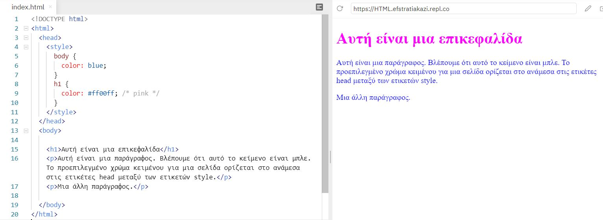

Όπως βλέπουμε στο παραπάνω παράδειγμα στην επικεφαλίδα εφαρμόστηκε το ροζ χρώμα, παρόλο που ετικέτα ```h1``` ανήκει στο ```body``` παίρνει προτεραιότητα γίνεται ροζ και έπειτα ότι άλλο βρίσκεται μεταξύ των ετικετών ```body``` παίρνει το χρώμα μπλε.

### Χρώμα φόντου

Η ιδιότητα ```background-color``` ορίζει το **χρώμα του φόντου**.

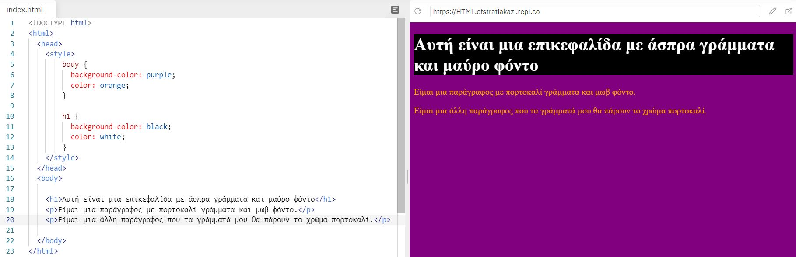

Όπως βλέπουμε στο παραπάνω παράδειγμα το μαύρο φόντο (background) εφαρμόστηκε μόνο στο πεδίο που βρίσκεται η επικεφαλίδα. Στο υπόλοιπο εφαρμόστηκε το χρώμα μωβ, τα γράμματα τους πήραν το αντίστοιχο χρώμα που ορίστηκε στο σώμα (head).

---

## 2. Eυθυγράμμιση κειμένου

Η ```text-align``` ιδιότητα χρησιμοποιείται για τον ορισμό της ευθυγράμμισης ενός κειμένου, η ιδιότητα αυτή παίρνει 3 τιμές:

- center (η ευθυγράμμιση του κειμένου γίνεται στο κέντρο.)
- left (η ευθυγράμμιση του κειμένου γίνεται στα αριστερά, **αρχική τιμή**.)
- right (η ευθυγράμμιση του κειμένου γίνεται στα δεξιά.)
- justify (η ευθυγράμμιση του κειμένου έχει ίσο πλάτος και τα αριστερά και δεξιά περιθώρια είναι ίσα, όπως σε περιοδικά και εφημερίδες.)

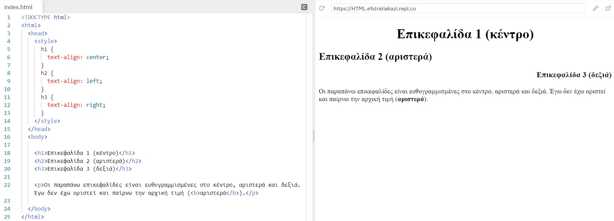

Στο παραπάνω παράδειγμα βλέπουμε μόνο τις τρεις πρώτες τιμές που προαναφέρθηκαν. Στο κέντρο, στα αριστερά και στα δεξιά.

---

Kάποιες από τις ιδιότητες και τις τιμές που αναφέρονται στο παρακάτω παράδειγμα που αφορά το ```text-align: justify;``` εμφανίζονται αναλυτικά στο κεφάλαιο [borders](borders.md).

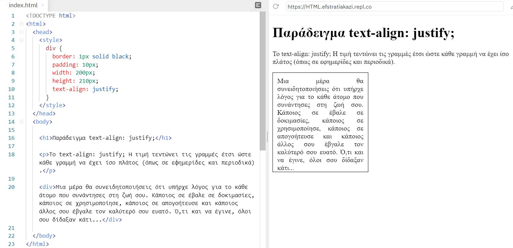

---

## 3. Διακόσμηση κειμένου

Η ιδιότητα για τη ρύθμιση ή αφαίρεση διακοσμήσεων από το κείμενο είναι η ```text-decoration``` και έχει τέσσερις τιμές:

- none (χρησιμοποιείται συχνά για την αφαίρεση υπογραμμίσεων από συνδέσμους)
- overline (χρησμιποιείται για να δώσει στο κείμενο μια γενική περιγραφή, εμφανίζει μια γραμμή ακριβώς πάνω από το κείμενο)
- line-through (χρησιμοποιείται για να εμφανίσει το κείμενο διαγραμμένο, δηλαδή με μια γραμμή επάνω από το κείμενο.)
- underline (χρησιμοποιείται για να εμφανίσει υπογραμμισμένο το κείμενο)

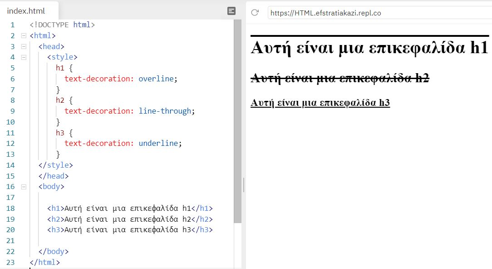

---

## 4. Mετασχηματισμός κειμένου

Η ιδιότητα χρησιμοποιείται για τον καθορισμό κεφαλαίων και πεζών γραμμάτων σε ένα κείμενο είναι η ```text-transform```. Μπορεί να χρησιμοποιηθεί για να μετατρέψει τα πάντα σε κεφαλαία ή πεζά (μικρά) γράμματα ή να κάνει κεφαλαίο το πρώτο γράμμα κάθε λέξης. Οι τιμές που περιλαμβάνει είναι πέντε:

- none, αποτρέπει κάθε μετασχηματισμό.
- uppercase, μετατρέπει ΟΛΟ ΤΟ ΚΕΙΜΕΝΟ ΣΕ ΚΕΦΑΛΑΙΑ.
- lowercase, μετατρέπει όλο το κείμενο σε πεζά.
- capitalize, μεταμορφώνει όλες τις λέξεις με κεφαλαίο **μόνο** Το Πρώτο Γράμμα και
- full-width

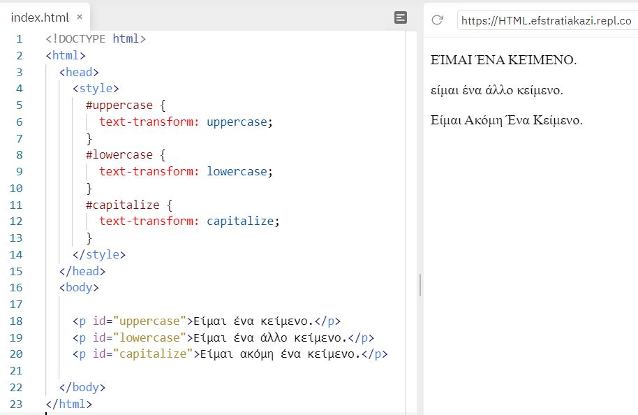

---

## 5. Διάστημα κειμένου

Το διάστημα μπορεί να εφαρμοστεί για:

- την εσοχή κειμένου με την ιδίοτητα ```text-indent```
- το διάστημα γραμμάτων με την ιδιότητα ```letter-spacing```
- το υψος γραμμής με την ιδίοτητα ```line-height```
- ο διαχωρισμός των λέξεων με την ιδιότητα ```word-spacing``` και
- ο λευκός χώρος με την ιδιότητα ```white-space```

### text-indent

Η ```text-indent``` ιδιότητα χρησιμοποιείται για τον καθορισμό της εσοχής της πρώτης γραμμής ενός κειμένου:

Στο παρακάτω παράδειγμα οι εσοχές διαμορφώθηκαν άναλογα με την τιμή px το πρώτο κείμενο με 50 και το δεύτερο κείμενο με 20 (βλ. εικόνα).

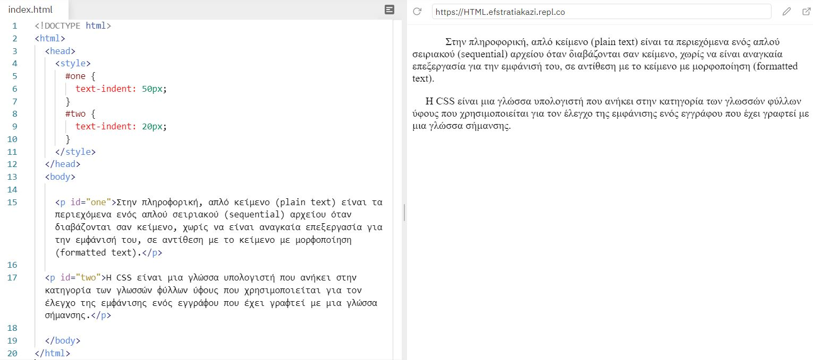

### letter-spacing

Η ιδιότητα ```letter-spacing``` χρησιμοποιείται για τον καθορισμό του διαστήματος μεταξύ των χαρακτήρων σε ένα κείμενο.

Το παρακάτω παράδειγμα δείχνει πώς μπορείτε να αυξήσετε ή να μειώσετε το διάστημα μεταξύ χαρακτήρων με px:

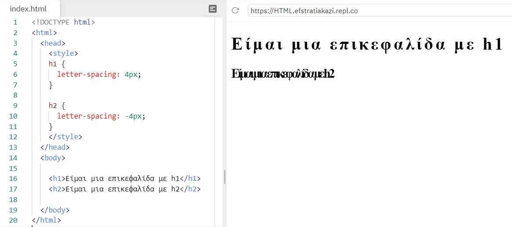

### line-height

Η ```line-height``` ιδιότητα χρησιμοποιείται για τον καθορισμό του διαστήματος μεταξύ γραμμών (βλ. εικόνα)

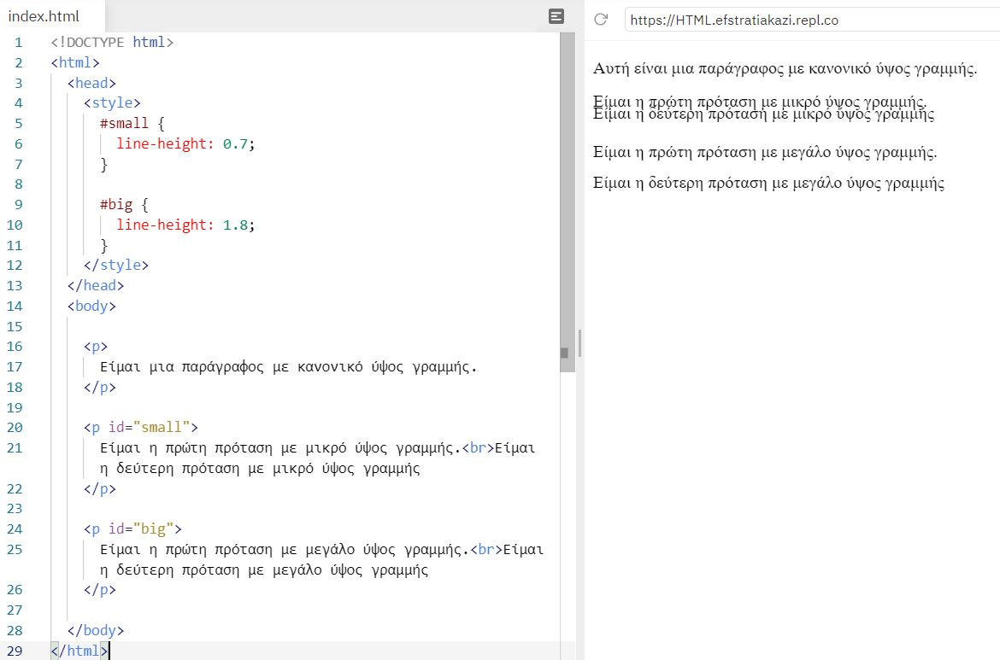

### word-spacing

Η ```word-spacing``` ιδιότητα χρησιμοποιείται για τον καθορισμό του διαστήματος μεταξύ των λέξεων σε ένα κείμενο.

Το παρακάτω παράδειγμα δείχνει πώς μπορείτε να αυξήσετε ή να μειώσετε το κενό μεταξύ των λέξεων:

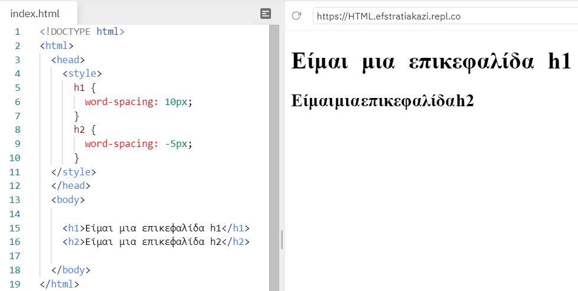

### white-space

Η ```white-space``` ιδιότητα καθορίζει τον τρόπο χειρισμού του λευκού χώρου μέσα σε ένα στοιχείο. Έχει 7 τιμές εμείς θα δούμε τις 3:

- normal (αρχική τιμή)
- nowrap (Το κείμενο δεν θα πάει ποτέ στην επόμενη γραμμή. Το κείμενο συνεχίζεται στην ίδια γραμμή έως ότου συναντηθεί μια ετικέτα ```<br>```)
- pre (Λειτουργεί όπως η ετικέτα ```<pre>``` στην HTML)

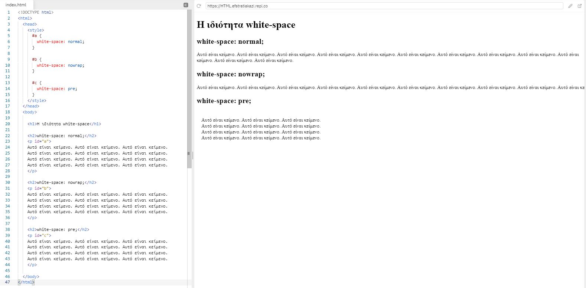

1. Στην τιμή normal, βλέπουμε ότι το κείμενο "κόβεται" εκεί που τελειώνει το πλαίσιο του κείμενου και πάει στην επόμενη γραμμή.
2. Στην τιμή nowrap, το κείμενο συνεχίζει και δεν πάει ποτέ στην επόμενη γραμμή, διότι δε συνάντησε ποτέ στον πηγαίο κώδικα την ετικέτα ```<br>```.
3. Στην τιμή pre, το κείμενο εμφανίζεται όπως έχει γραφεί στον πηγαίο κώδικα.

---

## 6. Σκιά κειμένου

### text-shadow

Η ```text-shadow``` ιδιότητα προσθέτει σκιά στο κείμενο.

Υπάρχουν 3 βήματα που πρέπει να ακολουθήσουμε:

1. καθορίζουμε μόνο την οριζόντια σκιά (στο παράδειγμα, 2px) και την κατακόρυφη σκιά (στο παράδειγμα, 2px):

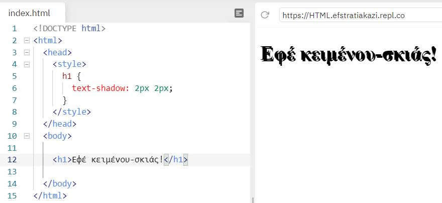

2. Στη συνέχεια, προσθέτουμε ένα χρώμα στη σκιά, στο παράδειγμα επιλέξαμε το κόκκινο:

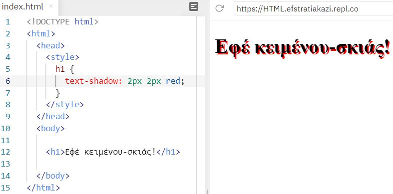

3. Έπειτα, προσθέτουμε ένα εφέ θόλωσης στη σκιά, στο παράδειγμα επιλέξαμε το 5px:

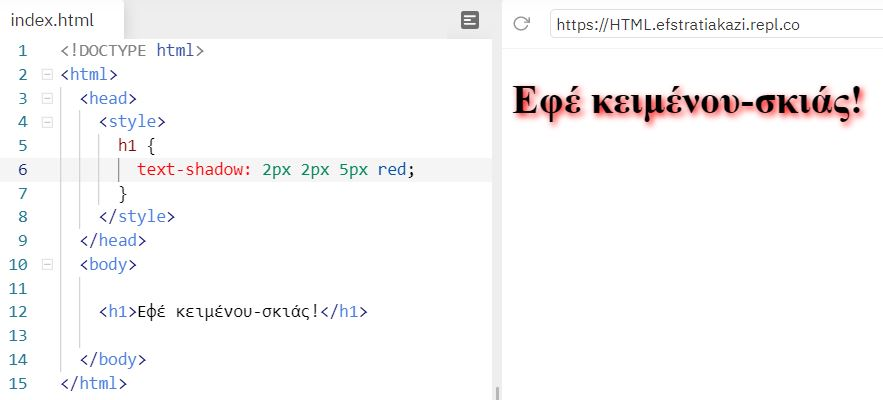
