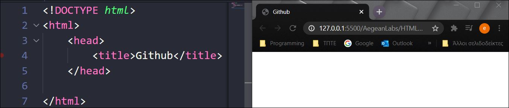

# Δομή HTML

## Βασικά tags (ετικέτες)

- To tag ```<!DOCTYPE HTML>```
Aυτό το tag είναι το πρώτο που μπορούμε να χρησιμοποιήσουμε στο έγγραφο μας και γράφεται πριν το tag ```<html>```. Το ```<!DOCTYPE>``` λέει στον Browser ποιο πρότυπο της HTML ή της XHTML θα χρησιμοποιηθεί στο έγγραφο.

- Tα tags ```<html>...</html>```
Ένα αρχείο **HTML** αρχίζει πάντα με το tag ```<html>``` και τελειώνει με το tag ```</html>```. Τα tags αυτά ενημερώνουν τον Βrowser ότι το περιεχόμενο της σελίδας είναι γραμμένο σε HTML κώδικα και τοποθετείται κάτω απο το ```<!DOCTYPE>```.

```html
<!DOCTYPE html>
<html>

</html>
```

## Βασικές ενότητες

### Ενότητα head

Η πρώτη ενότητα μιας HTML σελίδας ονομάζεται **head** και ορίζεται με το ανοιχτό tag ```<head>``` και το κλειστό tag ```</head>```.Υπάρχουν μόνο λίγα tags που γράφονται στην μέσα στην ενότητα αυτή. Τα tags αυτά, αποτελούν τον *πρόλογο* για την HTML σελίδα, δηλαδή παρέχουν πληροφορίες στον Βrowser. **ΠΡΟΣΟΧΗ** Ο Browser δεν εμφανίζει στην οθόνη ότι είναι γραμμένο μέσα στο head.

```html
<!DOCTYPE html>
<html>
    <head>

    </head>

</html>
```

Ποια tags γράφονται μέσα στην ενότητα head;

- Τα tags ```<title>...</title>```

Oρίζουν τον τίτλο μιας HTML σελίδας



Στο παραπάνω παράδειγμα αριστερά φαίνεται ο πηγαίος κώδικας και δεξιά πως εμφανίζεται ο τίτλος στο broswer

- Το tag ```<meta>```

Το tag ```<meta>``` περιέχει μετα-πληροφορίες (meta-information) για το HTML έγγραφο όπως ο συγγραφέας, η περιγραφή του εγγράφου, λέξεις κλειδιά που διαβάζονται από τις μηχανές αναζήτησης κτλ. Eίναι μια σειρά πρακτικών για να γίνει μια ιστοσελίδα περισσότερο φιλική στις μηχανές αναζήτησης, δηλαδή βοηθάει να βρίσκεται μια ιστοσελίδα όσο πιο ψηλά γίνεται στα αποτελέσματα των μηχανών αναζήτησης. ***Δεν έχει κλειστό tag***.

### Ενότητα body

Η δεύτερη ενότητα μιας HTML σελίδας ονομάζεται **body** και ορίζεται με το ανοιχτό tag ```<body>``` και την κλειστό tag ```</body>```.

Το ζευγάρι των tags ```<body>...</body>``` ορίζουν το ***κυρίως περιεχόμενο*** της σελίδας, περιέχουν όλα τα περιεχόμενα ενός εγγράφου HTML, όπως επικεφαλίδες, παραγράφους, εικόνες, υπερσυνδέσμους, πίνακες, λίστες κ.λπ. (Αναλυτικότερα [εδώ](tags.md))

### Σημείωση

Όταν ένας browser διαβάζει ένα HTML έγγραφο, αγνοεί τα διαδοχικά κενά διαστήματα, τα tabs και τις αλλαγές γραμμών που βρίσκονται στον πηγαίο κώδικα HTML. Απλά αν υπάρχουν διαδοχικά κενά διαστήματα, τα tabs και τις αλλαγές γραμμών φαίνεται πιο ομοιόμορφο.
