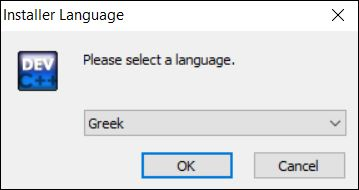
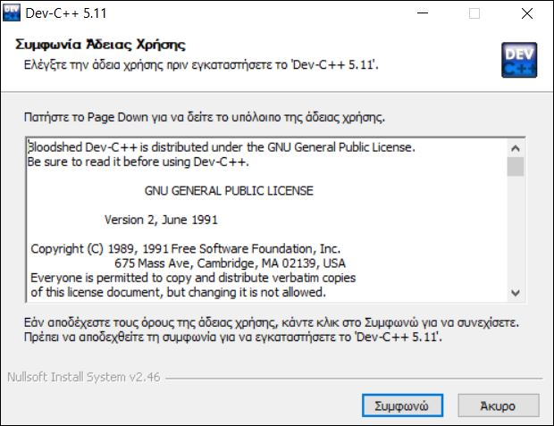
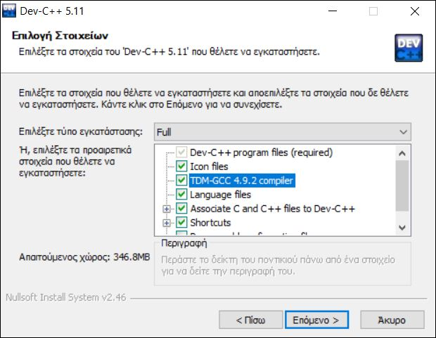
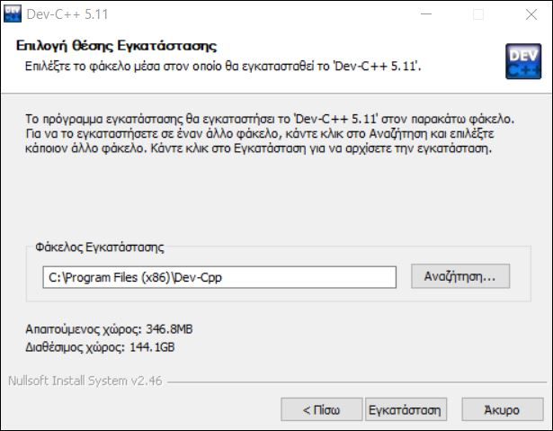
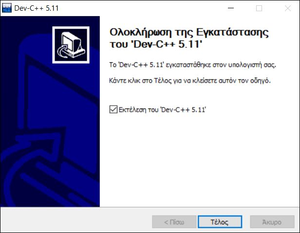
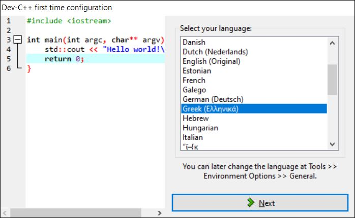
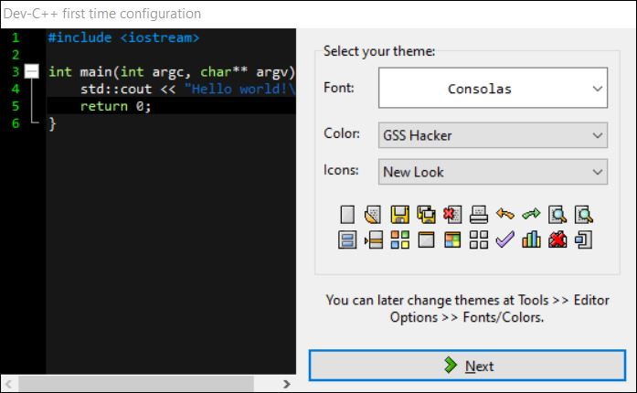
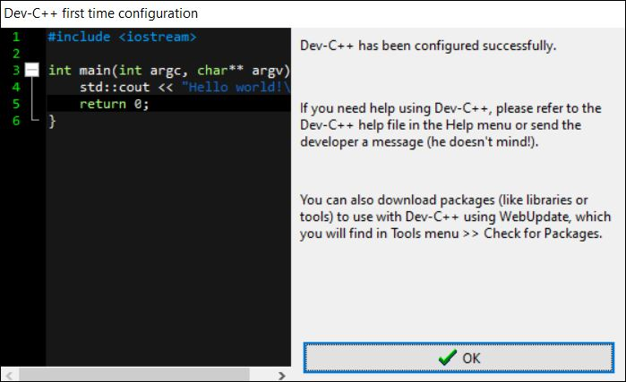

# Εγκατάσταση Dev C++

Το **Dev C++** είναι ένα δωρεάν ολοκληρωμένο περιβάλλον ανάπτυξης (IDE) πλήρους δυνατότητας που διανέμεται βάσει της άδειας GNU General Public License για προγραμματισμό σε C και C ++ .

Για την εγκατάστασή του ακολουθήστε τα εξής βήματα:

1.Για την λήψη της τελευταίας έκδοσης μεταβαίνουμε στον ιστότοπο του προγράμματος [εδώ](http://orwelldevcpp.blogspot.com/), όπου μπορούμε
να δούμε όλα τα νέα για το πρόγραμμα, ή στον ιστότοπο απ όπου μπορούμε να κατεβάσουμε απευθείας το πρόγραμμα [εδώ](https://sourceforge.net/projects/orwelldevcpp/).
2. Το αρχείο θα κατέβει στον φάκελο «λήψεις» ή «Downloads» ή όπου αλλού έχετε εσείς ρυθμίσει τον υπολογιστή σας να αποθηκεύει τα αρχεία που κατεβαίνουν από το internet.
3. Στο πρώτο παράθυρο της εγκατάστασης που θα εμφανιστεί θα πρέπει να επιλέξετε τη γλώσσα εγκατάστασης του προγράμματος (επίλεξτε αν επιθυμείτε τα ελληνικά).

4. Έπειτα θα επιλέξετε το πεδίο που αναγράφει **Συμφωνώ** χωρίς να χρειαστεί να κάνετε κάποια άλλη αλλαγή (το πρόγραμμα ζητάει να αποδεχτείτε την άδεια χρήσης).

5. Στη συνέχεια το πρόγραμμα ζητάει τα στοιχεία τα οποία θα εγκαταστήσει, οπότε τσεκάρετε τις επιλογές που εμφανίζονται στην εικόνα και πατήστε το πεδίο που αναγράφει **Επόμενο** (μη ξεχνάτε να τσεκάρετε την επιλογή **TDM-GCC 4.9.2 compiler**).

6. Ύστερα το πρόγραμμα ζητάει να δηλώσετε το φάκελο στον οποίο θα γίνει η εγκατάσταση (βάζοντας το στο πεδίο που εμφανίζεται στην εικόνα) και επίλεξτε το **Εγκατάσταση**.

7. Επιλέγοντας το **Εγκατάσταση** θα ξεκινήσει και θα ολοκληρωθεί η εγκατάσταση, στο τέλος της οποίας θα εμφανιστεί αντίστοιχο μήνυμα και προτροπή για να ξεκινήσει η εφαρμογή, οπότε και το επόμενο βήμα είναι να επιλέξετε το κουμπί **Τέλος**.

8. Κατά την πρώτη εκτέλεση της εφαρμογής θα εμφανιστεί πλαίσιο διαλόγου το οποίο θα σας ρωτήσει για τη γλώσσα εμφάνισης του προγράμματος (επιλέξτε αν επιθυμείτε τα ελληνικά) και έπειτα πατήστε **Next**.

9. Αμέσως μετά θα εμφανιστεί ένα πλαίσιο που θα ρωτήσει για τις παραμέτρους του περιβάλλοντος (επιλέγετε με δική σας αισθητική πρωτοβουλία) και αποδέχεστε πατώντας **Next**.

10. Η εφαρμογή πλέον έχει εγκατασταθεί και πρέπει να λειτουργεί κανονικά επιλέγοντας το κουμπί **ΟΚ**.

