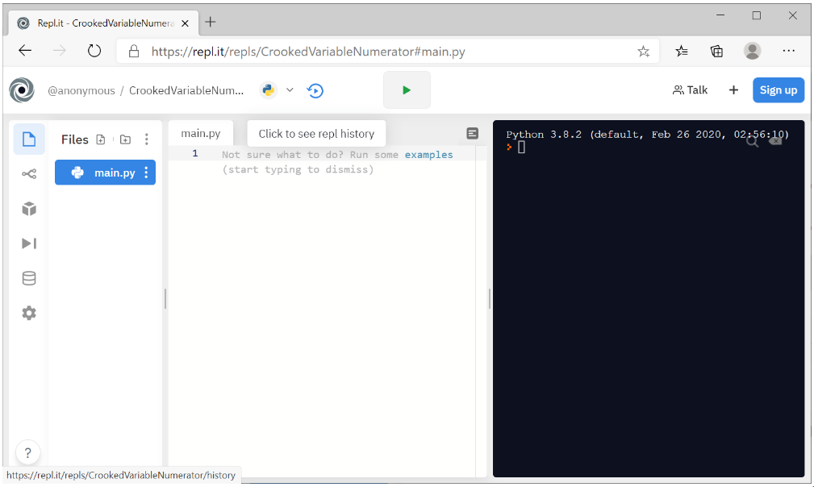

# 1 Εισαγωγή στην Python - Βασικές έννοιες

---

## Περιεχόμενα

---

- 1.1 Ιστορική Αναδρομή της Python
- 1.2 Η Python σήμερα
- 1.3 Τα βασικά χαρακτηριστικά της Python
- 1.4 Βασικά πλεονεκτήματα της Python
- 1.5 Μερικές από τις περιοχές εφαρμογών της Python
- 1.6 Περιβάλλον εργασίας

## 1.1 Ιστορική Αναδρομή της Python

---

Ξεκίνησε να αναπτύσσεται το Δεκέμβριο του 1989 από τον Guido van Rossum στο ερευνητικό κέντρο CWI (Centrum voor Wiskunde en Informatica) της Ολλανδίας. Η έκδοση 2.0 δημοσιεύτηκε στις 16 Οκτωβρίου 2000 και η έκδοση 3.0, η οποία δεν είναι, εν γένει, σύμφωνη (compatible) με τις προηγούμενες εκδόσεις, στις 3 Δεκεμβρίου 2008.

Το όνομα της γλώσσας προέρχεται από την τηλεοπτική σειρά του BBC `Monty Python's Flying Circus` (1969-74) της οποίας ο Guido van Rossum υπήρξε φανατικός οπαδός.

## 1.2 Η Python σήμερα

---

- Σύμφωνα με την εταιρία αξιολόγησης λογισμικού TIOBE είναι η 3η δημοφιλέστερη γλώσσα με 11.3% των προγραμμάτων να γράφονται σε αύτη.
- Λόγω της φύσης της είναι πιο παραγωγική από συνηθισμένες γλώσσες (C, Java, κτλ.).
- Χρησιμοποιείται σε ευρεία κλίμακα για επιστημονικές εφαρμογές, από αστροφυσική (Astropy) έως βιολογία (Biopy).

## 1.3 Τα βασικά χαρακτηριστικά της Python

---

Τα πιο βασικά χαρακτηριστικά της γλώσσας Python είναι:

- Χρησιμοποιεί διερμηνευτή (Interpreter). Το πρόγραμμα διερμηνεύεται και εκτελείται γραμμή-προς-γραμμή.
- Δεν υπάρχει δήλωση μεταβλητών και παραμέτρων.
- Είναι case-sensitive. Αυτό σημαίνει ότι η μεταβλητή name είναι διαφορετική από την Name. Όπως επίσης ότι η τιμή μιας Boolean μεταβλητής είναι True και όχι true.
- Είναι φτιαγμένη για να επεκτείνεται εύκολα. Για αυτό η βασική έκδοση της γλώσσας είναι ιδιαίτερα μικρή.
- Ως δυναμική γλώσσα είναι ιδιαίτερα αργή, αλλά επιτρέπει την εκτέλεση χρονοβόρων κομματιών σε C.
- Είναι Αντικειμενοστρεφής (object oriented). Τα πάντα στην Python είναι αντικείμενα (με ιδιότητες και μεθόδους χειρισμού).

## 1.4 Βασικά πλεονεκτήματα της Python

---

- Απλή σύνταξη - άμεσα κατανοητός κώδικας.
- Τρέχει σχεδόν σε όλα τα λειτουργικά συστήματα. 
- Τεράστιος αριθμός από βιβλιοθήκες συναρτήσεων για κάθε χρήση NumPy, matplotlib, Tkinter, Pandas, PyGame ...

## 1.5 Μερικές από τις περιοχές εφαρμογών της Python

---

- Επιστημονικός προγραμματισμός / Αριθμητική ανάλυση (Scientific /Numeric Computing)
- Επιστήμη Δεδομένων και Μηχανική Μάθηση (Data Science & Machine Learning)
- Ανάπτυξη εφαρμογών Web (Web Application Development)
- Ανάπτυξη διεπαφής χρήστη-υπολογιστή (GUI Programming)
- Ανάπτυξη παιχνιδιών (Game programming)

## 1.6 Περιβάλλον εργασίας

---

Υπάρχουν πολλοί τρόποι για να εγγραφεί κανείς στο [Repl.it](repl.it). Καταρχάς μπορούμε να δημιουργήσουμε ένα λογαριασμό δίνοντας ένα username, ένα E-mail και ένα password. Έπειτα δηλώνουμε ότι ήμαστε εκπαιδευτικοί επιλέγοντας το πλαίσιο που λέει : “I’m a teacher” και τέλος πατάμε το κουμπί “Sign up”. Μπορούμε να εγγραφούμε και με έναν ήδη υπάρχων λογαριασμό από το Google (gmail), το Github ή το Facebook. Στη συνέχεια μας καλωσορίζει στην πλατφόρμα, όπου στην περίπτωση που έχουμε εγγραφεί με τον πρώτο τρόπο πρέπει να επικυρώσουμε τη διεύθυνση email πηγαίνοντας στο αντίστοιχο email που μας έχει σταλεί αυτόματα στη διεύθυνση που δώσαμε κατά την εγγραφή. Μετά την εγγραφή μας καλωσορίζει στην αρχική σελίδα του [Repl.it](repl.it).

Στο "Home" βρίσκουμε την αρχική σελίδα και αριστερά βλέπουμε ένα panel για την περιήγηση στη σελίδα. Στο "My Repls" μπορούμε να δούμε όλα τα προγράμματα που έχουμε δημιουργήσει και μπορούμε να οργανώσουμε καλύτερα τα προγράμματά μας σε φακέλους, σαν να ήμασταν στον υπολογιστή μας. Με το "new repl" μπορούμε να δημιουργήσουμε ένα καινούριο πρόγραμμα και με το "new folder" ένα νέο κενό φάκελο. Τέλος, μπορούμε να σβήσουμε ή να μετονομάσουμε ένα αρχείο ή ένα φάκελο πατώντας τις τρεις κάθετες τελείες που εμφανίζονται δεξιά από το όνομα του αρχείου ή του φακέλου (για να διαγραφεί ένας φάκελος μας λέει να γράψουμε το όνομα του φακέλου που θέλουμε να διαγράψουμε σαν δικλείδα ασφαλείας για να μη χάσουμε κάποιο αρχείο κατά λάθος).

ΠΡΟΣΟΧΗ! Στις ρυθμίσεις στο πεδίο indent type πρέπει να είναι πάντα επιλεγμένο το `spaces` και ΌΧΙ το `tabs`.

---

[Home](../README.md) | [Lab 1](lab_01.md) | [Lab 2](lab_02.md) | [Lab 3](lab_03.md) | [Lab 4](lab_04.md) | [Lab 5](lab_05.md) | [Lab 6](lab_06.md) | [Lab 7](lab_07.md) | [Lab 8](lab_08.md) | [Lab 9](lab_09.md) | [Lab 10](lab_10.md)
