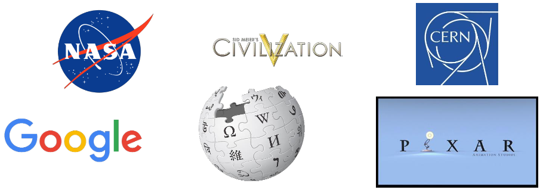

# 1 Εισαγωγή στην γλώσσα προγραμματισμού Python

---

## Περιεχόμενα

---

- 1.1 Η γλώσσα Python - Ιστορική αναδρομή
- 1.2 Η Python σήμερα
- 1.3 Χαρακτηριστικά
- 1.4 Περιβάλλον εργασίας
- 1.5 Βήματα

## 1.1 Η γλώσσα Python - Ιστορική αναδρομή

---

- Άρχισε να φτιάχνεται το 1989 από τον GuidovanRossum.
- Η πρώτη έκδοση βγήκε το 1991.
- Το 2000 βγήκε η Python2.0, με πολλά νέα στοιχεία. Περίπου την ίδια περίοδο, η ανάπτυξη της γλώσσας έγινε open-sourceμε την δημιουργία του PythonSoftware Foundation.
- Το 2008 βγήκε η Python3.0, με σημαντικές διαφορές από τις προηγούμενες εκδόσεις.
- Περισσότερες πληροφορίες στο *www.python.org*.

## 1.2 Η Python σήμερα

---

- Σύμφωνα με την εταιρία αξιολόγησης λογισμικού TIOBE είναι η 3η δημοφιλέστερη γλώσσα με 11.3% των προγραμμάτων να γράφονται σε αύτη.
- Λόγω της φύσης της είναι πιο παραγωγική από συνηθισμένες γλώσσες (C, java, κτλ).
- Χρησιμοποιείται σε ευρεία κλίμακα για επιστημονικές εφαρμογές, από αστροφυσική (Astropy) έως βιολογία (Biopy).

## 1.3 Χαρακτηριστικά

---

- Είναι δυναμική γλώσσα (δεν υπάρχει compiler).
- Δεν υπάρχει δήλωση μεταβλητών και παραμέτρων (όπως σε άλλες γλώσσες).
- Είναι case-sensitive. Αυτό σημαίνει ότι η μεταβλητή nameείναι διαφορετική από την Name. Όπως επίσης ότι η τιμή μιας Booleanμεταβλητής είναι Trueκαι όχι true.
- Είναι φτιαγμένη για να επεκτείνεται εύκολα. Για αυτό η βασική έκδοση της γλώσσας είναι ιδιαίτερα μικρή.
- Ως δυναμική γλώσσα είναι ιδιαίτερα αργή, αλλά επιτρέπει την εκτέλεση χρονοβόρων κομματιών σε C.

## 1.4 Περιβάλλον εργασίας

---

## 1.5 Βήματα

---

- Πηγαίνουμε στη σελίδα *repl.it*.
- Πατάμε το Start coding και από τις γλώσσες (languages) επιλέγουμε `Python`.Στη συνέχεια πατάμε Create repl.
- ΠΡΟΣΟΧΗ! Στις ρυθμίσεις στο πεδίο indent type πρέπει να είναι πάντα επιλεγμένο το `spaces` και ΌΧΙ το `tabs`.

[**Home**](../README.md) | [**Εργαστήριο 2**](lab_02.md)