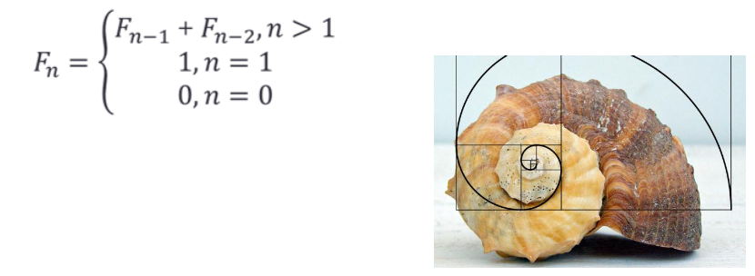

# 6 Εντολή επανάληψης - for

---

## Περιεχόμενα

---

- 6.1 Εντολή επανάληψης - for
- 6.2 Παραδείγματα
- 6.3 Ασκήσεις

## 6.1 Εντολή επανάληψης - for

---

```python
for i in list:
    ...E1
    ...E2
```

Η μεταβλητή i, σε κάθε επανάληψη, θα παίρνει την επομένη τιμήτης λίστας list.

```python
for i in range([start], stop, [step]):
  ...E1
  ...E2
```

- start, ο αριθμός εκκίνησης (Προαιρετικό,ΑρχικήΤιμή = 0)
- stop, δημιούργησε αριθμούς μέχρι (αλλά χωρίς) τον stop
- step, η διαφορά μεταξύ δύο αριθμών (Προαιρετικό, Αρχική Τιμή = 1)

## 6.2 Παραδείγματα

---

### [Παράδειγμα 1](source/lab_06/lab_06_example_1.py)

Να γραφεί ένα πρόγραμμα το οποίο θα δέχεται έναν αριθμό και θα τυπώνει το άθροισμα όλων των ακεραίων μέχρι και αυτόν τον αριθμό.

```python
# Αρχικοποίηση μεταβλητών
athroisma = 0

# Εισαγωγή δεδομένων
number = int(input("Δώσε αριθμό: "))

for i in range(number + 1):
  athroisma = athroisma + i

# Εκτύπωση αποτελέσματος
print(athroisma)
```

Για να κατεβάσετε τον κώδικα πατήστε [εδώ](source/lab_06/lab_06_example_1.py)

### [Παράδειγμα 2](source/lab_06/lab_06_example_2.py)

Να γραφεί ένα πρόγραμμα το οποίο θα δέχεται έναν αριθμό και θα ελέγχει εάν είναι πρώτος.(Πρώτος είναι ένας αριθμός που διαιρείται μόνο από το 1 και τον εαυτό του).

```python
# Αρχικοποίηση μεταβλητών
prime = True

# Εισαγωγή δεδομένων
number = int(input("Δώσε αριθμό: "))

for i in range(2, number // 2 + 1):
  if number % i == 0:
    prime = False

# Εκτύπωση αποτελέσματος
print(prime)
```

Για να κατεβάσετε τον κώδικα πατήστε [εδώ](source/lab_06/lab_06_example_2.py)

### [Παράδειγμα 3](source/lab_06/lab_06_example_3.py)

Να γραφεί ένα πρόγραμμα το οποίο θα δέχεται μία λέξη και θα μετράει πόσες φορές περιέχει το γράμμα 'e'.

```python
# Αρχικοποίηση μεταβλητών
counter = 0

# Εισαγωγή δεδομένων
leksi = input("Δώσε λέξη: ")

for gramma in leksi:
  if gramma == 'e':
    counter += 1

# Εκτύπωση αποτελέσματος
print(counter)
```

Για να κατεβάσετε τον κώδικα πατήστε [εδώ](source/lab_06/lab_06_example_3.py)

## 6.3 Ασκήσεις

---

### [Άσκηση 1](source/lab_06/lab_06_exercise_1.py)

Μία αθλήτρια του στίβου αγωνίστηκε στο έπταθλο. Να γραφεί πρόγραμμα που θα διαβάζει τη βαθμολογία σε κάθε ένα από τα 7 αθλήματα που συμμετείχε (ο βαθμός είναι ακέραιος αριθμός μεταξύ 0- 20). Για να βγει η τελική βαθμολογία κάθε αθλήματος, η βαθμολογία του πρώτου αθλήματος πολλαπλασιάζεται με το 5, του δεύτερου αθλήματος με το 10, του τρίτου με το 15, του τετάρτου με το 20, του πέμπτου με το 25, του έκτου με το 30 και του έβδομου με το 35. Ο τελικός βαθμός είναι ο μέσος όρος της τελικής βαθμολογίας των επτά αθλημάτων. Το πρόγραμμα να εμφανίζει τον τελικό βαθμό.

```python
# Αρχικοποίηση μεταβλητών
sum = 0
ls = []

for i in range(7):
  # Εισαγωγή δεδομένων
  vathmos = int(input("Δώσε βαθμό: "))
  ls.append(vathmos)

# Αρχικοποίηση μεταβλητών
k = 1

for i in ls:
  i = i * 5 * k
  k = k + 1
  um = sum + i

# Υπολογισμός μέσου όρου
mo = sum / 7

# Εκτύπωση αποτελέσματος
print("Ο μέσος όρος είναι", mo)
```

Για να κατεβάσετε τον κώδικα πατήστε [εδώ](source/lab_06/lab_06_exercise_1.py)

### [Άσκηση 2](source/lab_06/lab_06_exercise_2.py)

Να γραφεί πρόγραμμα το οποίο θα διαβάζει 10 αριθμούς. Μετά θα δέχεται έναν αριθμό και θα εμφανίζει στον χρήστη ποιοι από τους αριθμούς που εισήχθησαν διαιρούνται από αυτόν.

```python
# Αρχικοποίηση μεταβλητών
list = []

for i in range(10):
  # Εισαγωγή δεδομένων
  list.append(int(input("Δώσε αριθμό: ")))

# Εισαγωγή δεδομένων
num = int(input("Δώσε αριθμό για έλεγχο διαιρετέων: "))

for arithmos in list:
  if arithmos % num == 0:
    # Εκτύπωση αριθμού
    print(arithmos)
```

Για να κατεβάσετε τον κώδικα πατήστε [εδώ](source/lab_06/lab_06_exercise_2.py)

### [Άσκηση 3](source/lab_06/lab_06_exercise_3.py)

Να γραφεί ένα πρόγραμμα το οποίο θα δέχεται από τον χρήστη έναν αριθμό ν και θα εμφανίζει τους πρώτους αριθμούς μεταξύ 1 – ν.

```python
# Εισαγωγή δεδομένων
limit = int(input("Δώσε αριθμό: "))

for i in range(1, limit+1):
  prime = True
  for j in range(2, i//2+1):
    if i % j == 0:
      prime = False
    if prime:
      # Εκτύπωση αποτελέσματος
      print(i)
```

Για να κατεβάσετε τον κώδικα πατήστε [εδώ](source/lab_06/lab_06_exercise_3.py)

### [Άσκηση 4](source/lab_06/lab_06_exercise_4.py)

Να γραφεί ένα πρόγραμμα που θα δέχεται από τον χρήστη μια λέξη και θα εμφανίζει πόσες φορές εμφανίστηκε το κάθε γράμμα.

```python
# Αρχικοποίηση μεταβλητών
grammata = "abcdefghijklmnopqrstuvwxyz"

# Εισαγωγή δεδομένων
leksi = input("Δώσε λέξη: ").lower()

for letter in grammata:
  counter = 0
  for grammaLeksis in leksi:
    if grammaLeksis == letter:
      counter += 1
  if counter != 0:
    # Εκτύπωση αποτελέσματος
    print("To γράμμα '%s' εμφανίστηκε %d φορές." % (letter, counter))
```

Για να κατεβάσετε τον κώδικα πατήστε [εδώ](source/lab_06/lab_06_exercise_4.py)

### [Άσκηση 5](source/lab_06/lab_06_exercise_5.py)

Να γραφεί ένα πρόγραμμα που θα δέχεται έναν αριθμό Ν και θα επιστρέφει τον Ν-οστο αριθμό Fibonacci. Στον παρακάτω πίνακα μπορείτε να δείτε τον αριθμό που επιστρέφει η ακολουθία Fibonacci ανάλογα τον αριθμό που δίνουμε.


Ένας αριθμός Fibonacci υπολογίζεται από τον τύπο:



```python
# Εισαγωγή δεδομένων
fib_no = input("Δώσε αριθμό Fibonacci:")

while not fib_no.isdigit():
  # Εισαγωγή δεδομένων
  fib_no = input("Δώσε σωστό αριθμό Fibonacci:")

# Μετατροπή από str σε int
fib_no = int(fib_no)

# Αρχικοποίηση μεταβλητών
fib_minus_2 = 0
fib_minus_1 = 1

if fib_no == 1:
  fib = 1
elif fib_no == 0:
  fib = 0
else:
  for i in range(fib_no-1):
    fib = fib_minus_1 + fib_minus_2
    fib_minus_2 = fib_minus_1
    fib_minus_1 = fib

# Εκτύπωση αποτελέσματος
print(fib)
```

Για να κατεβάσετε τον κώδικα πατήστε [εδώ](source/lab_06/lab_06_exercise_5.py)

[Home](../README.md) | [Lab 1](lab_01.md) | [Lab 2](lab_02.md) | [Lab 3](lab_03.md) | [Lab 4](lab_04.md) | [Lab 5](lab_05.md) | [Lab 6](lab_06.md) | [Lab 7](lab_07.md) | [Lab 8](lab_08.md) | [Lab 9](lab_09.md) | [Lab 10](lab_10.md)
