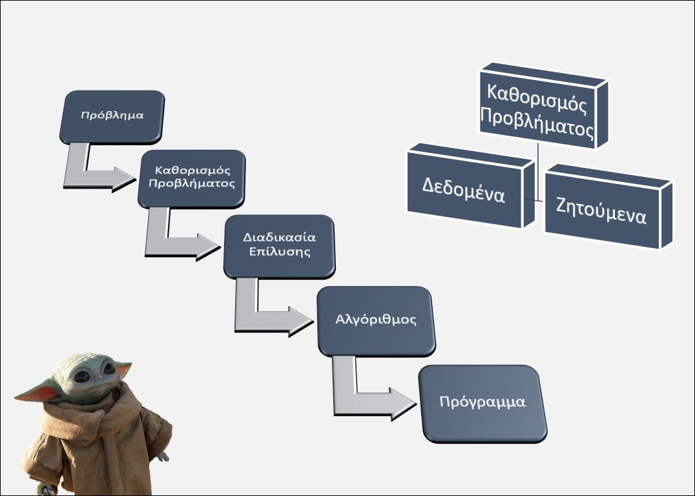
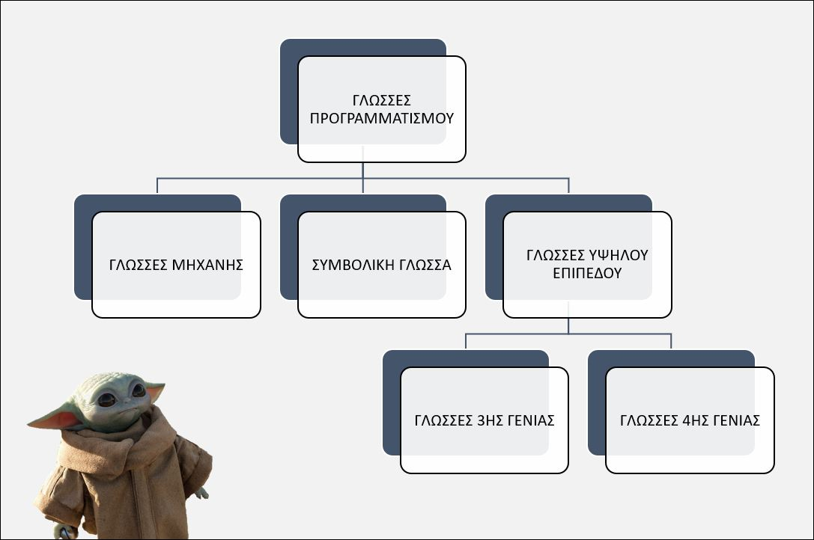
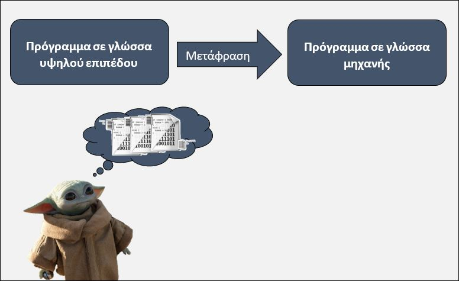

[](https://hits.seeyoufarm.com)

# 1 Βασικές Έννοιες

---

## Περιεχόμενα

---

- 1.1 Η έννοια του προβλήματος
- 1.2 Γλώσσες προγραμματισμού
- 1.3 Κατηγορίες γλωσσών υψηλού επιπέδου
- 1.4 Ο πηγαίος κώδικας
- 1.5 Μετάφραση πηγαίου κώδικα
- 1.6 Compiler
- 1.7 Interpreter
- 1.8 Προγραμματιστικό περιβάλλον
- 1.9 Δομή Προγράμματος στη Python
- 1.10 Σχόλια
- 1.11 Τι είναι οι μεταβλητές
- 1.12 Στοιχεία μεταβλητής
- 1.13 Εκχώρηση τιμής
- 1.14 Επιτρεπτά σύμβολα
- 1.15 DIV και MOD
- 1.16 Δεσμευμένες λέξεις
- 1.17 Ιεραρχία πράξεων

## 1.1 Η έννοια του προβλήματος

---

Γενικότερα, ως **πρόβλημα** θεωρούμε κάθε ζήτημα που τίθεται προς επίλυση, κάθε κατάσταση που μας απασχολεί και πρέπει να αντιμετωπιστεί. Η πρώτη μας ενέργεια για να λύσουμε πιο εύκολα ένα πρόβλημα, είναι η καταγραφή των δεδομένων. **Δεδομένα** προβλήματος είναι τα στοιχεία που μας είναι γνωστά και μπορούν να μας βοηθήσουν στη λύση του προβλήματος. Σε κάθε πρόβλημα ψάχνουμε να βρούμε την απάντηση σε μια ερώτηση. Αυτό που ψάχνουμε είναι το **ζητούμενο**. Η διαδικασία μέσω της οποίας βρίσκουμε το ζητούμενο και επιτυγχάνουμε τον επιθυμητό στόχο ονομάζεται **επίλυση προβλήματος**. **Αλγόριθμο** ονομάζουμε κάθε πεπερασμένη και αυστηρά καθορισμένη σειρά βημάτων (οδηγιών) για την επίλυση ενός προβλήματος. Τα βήματα που ακολουθούμε, για παράδειγμα, κατά την εκτέλεση μιας μαγειρικής συνταγής ή την επίλυση ενός μαθηματικού προβλήματος αποτελούν έναν αλγόριθμο. Όταν ακολουθήσουμε τα βήματα ενός αλγορίθμου, θα πρέπει στο τέλος να προκύψει ένα αποτέλεσμα. Επίσης, ένας αλγόριθμος θα πρέπει κάποτε να τελειώνει. Ένας αλγόριθµος υλοποιείται µε τη χρήση **Προγράµµατος στον Η/Υ**. Το πρόγραµµα υλοποιείται σε µια **γλώσσα προγραµµατισµού**.



## 1.2 Γλώσσες Προγραμματισμού

---

Οι **γλώσσες προγραμματισμού** (όπως άλλωστε και οι ανθρώπινες γλώσσες) ορίζονται από ένα σύνολο συντακτικών και εννοιολογικών κανόνων, που ορίζουν τη δομή και το νόημα, αντίστοιχα, των προτάσεων της γλώσσας.



### 1.2.1 Γλώσσα Μηχανής

---

Το πρόγραμμα περιέχει εντολές που είναι σε δυαδική μορφή, άμεσα κατανοητή από τον Η/Υ (όχι όμως από τον άνθρωπο). Δηλαδή, το πρόγραμμα αποτελείται από ακολουθίες 0 και 1.

**Πλεονεκτήματα**:

- Ταχύτατη εκτέλεση των εντολών.
- Δεν απαιτείται μεταφραστικό πρόγραμμα.

**Μειονεκτήματα**:

- Το γράψιμο του προγράμματος είναι μία ιδιαίτερα επίπονη και χρονοβόρα
διαδικασία.
- Απαιτείται βαθιά γνώση της αρχιτεκτονικής του Η/Υ.
- Το πρόγραμμα «τρέχει» μόνο στο συγκεκριμένο τύπο του Η/Υ.

### 1.2.2 Συμβολικές γλώσσες

---

Οι εντολές που είναι σε μορφή 0 και 1 αντικαθίστανται από μνημονικά (συμβολικά) ονόματα. Για παράδειγμα, η εντολή `100001100` αντικαθίστανται από το `ADD`.

**Πλεονεκτήματα**:

- Ταχύτατη εκτέλεση των εντολών.
- Η μορφή του προγράμματος είναι καλύτερα κατανοητή από τον άνθρωπο σε σχέση με τη γλώσσα μηχανής.

**Μειονεκτήματα**:

- Απαιτείται η χρήση ενός μεταφραστικού προγράμματος ώστε οι συμβολικές εντολές να μετατραπούν στις αντίστοιχες δυαδικές. Το ειδικό αυτό πρόγραμμα ονομάζεται **συμβολομεταφραστής** (assembler).
- Το γράψιμο του προγράμματος εξακολουθεί να είναι μία ιδιαίτερα επίπονη και χρονοβόρα διαδικασία.
- Απαιτείται βαθιά γνώση της αρχιτεκτονικής του Η/Υ.
- Το πρόγραμμα «τρέχει» μόνο στο συγκεκριμένο τύπο του Η/Υ.

### 1.2.3 Γλώσσες υψηλού επιπέδου

---

Λέγονται έτσι διότι τα προγράμματα διατυπωμένα σε μία τέτοια γλώσσα είναι άμεσα κατανοητά από τον άνθρωπο (αλλά όχι από τον Η/Υ) αφού χρησιμοποιείται μία γλώσσα που είναι αρκετά περιγραφική όπως μία φυσική γλώσσα.

**Πλεονεκτήματα**:

- Η μορφή του προγράμματος είναι εύκολα κατανοητή από τον άνθρωπο σε σχέση με τη γλώσσα μηχανής ή τη συμβολική γλώσσα.
- Το γράψιμο του προγράμματος δεν είναι πλέον μία ιδιαίτερα επίπονη και χρονοβόρα διαδικασία όπως συμβαίνει με τη γλώσσα μηχανής ή τη συμβολική γλώσσα.
- Δεν απαιτείται σχεδόν καμία γνώση της αρχιτεκτονικής του Η/Υ. Συνεπώς, είναι ανεξάρτητα από την αρχιτεκτονική του Η/Υ.
- Το πρόγραμμα «τρέχει» σε όλους τους τύπους Η/Υ αρκεί να υπάρχει το κατάλληλο μεταφραστικό πρόγραμμα.
- Η εκμάθηση της γλώσσας είναι εύκολη.
- Η διόρθωση λαθών και η συντήρηση των προγραμμάτων είναι ευκολότερη.

**Μειονεκτήματα**:

- Απαιτείται η χρήση ενός μεταφραστικού προγράμματος ώστε οι εντολές να μετατραπούν σε πολλές δυαδικές εντολές.
- Το πρόγραμμα «τρέχει» πιο αργά σε σχέση με τα προγράμματα των συμβολικών γλωσσών ή της γλώσσας μηχανής.

## 1.3 Κατηγορίες Γλωσσών υψηλού επιπέδου

---

- **Επιστηµονικές**
  - *C*: Περιέχει αρκετά κοινά χαρακτηριστικά με τη Pascal για την ανάπτυξη δομημένων εφαρμογών αλλά παράλληλα ενσωματώνει και χαρακτηριστικά γλώσσας χαμηλού επιπέδου.
  - *Fortran*: Κατάλληλη για επίλυση επιστημονικών προβλημάτων (αριθμητικές εφαρμογές).
- **Εκπαιδευτικές**
  - *Basic*: Σκοπός της είναι να γράφονται μικρά προγράμματα που κατόπιν εκτελούνται με τη βοήθεια
διερμηνέα.
- **Τεχνητής Νοηµοσύνης**
  - *Lisp*: Δημιουργήθηκε για την ανάπτυξη προγραμμάτων στο χώρο της τεχνητής νοημοσύνης.
- **Επιστηµονικές / Εµπορικές**
  - *Pl-1*: Προσπάθησε να συνδυάσει τις δυνατότητες των γλωσσών προσανατολισμένων για εμπορικές
και επιστημονικές εφαρμογές χωρίς όμως να γνωρίσει επιτυχία.
  - *Pascal*: Γλώσσα γενικής χρήσης. Στηρίχθηκε στην ALGOL. Είναι η καταλληλότερη γλώσσα για να
μάθει κάποιος δομημένο προγραμματισμό.
  - *Python*: Γλώσσα που ανήκει ουσιαστικά σε μικτά υποδείγματα προγραμματισμού, όπως αντικειμενοστρεφές, συναρτησιακό και διαδικαστικό.
- **Αντικειµενοστρεφής**
  - *C++*: Αποτελεί μία μετεξέλιξη της C στο χώρο του αντικειμενοστραφούς προγραμματισμού και χρησιμοποιείται αρκετά στην ανάπτυξη λειτουργικών συστημάτων (π.χ. Windows) αλλά και άλλου τύπου
εφαρμογών.
  - *Java*: Γλώσσα ειδικά σχεδιασμένη για την ανάπτυξη εφαρμογών στο Internet.
- **Βάσεις Δεδοµένων**
  - *SQL*: Δεν απευθύνεται μόνο σε προγραμματιστές αλλά και χρήστες. Ο χρήστης μπορεί, σχετικά εύκολα, να υποβάλει ερωτήσεις στο σύστημα ή να αναζητά πληροφορίες από μία Βάση Δεδομένων.
- **Δηλωτικές Γλώσσες εφαρµογών Διαδικτύου**
  - *HTML*: Η HTML είναι η βασική γλώσσα δόμηση σελίδων του World Wide Web (ή απλά ιστού: Web).

## 1.4 Ο πηγαίος κώδικας

---

Ο πηγαίος κώδικας (source code) είναι το σύνολο οδηγιών και προτάσεων που γράφει ένας προγραμματιστής που χρησιμοποιεί μια γλώσσα προγραμματισμού υπολογιστών.

## 1.5 Μετάφραση πηγαίου κώδικα

---

Ο Η/Υ καταλαβαίνει µόνο τη γλώσσα µηχανής. Έτσι, ο πηγαίος κώδικας θα πρέπει να μετατραπεί σε ένα πρόγραμμα γλώσσας μηχανής. Η γλώσσα μηχανής αποτελείται από λέξεις που περιλαμβάνουν διαδοχικές σειρές μηδέν (0) και ένα (1). Τότε και μόνον τότε, το πρόγραμμα θα εκτελεστεί από τον υπολογιστή και θα παράγει αποτελέσματα. Για την μετατροπή ενός προγράµµατος από γλώσσα υψηλού επιπέδου σε γλώσσα µηχανής πρέπει να γίνει η μετάφραση.



Η γλώσσα Python διαθέτει ένα μεταφραστικό πρόγραμμα με το οποίο, για να γίνει κατανοητό και να εκτελεστεί το πρόγραμμα από τον υπολογιστή, μεταφράζεται σε γλώσσα μηχανής. Το μεραφραστικό πρόγραμμα εκτός από τη μετατροπή σε γλώσσα μηχανής ελέγχει και για συντακτικά λάθη τον πηγαίο κώδικα. Τα μεταφραστικά προγράμματα διακρίνονται σε:

- μεταλωτιστές (compilers)
- διερμηνευτές (interpreters)

## 1.6 Compiler

---

Ένας μεταγλωττιστής μετατρέπει ολόκληρο τον πηγαίο κώδικα υψηλού επιπέδου σε κώδικα μηχανής. Εάν υπάρχει σύνταξη ή σημασιολογικό σφάλμα, το πρόγραμμα δεν θα εκτελεστεί. Καθώς ο μεταγλωττιστής ελέγχει ολόκληρο το πρόγραμμα, ο χρόνος σάρωσης είναι μεγάλος, αλλά ο χρόνος εκτέλεσης είναι μικρότερος. Ως εκ τούτου, οι γλώσσες που βασίζονται σε μεταγλωττιστές, όπως το C, C ++, θεωρούνται ως γλωσσικές γλώσσες ταχέως. Συνοπτικά ο μεταγλωττιστής:

- μετατρέπει ολόκληρο το πρόγραμμα σε κώδικα μηχανής.
- εμφανίζει όλα τα σφάλματα.
- δεν τρέχει το πρόγραμμα εάν δεν διορθωθούν όλα τα σφάλματα.

## 1.7 Interpreter

---

Ένας διερμηνέας είναι ένας άλλος τύπος μεταφραστή που μετατρέπει γλώσσα προγραμματισμού υψηλού επιπέδου σε γλώσσα μηχανής. Μετατρέπει τον πηγαίο κώδικα στη γραμμή κώδικα μηχανής κατά γραμμή. Καθώς ελέγχει τον κώδικα μια γραμμή τη φορά, ο χρόνος σάρωσης είναι χαμηλότερος. Αλλά ο χρόνος εκτέλεσης είναι υψηλότερος. Ως εκ τούτου, γλώσσες που βασίζονται σε διερμηνείς όπως η Python θεωρούνται πιο αργές γλώσσες. Επιπλέον, ο διερμηνέας δηλώνει ένα σφάλμα κάθε φορά. Για να ερμηνεύσει την επόμενη γραμμή, ο προγραμματιστής πρέπει να διορθώσει το σφάλμα στην τρέχουσα γραμμή. Συνοπτικά ο διερμηνέας:

- μετατρέπει προγράμματα υψηλού επιπέδου σε κώδικες μηχανών.
- ελέγχει γραμμή με γραμμή.
- απαιτεί λιγότερη μνήμη.
- εμφανίζει ένα σφάλμα κάθε φορά.

## 1.8 Προγραμματιστικό περιβάλλον

---

Το προγραµµατιστικό περιβάλλον µιας γλώσσας είναι το λογισµικό της, το οποίο έχει τουλάχιστον τις παρακάτω λειτουργίες:

- **Editor**: Περιβάλλον στο οποίο συγγράφεται ο πηγαίος κώδικας. Αποθήκευση του αρχείου µε το extension της γλώσσας.
- **Compiler/Interpreter**: Για τη µετάφραση του πηγαίου κώδικα και τη δηµιουργία του object αρχείου.
- **Build**: Για τη δηµιουργία του exe αρχείου.
- **Run**: Για την εκτέλεση του exe αρχείου.

## 1.9 Δομή Προγράμματος στη Python

---

Συνήθως, στην αρχή ενός προγράμματος δηλώνουμε τις βιβλιοθήκες που θα χρησιμοποιηθούν. Οι βιβλιοθήκες (libaries) είναι έτοιμα υποπρογράμματα τα οποία αν τα δηλώσουμε μπορούμε να τα καλέσουμε (import) και να τα χρησιμοποιήσουμε μέσα στο δικό μας πρόγραμμα. Στη συνέχεια, δηλώνουμε τα δικά μας υποπρογράμματα (def). Στην Python χρησιμοποιούμε την **def** για τον σκοπό αυτόν. Στη συνέχεια ορίζουμε τις Κλάσεις (Class) και τέλος το κυρίως Πρόγραμμα. Λεπτομέρειες θα δούμε σε αντίστοιχες διάλέξεις παρακάτω.

- Βιβλιοθήκες (import)
- Συναρτήσεις (def)
- Κλάσεις (Class)
- Κυρίως Πρόγραµµα

## 1.10 Σχόλια

---

Καθώς γράφουμε όλο και μεγαλύτερα προγράμματα, μεγαλώνει και η δυσκολία να καταλαβαίνουμε αυτά που γράφουμε. Πολύ περισσότερο όμως, αν προσπαθήσει να τα διαβάσει κάποιος τρίτος. Χρειάζεται λοιπόν να προσθέτουμε σχόλια (comments) στα προγράμματα που γράφουμε. Τα σχόλια στη Python ξεκινούν με το χαρακτήρα `#`. Οτιδήποτε ακολουθεί μετά το `#` αγνοείται από την Python μέχρι το τέλος της γραμμής. Ένα σχόλιο μπορεί να εμφανιστεί στην αρχή μιας γραμμής ή μετά από κώδικα, αλλά
όχι μέσα σε ένα *string*. Μερικά παραδείγματα:

```python
# Αυτό είναι ένα σχόλιο
arithmos = 4 # και αυτό είναι ένα άλλο σχόλιο
onoma = "# Αυτό δεν είναι σχόλιο!"
```

## 1.11 Τι είναι οι μεταβλητές

---

Ένα από τα πιο δυνατά χαρακτηριστικά μιας γλώσσας προγραμματισμού είναι η δυνατότητα διαχείρισης μεταβλητών. Καθώς ένα πρόγραμμα εκτελείται, χρειάζεται μερικές φορές ο υπολογιστής να θυμάται κάποιες πληροφορίες που υπολογίζει το πρόγραμμά.

Μια μεταβλητή μπορεί να θεωρηθεί ως ένα κουτί που ο υπολογιστής μπορεί να χρησιμοποιήσει για να αποθηκεύσει μια τιμή. Η τιμή σε αυτό το κουτί μπορεί να αλλάξει ή να «μεταβληθεί». Ένα πρόγραμμα μπορεί να χρησιμοποιήσει πολλές μεταβλητές.

Δηλαδή οι μεταβλητές με απλά λόγια είναι θέσεις μνήμης στις οποίες αποθηκεύονται τιμές.

## 1.12 Στοιχεία μεταβλητής

---

Μια μεταβλητή έχει τρεις σημαντικές ιδιότητες:

- όνομα
- τιμή
- τύπος δεδομένων

## 1.13 Εκχώρηση τιμής

---

Με την **εντολή εκχώρισης** (assignment statement) τιμής δίνουμε τιμή σε μια μεταβλητή και ταυτόχρονα την ορίζουμε. Ας δούμε ένα παράδειγμα:

```python
# Στη μεταβλητή x αποθηκεύεται η τιμή 10
x = 10
# Στη συνέχεια αποθηκεύεται η τιμή 20
x = 20
```

Μία εντολή εκχώρησης αποτελείται από τρία μέρη: το αριστερό που υποχρεωτικά πρέπει να είναι μία μεταβλητή, το ίσον = (τελεστής εκχώρησης) και το δεξί μέρος που μπορεί να είναι μία τιμή ή μία άλλη μεταβλητή.

Για περισσότερες ασκήσεις πατήστε [εδώ](../more/docs/variables.md).

## 1.14 Επιτρεπτά σύμβολα

---

- Αριθμητικοί Τελεστές
  - `+`, `-`, `*`, `/`, `//`, `%`, `**`
- Συγκριτικοί Τελεστές
  - `==`, `<`, `>`, `<=`, `>=`, `!=`
- Λοιπά Σύμβολα
  - `:`, `.`, `,`, `:=`, `(`, `)`, `[`, `]`, `{`, `}`

## 1.15 DIV και MOD

---

- Div(ide) (`//`): Ακέραιο πηλίκο µιας διαίρεσης µεταξύ δύο ακεραίων αριθµών.
- Mod(ulo) (`%`): Το ακέραιο υπόλοιπο µίας διαίρεσης µεταξύ δύο ακεραίων αριθµών.

## 1.16 Δεσμευμένες Λέξεις

---

Οι **λέξεις κλειδιά** είναι δεσμευμένες λέξεις με ειδική σημασία και συνδέονται με τους κανόνες και τη δομή της γλώσσας. Επίσης δεν μπορούν να χρησιμοποιηθούν ως ονόματα μεταβλητών.


## 1.17 Ιεραρχία πράξεων

---

Οι **παρενθέσεις** έχουν τη μεγαλύτερη προτεραιότητα και έτσι χρησιμοποιούνται, για να «αναγκάσουν» την Python να αποτιμήσει μία έκφραση σύμφωνα με τη σειρά που θέλουμε. Εκφράσεις σε παρενθέσεις αποτιμώνται πρώτες. Επίσης, παρενθέσεις χρησιμοποιούνται, για να κάνουν τις εκφράσεις πιο αναγνώσιμες, χωρίς να αλλάξουν το τελικό αποτέλεσμα. Η **ύψωση σε δύναμη** έχει την επόμενη μεγαλύτερη προτεραιότητα. **Πολλαπλασιασμός** και **διαίρεση** έχουν την ίδια προτεραιότητα, η οποία είναι μεγαλύτερη από την **πρόσθεση** και την **αφαίρεση** που μεταξύ τους έχουν επίσης την ίδια προτεραιότητα. Για παράδειγμα:

```python
# Υπολογισμός των πράξεων και εκτύπωση των αποτελεσμάτων τους

print(2 * (4 - 1)) # Αποτέλεσμα -> 6
print(2 * 4 - 1) # Αποτέλεσμα -> 7
print((2 + 1) ** (5 - 2)) # Αποτέλεσμα -> 27
print(2 ** 1 + 1) # Αποτέλεσμα -> 3
print(2 ** (1 + 1)) # Αποτέλεσμα -> 4

# Υπολογισμός των πράξεων και εκτύπωση των αποτελεσμάτων τους

print(3 * 5 + 2) # Αποτέλεσμα -> 17
print(15 / 3 - 2) # Αποτέλεσμα -> 3.0
```

**ΠΡΟΣΟΧΗ**:

Τελεστές με την ίδια προτεραιότητα αποτιμώνται από τα αριστερά προς τα δεξιά.

Πειραματιστείτε, δώστε τις δικές σας εκφράσεις στον διερμηνευτή και δείτε τις τιμές που παράγονται.

### 1.17.1 Παραδείγματα Πράξεων

---


[Home](../README.md) | [Lect 1](lecture_01.md) | [Lect 2](lecture_02.md) | [Lect 3](lecture_03.md) | [Lect 4](lecture_04.md) | [Lect 5](lecture_05.md) | [Lect 6](lecture_06.md) | [Lect 7](lecture_07.md) | [Lect 8](lecture_08.md) | [Lect 9](lecture_09.md)
