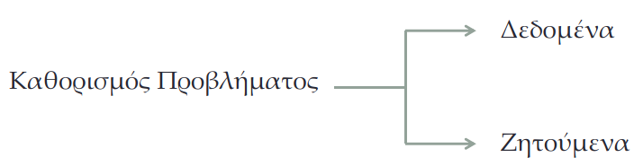
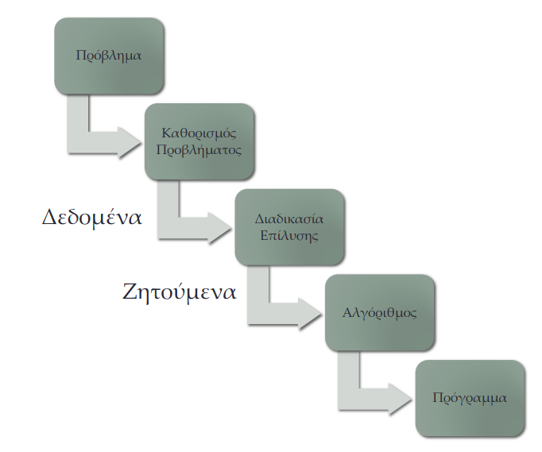
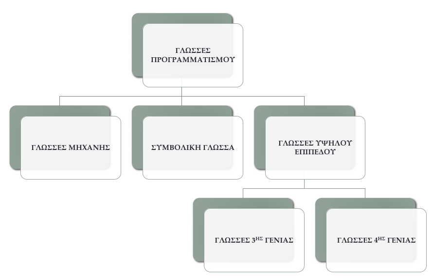
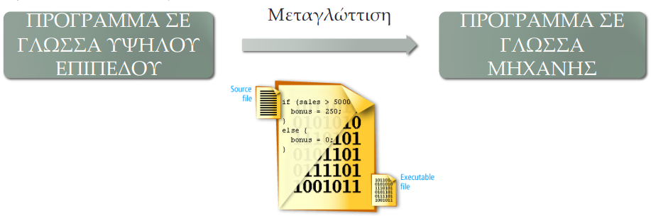
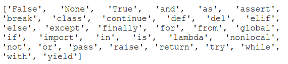
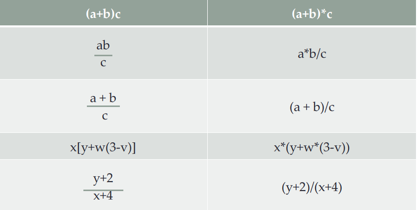

# 1 Βασικές Έννοιες

---

## Περιεχόμενα

---

- 1.1 Ανατομία ενός προβλήματος
- 1.2 Γλώσσες προγραμματισμού
- 1.3 Κατηγορίες γλωσσών υψηλού επιπέδου
- 1.4 Μεταγλώττιση - Μετάφραση
- 1.5 Compiler
- 1.6 Interpreter
- 1.7 Προγραμματιστικό περιβάλλον
- 1.8 Δομή Προγράμματος στη Python
- 1.9 Μεταβλητές
- 1.10 Ιδιότητες μεταβλητών - σταθερών
- 1.11 Επιτρεπτά σύμβολα
- 1.12 DIV και MOD
- 1.13 Δεσμευμένες λέξεις
- 1.14 Ιεραρχία πράξεων
- 1.15 Παραδείγματα πράξεων
- 1.16 Σχόλια

## 1.1 Ανατομία ενός προβλήματος

---

**Πρόβληµα**: Μια κατάσταση την οποία επιζητούµε να αλλάξουµε.

**Καθορισµός Προβλήµατος**: Η διατύπωση του προβλήµατος (δηλ. της κατάστασης που θέλουµε να αλλάξουµε) µε τέτοιο τρόπο ώστε να κάνουµε εφικτή την κατανόηση του προβλήµατος.



**Διαδικασία Επίλυσης**: Η διαδικασία µε βάση την οποία µεταβαίνουµε από τα δεδοµένα στα ζητούµενα.

**Αλγόριθμο** ονομάζουμε κάθε πεπερασμένη και αυστηρά καθορισμένη
σειρά βημάτων (οδηγιών) για την επίλυση ενός προβλήματος. Τα βήματα που
ακολουθούμε, για παράδειγμα, κατά την εκτέλεση μιας μαγειρικής συνταγής ή την επίλυση ενός μαθηματικού προβλήματος αποτελούν έναν αλγόριθμο. Όταν
ακολουθήσουμε τα βήματα ενός αλγορίθμου, θα πρέπει στο τέλος να προκύψει
ένα αποτέλεσμα. Επίσης, ένας αλγόριθμος θα πρέπει κάποτε να τελειώνει. Ένας αλγόριθµος υλοποιείται µε τη χρήση **Προγράµµατος στον Η/Υ**. Το πρόγραµµα υλοποιείται σε µια **γλώσσα προγραµµατισµού**.

Μια γλώσσα προγραµµατισµού αποτελείται από ένα σύνολο κανόνων, συµβόλων και ειδικών λέξεων τα οποία χρησιµοποιούνται στην υλοποίηση του προγράµµατος. Μια γλώσσα προγραμματισμού θα πρέπει να έχει αυστηρά ορισμένη σύνταξη και σημασιολογία.



## 1.2 Γλώσσες Προγραμματισμού

---



## 1.3 Κατηγορίες Γλωσσών υψηλού επιπέδου

---

- Επιστηµονικές (C, Fortran, ADL)
- Εµπορικές (Cobol, RDG)
- Εκπαιδευτικές (Basic, Logo)
- Τεχνητής Νοηµοσύνης για την κωδικοποίηση της λογικής (Lisp, Prolog)
- Επιστηµονικές/Εµπορικές (Pl-1, Pascal, Python)
- Αντικειµενοστρεφής (C++, Java)
- Βάσεις Δεδοµένων (SQL)
- Προγραµµατισµού Πολυµέσων (Lingo)
- Δηλωτικές Γλώσσες εφαρµογών Διαδικτύου (XML, RDF, HTML, XHTML)

## 1.4 Μεταγλώττιση - Μετάφραση

---

Ο Η/Υ καταλαβαίνει µόνο τη γλώσσα µηχανής. Για την μετατροπή ενός προγράµµατος από γλώσσα υψηλού επιπέδου σε γλώσσα µηχανής πρέπει να γίνει η µεταγλώττιση.



## 1.5 Compiler

---

- Μετατρέπει προγράμματα υψηλού επιπέδου σε κώδικες μηχανών.
- Μετατροπή ολόκληρου του προγράμματος σε κώδικα μηχανής.
- Εμφανίζει όλα τα σφάλματα.
- Δεν τρέχει το πρόγραμμα εάν δεν διορθωθούν όλα τα σφάλματα.
- C, C++, C#, ...

## 1.6 Interpreter

---

- Μετατρέπει προγράμματα υψηλού επιπέδου σε κώδικες μηχανών.
- Ο έλεγχος γίνεται γραμμή με γραμμή.
- Απαιτεί λιγότερη μνήμη.
- Εμφανίζει ένα σφάλμα κάθε φορά.
- Python, Java, Ruby, ...

## 1.7 Προγραμματιστικό περιβάλλον

---

Το προγραµµατιστικό περιβάλλον µιας γλώσσας είναι το λογισµικό της, το οποίο έχει τουλάχιστον τις παρακάτω λειτουργίες:

- **Editor**: Περιβάλλον στο οποίο συγγράφεται ο πηγαίος κώδικας. Αποθήκευση του αρχείου µε το extension της γλώσσας.
- **Compiler/Interpreter**: Για τη µετάφραση του πηγαίου κώδικα και τη δηµιουργία του object αρχείου.
- **Build**: Για τη δηµιουργία του exe αρχείου.
- **Run**: Για την εκτέλεση του exe αρχείου.

## 1.8 Δομή Προγράμματος στη Python

---

- Τµήµα Δηλώσεων, Ορισµοί Υποπρογραµµάτων
- **import** (Βιβλιοθήκες)
- **def** (Συναρτήσεις)
- **Class** (Κλάσεις)
- Κυρίως Πρόγραµµα

## 1.9 Μεταβλητές

---

Ένα από τα πιο δυνατά χαρακτηριστικά μιας γλώσσας προγραμματισμού είναι η δυνατότητα διαχείρισης μεταβλητών. Μια **μεταβλητή** (variable) είναι ένα όνομα που αναφέρεται σε μία τιμή. Η τιμή αυτή μπορεί να αλλάξει όσες φορές θέλουμε ή απαιτείται κατά την εκτέλεση του προγράμματός μας, εξ ου και ο όρος μεταβλητή. Οι μεταβλητές απλά είναι τμήματα της μνήμης του υπολογιστή μας όπου μπορούμε να αποθηκεύσουμε πληροφορία.

Η **εντολή εκχώρησης** (assignment statement) δημιουργεί νέες μεταβλητές και τους δίνει τιμές. Οι μεταβλητές έχουν επίσης τύπους και μπορούμε να ρωτήσουμε την Python ποιοι είναι. Ο τύπος μιας μεταβλητής είναι ο τύπος της τιμής στην οποία αναφέρεται. Για να χρησιμοποιήσουμε μια μεταβλητή, χρειάζεται απλά να γνωρίζουμε το όνομά της. Ας δούμε ένα παράδειγμα:

```python
day = 'Δευτέρα'

# Εκτύπωση της μεταβλητής day
print(day)
# Εκτύπωση τον τύπο της μεταβλητής day
print(type(day))

i = 10

# Εκτύπωση της μεταβλητής i
print(i)
# Εκτύπωση τον τύπο της μεταβλητής i
print(type(i))

pi = 3.14

# Εκτύπωση της μεταβλητής pi
print(pi)
# Εκτύπωση τον τύπο της μεταβλητής pi
print(type(pi))
```

Στο παραπάνω παράδειγμα έχουμε τρεις εντολές εκχώρησης:

- Η συμβολοσειρά `'Δευτέρα'` εκχωρείται στη νέα μεταβλητή που ονομάζεται day.
- Ο ακέραιος αριθμός `10` εκχωρείται στη μεταβλητή `i`.
- Ο δεκαδικός αριθμός `3.14159` εκχωρείται στη μεταβλητή  `pi`.

Μία εντολή εκχώρησης αποτελείται από τρία μέρη: το αριστερό που υποχρεωτικά πρέπει να είναι μία μεταβλητή, το ίσον = (τελεστής εκχώρησης) και το δεξί μέρος που μπορεί να είναι μία τιμή, μία άλλη μεταβλητή ή μία έκφραση που αποτιμάται (υπολογίζεται) σε μία τιμή.

## 1.10 Ιδιότητες Μεταβλητών - Σταθερών

---

- Όνοµα
- Τύπος
- Θέση Μνήµης
- Τιµή (Στις σταθερές δεν αλλάζει)

## 1.11 Επιτρεπτά σύμβολα

---

- Αριθμητικοί Τελεστές
  - `+`, `-`, `*`, `/`, `//`, `%`, `**`
- Συγκριτικοί Τελεστές
  - `==`, `<`, `>`, `<=`, `>=`, `!=`
- Λοιπά Σύμβολα
  - `:`, `.`, `,`, `:=`, `(`, `)`, `[`, `]`, `{`, `}`

## 1.12 DIV και MOD

---

- Div(ide) (`//`): Ακέραιο πηλίκο µιας διαίρεσης µεταξύ δύο ακεραίων αριθµών.
- Mod(ulo) (`%`): Το ακέραιο υπόλοιπο µίας διαίρεσης µεταξύ δύο ακεραίων αριθµών.

## 1.13 Δεσμευμένες Λέξεις

---

Η λέξη `from` είναι μία από τις λέξεις κλειδιά (keywords) της Python. Οι λέξεις κλειδιά συνδέονται με τους κανόνες και τη δομή της γλώσσας, και δεν μπορούν να χρησιμοποιηθούν ως ονόματα μεταβλητών.



## 1.14 Ιεραρχία πράξεων

---

Οι **παρενθέσεις** έχουν τη μεγαλύτερη προτεραιότητα και έτσι χρησιμοποιούνται, για να «αναγκάσουν» την Python να αποτιμήσει μία έκφραση σύμφωνα με τη σειρά που θέλουμε. Εκφράσεις σε παρενθέσεις αποτιμώνται πρώτες. Επίσης, παρενθέσεις χρησιμοποιούνται, για να κάνουν τις εκφράσεις πιο αναγνώσιμες, χωρίς να αλλάξουν το τελικό αποτέλεσμα. Η **ύψωση σε δύναμη** έχει την επόμενη μεγαλύτερη προτεραιότητα. Για παράδειγμα:

```python
# Υπολογισμός των πράξεων και εκτύπωση των αποτελεσμάτων τους
print(2 * (4 - 1)) # Αποτέλεσμα -> 6
print(2 * 4 - 1) # Αποτέλεσμα -> 7
print((2 + 1) ** (5 - 2)) # Αποτέλεσμα -> 27
print(2 ** 1 + 1) # Αποτέλεσμα -> 3
print(2 ** (1 + 1)) # Αποτέλεσμα -> 4
```

**Πολλαπλασιασμός** και **διαίρεση** έχουν την ίδια προτεραιότητα, η οποία είναι μεγαλύτερη από την **πρόσθεση** και την **αφαίρεση** που μεταξύ τους έχουν επίσης την ίδια προτεραιότητα. Για παράδειγμα:

```python
# Υπολογισμός των πράξεων και εκτύπωση των αποτελεσμάτων τους
print(3 * 5 + 2) # Αποτέλεσμα -> 17
print(15 / 3 - 2) # Αποτέλεσμα -> 3.0
```

**ΠΡΟΣΟΧΗ**:

Τελεστές με την ίδια προτεραιότητα αποτιμώνται από τα αριστερά προς τα δεξιά.

Πειραματιστείτε, δώστε τις δικές σας εκφράσεις στον διερμηνευτή και δείτε τις τιμές που παράγονται.

### 1.15 Παραδείγματα Πράξεων

---



### 1.16 Σχόλια

---

Καθώς γράφουμε όλο και μεγαλύτερα προγράμματα, μεγαλώνει και η δυσκολία να καταλαβαίνουμε αυτά που γράφουμε. Πολύ περισσότερο όμως, αν προσπαθήσει να τα διαβάσει κάποιος τρίτος. Χρειάζεται λοιπόν να προσθέτουμε σχόλια (comments) στα προγράμματα που γράφουμε. Τα σχόλια στην Python αρχίζουν πάντα με τον χαρακτήρα `#`. Οτιδήποτε ακολουθεί μετά το `#` αγνοείται από την Python μέχρι το τέλος της γραμμής. Ας δούμε ένα παράδειγμα:

```python
# Αρχικοποίηση της μεταβλητής για το μήκος
length = 5
# Αρχικοποίηση της μεταβλητής για το πλάτος
width = 6
# Υπολογίζουμε το εμβαδόν
area = length * width
# Εκτύπωση του εμβαδού
print("Εμβαδόν =", area)
```

[Home](../README.md) | [Lect 1](lecture_01.md) | [Lect 2](lecture_02.md) | [Lect 3](lecture_03.md) | [Lect 4](lecture_04.md) | [Lect 5](lecture_05.md) | [Lect 6](lecture_06.md) | [Lect 7](lecture_07.md) | [Lect 8](lecture_08.md) | [Lect 9](lecture_09.md)
