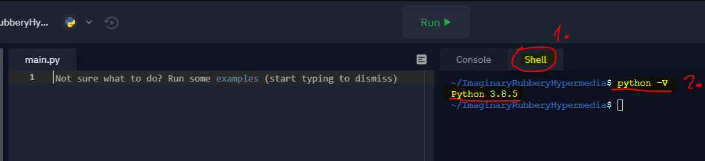
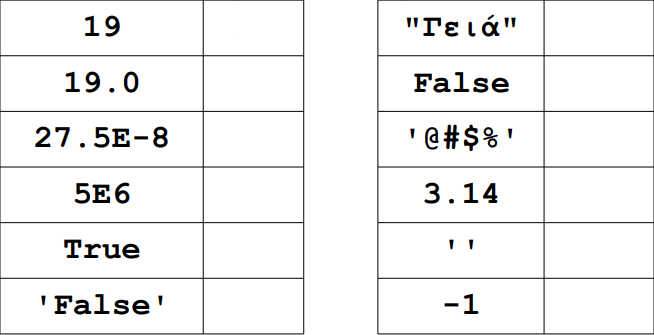

[](https://hits.seeyoufarm.com)

# 2 Τύποι μεταβλητών - Απλές εντολές

---

## Περιεχόμενα

---

- 2.1 Τύποι δεδομένων
- 2.2 Integer
- 2.3 Float
- 2.4 Boolean
- 2.5 Str
- 2.6 Έτοιμες συναρτήσεις
- 2.7 print
- 2.8 input
- 2.9 Λυμένα Παραδείγματα

## 2.1 Τύποι Δεδομένων

---

Οι τύποι δεδομένων προσδιορίζουν τον τρόπο παράστασης των δεδομένων εσωτερικά στον υπολογιστή, καθώς και το είδος της επεξεργασίας τους από αυτόν. Στην Python δε δηλώνουμε ποιο τύπο δεδομένων χρησιμοποιούμε.

Οι χαρακτηριστικοί **τύποι δεδομένων** στην Python είναι:

- Αριθµητικοί
  - Ακέραιοι (Integer)
    - `2, 3, 7, 8, -20`
  - Πραγµατικοί (Float)
    - `3.5, 4.0, 7.3, -12.8`
  - Complex (τύπος που δε θα μας απασχολήσει στη συνέχεια...)
    - `(3,5)`
- Αλφαριθµητικοί (String)
  - `"123", "#abcd1234)", "John"`
- Λογικοί (Boolean)

## 2.2 Integer

---

Ο τύπος integer (int) µας επιτρέπει να επεξεργαζόµαστε **ακεραίους αριθµούς**. εάν δεν γνωρίζεται τους ακεραίους αριθμούς πατήστε [εδώ](misc/numbers.md).

Δήλωση Μεταβλητών Τύπου **Integer**:

```python
variable = 100
```

Ο Η/Υ δεν µπορεί να αποθηκεύει άπειρους ακεραίους.

- `-maxint, …, -2, -1, 0, 1, 2, …, +maxint`

Ο αριθµός maxint ειναι ο μεγαλύτερος ακέραιος αριθμός και διαφέρει από υπολογιστή σε υπολογιστή και από γλώσσα σε γλώσσα. Παράδειγµα:

- 16-bitos Η/Υ: `maxint = 32725 (2^16-1)`
- 32-bitos Η/Υ: `maxint = 2147483647 (232^-1)`

Όταν χρησιµοποιούµε τον τύπο **integer** πρέπει να προσέχουµε τι θα διαβαστεί, επεξεργαστεί και τυπωθεί γιατί σε περίπτωση που ξεπεράσουµε το maxint θα προκαλέσουµε *υπερχείλιση προσωρινής μνήμης*. Υπερχείλιση προσωρινής μνήμης κατά την εκτέλεση ενός προγράμματος προκύπτει όταν τα δεδομένα που καταγράφονται σε μία περιοχή προσωρινής μνήμης υπερβαίνουν τα όρια αυτής, με αποτέλεσμα να αντικαταστήσουν δεδομένων που βρίσκονται σε γειτονικές περιοχές μνήμης.

Η Python από τη version `3.x` και µετά δεν αντιµετωπίζει τέτοιο πρόβληµα. Οπότε αυτό δεν πρέπει να μας ανησυχεί! Για να βρούμε την έκδοση της Python στο **Repl.it** πατάμε πάνω στο **Shell** και στην συνέχεια εισάγουμε την εντολή:

```python
python -V
```



Η έκδοση είναι η `3.8.5`!

## 2.3 Float

---

Αναφέρεται στην επεξεργασία πραγµατικών αριθµών. Αλλιώς συναντιούνται ως αριθµοί κινητής υποδιαστολής. Π.χ. `3.14` και `28.2E-5`, όπου το `E` ή `e` δηλώνει το `10`, και το `-5` τη
δύναμη δηλαδή `28.2 επί 10 εις την -5`.

**ΠΡΟΣΟΧΗ!!!**

Αντί για κόμμα (,) χρησιμοποιούμε τελεία (.)

Δήλωση Μεταβλητών Τύπου **Float**:

```python
x = 10.0
y = 2E2
z = 10 / 3
```

## 2.4 Boolean

---

Οι µεταβλητές αυτές παίρνουν τις τιµές `True` ή `False`. Σκοπός των µεταβλητών αυτών είναι η καταγραφή του αποτελέσµατος ενός ελέγχου ή της τιµής µιας λογικής συνθήκης.

- True (Αληθής) ή
- False (Ψευδής)

Δήλωση Μεταβλητών Τύπου **Boolean**:

```python
x = True
y = False
```

## 2.5 Str

---

Είναι μια ακολουθία χαρακτήρων που ορίζεται με **μονά** ή **διπλά** εισαγωγικά, αρκεί με όποια ξεκινάμε με την ίδια να κλείνουμε. Οι µεταβλητές αυτές χρησιµοποιούνται κυρίως για την επεξεργασία κειµένου. Αποθηκεύουν µία σειρά αλφαρηθµιτικών χαρακτήρων.

Δήλωση Μεταβλητών Τύπου **String**:

```python
x = "abc"
y = '123'
z = "abc123"
```

Δεν κάνουµε αριθµητικές πράξεις αλλά λογικές µε τις `str` µεταβλητές.

### Άσκηση

Να γράψετε τον τύπο δεδομένων (int, float, bool, str) για καθένα από τα παρακάτω δεδομένα:



Για να δείτε την λύση πατήστε [εδώ](../images/Exercise_1S.PNG).

## 2.6 Έτοιμες συναρτήσεις

---

- ***Συναρτήσεις για Integers και Floats***
  - ceil(x), abs(x), floor(x), factorial(x), trunc(x), exp(x), log(x[, base]), sqrt(x), sin(x), cos(x)…
- ***Συναρτήσεις για Strings***
  - len(x) : Επιστρέφει το µήκος του x.
  - capitalise(x) : Επιστρέφει την πρόταση µε κεφαλαία γράµµατα.
  - isdigit(x): Ελέγχει αν η πρόταση περιέχει µόνο αριθµούς.
  - round(x): Στρογγυλοποιεί δεκαδικούς αριθμούς.

## 2.7 print

---

Η εντολή `print` εμφανίζει στην οθόνη ένα string. Εάν ζητήσουμε να εμφανίσει το περιεχόμενο μιας μεταβλητής που δεν είναι *string*, το μετατρέπει πρώτα σε string και μετά το εμφανίζει. Μπορούμε να ζητήσουμε την εμφάνιση σύνθετων αριθμητικών παραστάσεων με μεταβλητές ή και με αριθμούς. Σε αυτήν την περίπτωση πρώτα εκτελεί τους υπολογισμούς και στην συνέχεια μετατρέπει το αποτέλεσμα σε *string* και το εμφανίζει στην οθόνη. Για παράδειγµα:

```python
print(19)
print("Γεια σου Μαρία")

onoma1 = "Μαρία"

print("Γεια σου", onoma1)

onoma2 = "Ελένη"

print("Γεια σου", onoma1, "και", onoma2)
print(onoma1, onoma2)

ilikia = 19

print("Η", onoma1, "είναι", ilikia, "χρονών")
print(ilikia)

arithmos1 = 10
arithmos2 = 5
athroisma = arithmos1 + arithmos2

print(athroisma)
print("Η %s είναι %d χρονών" % (onoma1, ilikia))
print("Γεια σου %s" % (onoma2))

timi = 1.50

print("Το τετράδιο κοστίζει %.2f Ευρώ" % (timi))
print("%d + %d = %d" % (arithmos1, arithmos2, athroisma))
```

Οι μεταβλητές όπως είδαμε παραπάνω έχουν τύπους και μπορούμε να ρωτήσουμε την Python ποιοι είναι. Με την σύνταξη **type** (όνομα μεταβλητής) μπορούμε να ελέγξουμε τον τύπο των μεταβλητών οι οποίες ήδη έχουν ορισθεί (έχουν τιμές). Για να χρησιμοποιήσουμε μια μεταβλητή, χρειάζεται απλά να γνωρίζουμε το όνομά της.

```python
day = 'Δευτέρα' # 1ος τρόπος
day = "Δευτέρα" # 2ος τρόπος

# Εκτύπωση της μεταβλητής day
print(day)

# Εκτύπωση τον τύπο της μεταβλητής day
print(type(day))

i = 10

# Εκτύπωση της μεταβλητής i
print(i)

# Εκτύπωση τον τύπο της μεταβλητής i
print(type(i))

PI = 3.14

# Εκτύπωση της μεταβλητής PI
print(PI)

# Εκτύπωση τον τύπο της μεταβλητής PI
print(type(PI))
```

Στο παραπάνω παράδειγμα έχουμε τρεις εντολές εκχώρησης:

- Η συμβολοσειρά `'Δευτέρα'` ή `"Δευτέρα"` εκχωρείται στη νέα μεταβλητή που ονομάζεται day.
- Ο ακέραιος αριθμός `10` εκχωρείται στη μεταβλητή `i`.
- Ο δεκαδικός αριθμός `3.14159` εκχωρείται στη μεταβλητή  `PI`.

## 2.8 input

---

Στα περισσότερα προγράμματα απαιτείται η είσοδος δεδομένων από το χρήστη. Για τον σκοπό αυτό η Python διαθέτει την ενσωματωμένη συνάρτηση **input**. Κάθε φορά που καλείται η συνάρτηση αυτή από ένα πρόγραμμα, αυτό σταματάει και περιμένει από το χρήστη να πληκτρολογήσει κάτι. Όταν ο χρήσης πληκτρολογήσει την είσοδο και πατήσει το πλήκτρο **Enter**, το πρόγραμμα συνεχίζει τη ροή εκτέλεσης και η συνάρτηση **input** επιστρέφει την είσοδο σαν συμβολοσειρά. Χρήσιμο είναι να εμφανίζεται και ένα μήνυμα (prompt) που να πληροφορεί το χρήστη για το είδος της εισόδου που αναμένεται από το πρόγραμμα.

```python
# Ζητάμε από το χρήστη έναν αριθμό
x = input("Δώσε έναν αριθμό: ")
# Ζητάμε από το χρήστη έναν ακόμα αριθμό
y = input("Δώσε έναν ακόμα αριθμό: ")

# Μετατρέπουμε τις αλφαριθμητικές τιμές σε ακέραιες
x = int(x)
y = int(y)

# Υπολογίζουμε το άθροισμα των δύο αριθμών
athroisma = x + y

# Εκτύπωση του αθροίσματος των δυο αριθμών
print("Το άθροισμα των αριθμών %d και %d είναι %d." % (x, y, athroisma))
```

Στο παράδειγμα αυτό βλέπουμε ξεκάθαρα ότι η συνάρτηση `input` επιστρέφει  πάντα συμβολοσειρά **string** και έτσι οι μεταβλητές `x` και `y` δεν δείχνουν σε αριθμό. Συνεπώς πρέπει να μετατρέψουμε και τις δύο μεταβλητές σε **integer**.

## 2.9 Λυμένα Παραδείγματα

---

### 2.9.1 Παράδειγµα 1

---

- Αρχικά ζητάμε από τον υπάλληλο να εισάγει το όνομά του.
- Μετά του ζητάμε να μας δώσει τον αρχικό μισθό που παίρνει και το ποσοστό φόρου που πληρώνει.
- Υπολογίζουμε τον τελικό μισθό ο οποίος προκύπτει απο τον τύπο `αρχικός μισθός - (αρχικός μισθός * ποσοστό φόρου * %)`.
- Τέλος εκτυπώνουμε στην οθόνη το όνομά και τον τελικό μισθό του.

```python
# Ζητάμε από τον υπάλληλο το όνομά του
onoma = input('Δώσε όνομα υπαλλήλου: ')

# Ζητάμε από τον υπάλληλο τον αρχικό του μισθό
arxikosMisthos = int(input('Δώσε μισθό: '))

# Ζητάμε από τον υπάλληλο το ποσοστό φόρου του
foros = int(input('Δώσε ποσοστό φόρου: '))

# Υπολογίζουμε τον τελικό μισθό του υπαλλήλου
telikosMisthos = arxikosMisthos - arxikosMisthos * (foros / 100)

# Εκτύπωση του ονόματος
print('Όνομα:', onoma)
# Εκτύπωση του μισθού
print('Μισθός:', telikosMisthos)
```

[Home](../README.md) | [Lect 1](lecture_01.md) | [Lect 2](lecture_02.md) | [Lect 3](lecture_03.md) | [Lect 4](lecture_04.md) | [Lect 5](lecture_05.md) | [Lect 6](lecture_06.md) | [Lect 8](lecture_08.md) | [Lect 9](lecture_09.md) | [Lect 10](lecture_10.md)
