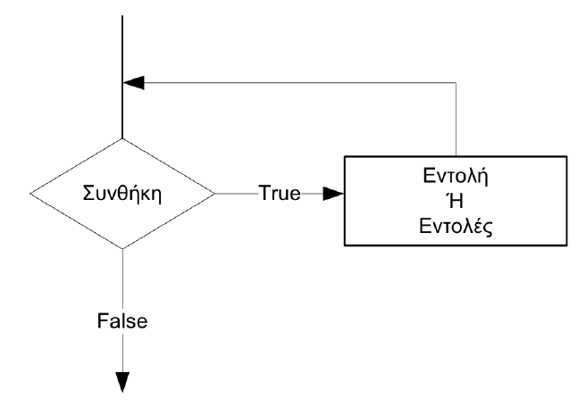

# 4 Δομή πολλαπλής επιλογής / Μη-προκαθορισμένες επαναλήψεις - while

---

## Περιεχόμενα

---

- 4.1 If Statement - 3η Μορφή
- 4.2 Παραδείγματα
- 4.3 Η εντολή While
- 4.4 Η εντολή While - Flow Chart
- 4.5 Παράδειγματα
- 4.6 Ασκήσεις

## 4.1 If Statement - 3η Μορφή

---

```python
if (συνθήκη ή συνθήκες):
    E1
elif (συνθήκη ή συνθήκες):
    E2
...
elif (συνθήκη ή συνθήκες):
    En-1
else:
    En
```

## 4.2 Παραδείγματα

---

### [Παράδειγμα 1](source/lecture_04/lecture_04_example_1.py)

```python
day = input("Δώσε έναν αριθμό από 1-7: ")

if day == "1":
  print("Κυριακή")
elif day == "2":
  print("Δευτέρα")
elif day == "3":
  print("Τρίτη")
elif day == "4":
  print("Τετάρτη")
elif day == "5":
  print("Πέμπτη")
elif day == "6":
  print("Παρασκευή")
elif day == "7":
  print("Σάββατο")
else:
  print("Λάθος αριθμός")
```

Για να κατεβάσετε τον κώδικα πατήστε [εδώ](source/lecture_04/lecture_04_example_1.py).

### [Παράδειγμα 2](source/lecture_04/lecture_04_example_2.py)

Τι θα εμφανιστεί στην οθόνη του Η/Υ μετά την εκτέλεση του προγράμματος αν δοθούν ως είσοδοι στα a, x, y οι τιμές:

- `10, 2, 5`
- `5, 2, 3`
- `4, 6, 2`

```python
a = int(input("Δώσε 1ο αριθμό: "))
x = int(input("Δώσε 2ο αριθμό: "))
y = float(input("Δώσε 3ο αριθμό: "))

if a == 10:
  x = x % 2
  y = y ** 2
elif a == 3:
  x = x * 2
  y -= 1
elif a == 5:
  x = x + 4
  y += 7
else:
  x -= 3
  y += 1

print (x, y)
```

Για να κατεβάσετε τον κώδικα πατήστε [εδώ](source/lecture_04/lecture_04_example_2.py).

## 4.3 Η εντολή While

---

Mη-Προκαθορισμένος Αριθμός Επαναλήψεων.

```python
while (συνθήκη):
  commands
```

**Παράδειγμα:**

```python
x = 0
while x != 3:
  print("Hello")
  x += 3
```

## 4.4 Η εντολή While - Flow Chart

---



## 4.5 Παράδειγματα

---

### [Παράδειγμα 3](source/lecture_04/lecture_04_example_3.py)

Να γραφεί πρόγραμμα που να εμφανίζει τους ακεραίους αριθμούς από το 1 μέχρι το 10.

```python
i = 1

while i <= 10: 
  print(i)
  i += 1
```

Για να κατεβάσετε τον κώδικα πατήστε [εδώ](source/lecture_04/lecture_04_example_3.py).

### [Παράδειγμα 4](source/lecture_04/lecture_04_example_4.py)

Να γραφεί πρόγραμμα το οποίο θα διαβάζει ένα άγνωστο πλήθος αριθμών και θα τους εμφανίζει. Η επανάληψη θα σταματά όταν διαβαστεί αριθμός μικρότερος ή ίσος του μηδενός.

```python
num = int(input("Δώσε αριθμό: "))

while num > 0:
  print(num)
  num = int(input("Δώσε αριθμό: "))
```

Για να κατεβάσετε τον κώδικα πατήστε [εδώ](source/lecture_04/lecture_04_example_4.py).

### [Παράδειγμα 5](source/lecture_04/lecture_04_example_5.py)

Να γραφεί πρόγραμμα το οποίο θα διαβάζει ένα άγνωστο πλήθος αριθμών και θα υπολογίζει το άθροισμά τους. Η επανάληψη θα σταματά όταν διαβαστεί ο αριθμός 55555.

```python
athroisma = 0

num = int(input("Δώσε αριθμό: "))

while num != 55555:
  athroisma += num
  num = int(input("Δώσε αριθμό: "))
```

Για να κατεβάσετε τον κώδικα πατήστε [εδώ](source/lecture_04/lecture_04_example_5.py).

## 4.6 Ασκήσεις

---

### [Άσκηση 1](source/lecture_04/lecture_04_exercise_1.py)

Να γίνει πρόγραμμα σε Python το οποίο θα διαβάζει τυχαίους πραγματικούς αριθμούς και θα σταματάει όταν διαβάσει το μηδέν. Το πρόγραμμα θα εμφανίζει το πλήθος των θετικών αριθμών που διαβάστηκαν.

```python
plithos = 0

num = float(input("Δώσε αριθμό: "))

while num != 0:
  if num > 0:
    plithos += 1
    num = float(input("Δώσε αριθμό: "))

if plithos > 0:
  print("Θετικοί:", plithos)
else:
  print("Δεν υπάρχουν θετικοί :(")
```

Για να κατεβάσετε τον κώδικα πατήστε [εδώ](source/lecture_04/lecture_04_exercise_1.py).

### [Άσκηση 2](source/lecture_04/lecture_04_exercise_2.py)

Ένας φοιτητής ζήτησε από τους γονείς του να αγοράσει έναν H/Y αξίας 3000€. Οι γονείς του συµφώνησαν να του δώσουν τα χρήµατα µε τον εξής τρόπο: Την πρώτη εβδοµάδα θα του δώσουν 20€. Στο τέλος κάθε εβδοµάδας θα του δίνουνε τα διπλάσια από αυτά που του δώσανε την προηγούµενη εβδοµάδα µέχρι να συγκεντρωθεί το ποσό που χρειάζεται.
Να γίνει πρόγραµµα σε Python το οποίο θα υπολογίζει και θα εµφανίζει τον αριθµό των εβδοµάδων που χρειάστηκε ο φοιτητής να πάρει τον Η/Υ καθώς και το πόσο που περισσεύει (αν περισσεύει).

```python
aksia = 3000
weeks = 0
dosi = 20
tameio = 0

while tameio <= aksia:
  tameio += dosi
  weeks += 1
  dosi *= 2

print(weeks)

if tameio > aksia:
  print("Περίσσεψαν ", tameio - aksia,  "Ευρώ.")
```

Για να κατεβάσετε τον κώδικα πατήστε [εδώ](source/lecture_04/lecture_04_exercise_2.py).

[Home](../README.md) | [Lect 1](lecture_01.md) | [Lect 2](lecture_02.md) | [Lect 3](lecture_03.md) | [Lect 4](lecture_04.md) | [Lect 5](lecture_05.md) | [Lect 6](lecture_06.md) | [Lect 7](lecture_07.md) | [Lect 8](lecture_08.md)
