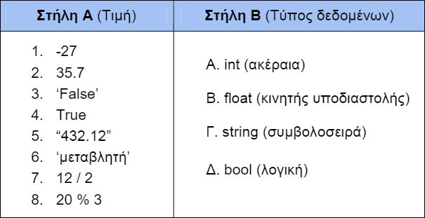

# Η εντολή if

## [Άσκηση 1](../source/if_exercise_1.py)

Να γράψετε πρόγραμμα σε python το οποίο να διαβάζει το μισθό ενός υπαλλήλου και να εμφανίζει στην οθόνη του υπολογιστή το αντίστοιχο μήνυμα σύμφωνα με τον παρακάτω πίνακα:

|Μισθός|Μήνυμα (χαρακτηρισμός)|
|:-|:-|
|0-800 €|Χαμηλόμισθος|
|Πάνω από 800 – 1400|Μεσαία αμειβόμενος|
|Πάνω από 1400|Υψηλόμισθος|

Για να δείτε τη **ΛΥΣΗ** πατήστε [εδώ](../source/if_exercise_1.py).

## [Άσκηση 2](../source/if_exercise_2.py)

Να υπολογιστεί ο μεγαλύτερος δύο ακέραιων αριθμών που δίνονται από το πληκτρολόγιο.

Για να δείτε τη **ΛΥΣΗ** πατήστε [εδώ](../source/if_exercise_2.py).

## [Άσκηση 3](../source/if_exercise_3.py)

Σε τρεις διαφορετικούς αγώνες πρόκρισης στο άλμα εις μήκος, ένας άλτης πέτυχε τις επιδόσεις α, β, γ. Να γράψετε πρόγραμμα σε γλώσσα Python που:

1) Να δέχεται τις τιμές α, β, γ.
2) Να υπολογίζει και να εμφανίζει τη μέση τιμή των παραπάνω τιμών.
3) Να εμφανίζει το μήνυμα προκρίθηκε, εάν η παραπάνω μέση τιμή είναι μεγαλύτερη από 8 μέτρα.

Για να δείτε τη **ΛΥΣΗ** πατήστε [εδώ](../source/if_exercise_3.py).

## [Άσκηση 4](../source/if_exercise_4.py)

Η εφορία κάθε τέλος έτους φορολογεί τα αυτοκίνητα ανάλογα με τον κυβισμό τους, σύμφωνα με τον παρακάτω πίνακα:

|Κυβισμός|φόρος|
|:-|:-|
|0-1100|110€|
|1101-1400|150€|
|1401-2000|225€|
|2001 και πάνω|600€|

Να γραφτεί πρόγραμμα σε γλώσσα Python, που να δέχεται τον κυβισμό ενός αυτοκινήτου, να υπολογίζει τον φόρο που του αναλογεί και στη συνέχεια να εμφανίζεται με κατάλληλο μήνυμα.

Για να δείτε τη **ΛΥΣΗ** πατήστε [εδώ](../source/if_exercise_4.py).

## [Άσκηση 5](../source/if_exercise_5.py)

Να γραφεί πρόγραμμα σε Pythonπου να διαβάζει έναν ακέραιο αριθμό και να ελέγχει αν είναι άρτιος ή περιττός. Στη συνέχεια, να εμφανίζει στην οθόνη αντίστοιχο μήνυμα.

Για να δείτε τη **ΛΥΣΗ** πατήστε [εδώ](../source/if_exercise_5.py).

## [Άσκηση 6](../../images/photo1.jpg)

Για να δείτε τη **ΛΥΣΗ** πατήστε [εδώ](../../images/photo1L.jpg).
