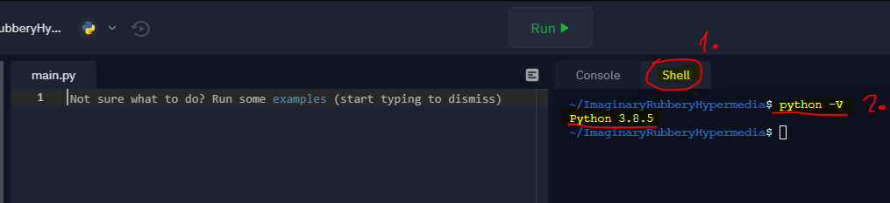
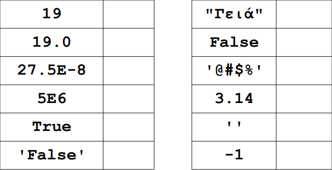

# Εκπαιδευτικό υλικό για την εκμάθηση της γλώσσας Python 🐍

**Περιεχόμενα**:

- Τύποι δεδομένων
  - Ακέραιοι (int)
  - Λογικές (bool)
  - Συμβολοσειρές (str)
  - Κινητής υποδιαστολής (float)
- Τελεστές και εκφράσεις
- Εντολές εισόδου και εξόδου
  - Η εντολή `print`

## Τύποι δεδομένων

Οι τύποι δεδομένων προσδιορίζουν τον τρόπο παράστασης των δεδομένων εσωτερικά στον υπολογιστή, καθώς και το είδος της επεξεργασίας τους από αυτόν. Στην Python δε δηλώνουμε ποιο τύπο δεδομένων χρησιμοποιούμε.

Οι χαρακτηριστικοί **τύποι δεδομένων** στην Python είναι:

- Αριθµητικοί
  - Ακέραιοι (Integer)
    - `2, 3, 7, 8, -20`
  - Πραγµατικοί (Float)
    - `3.5, 4.0, 7.3, -12.8`
  - Complex (τύπος που δε θα μας απασχολήσει στη συνέχεια...)
    - `(3,5)`
- Αλφαριθµητικοί (String)
  - `"123", "#abcd1234)", "John"`
- Λογικοί (Boolean)

### Ακέραιοι (int)

Ο τύπος integer (int) µας επιτρέπει να επεξεργαζόµαστε **ακεραίους αριθµούς**. Εαν δεν γνωρίζεται τους ακεραίους αριθμούς πατήστε [εδώ](Numbers.md).

Δήλωση Μεταβλητών Τύπου **Integer**:

```python
variable = 100
```

Ο Η/Υ δεν µπορεί να αποθηκεύει άπειρους ακεραίους.

- `-maxint, …, -2, -1, 0, 1, 2, …, +maxint`

Ο αριθµός maxint ειναι ο μεγαλύτερος ακέραιος αριθμός και διαφέρει από υπολογιστή σε υπολογιστή και από γλώσσα σε γλώσσα. Παράδειγµα:

- 16-bitos Η/Υ: `maxint = 32725 (2^16-1)`
- 32-bitos Η/Υ: `maxint = 2147483647 (232^-1)`

Όταν χρησιµοποιούµε τον τύπο **integer** πρέπει να προσέχουµε τι θα διαβαστεί, επεξεργαστεί και τυπωθεί γιατί σε περίπτωση που ξεπεράσουµε το maxint θα προκαλέσουµε *υπερχείλιση προσωρινής μνήμης*. Υπερχείλιση προσωρινής μνήμης κατά την εκτέλεση ενός προγράμματος προκύπτει όταν τα δεδομένα που καταγράφονται σε μία περιοχή προσωρινής μνήμης υπερβαίνουν τα όρια αυτής, με αποτέλεσμα να αντικαταστήσουν δεδομένων που βρίσκονται σε γειτονικές περιοχές μνήμης.

Η Python από τη version `3.x` και µετά δεν αντιµετωπίζει τέτοιο πρόβληµα. Οπότε αυτό δεν πρέπει να μας ανησυχεί! Για να βρούμε την έκδοση της Python στο **Repl.it** πατάμε πάνω στο **Shell** και στην συνέχεια εισάγουμε την εντολή:

```python
python -V
```



Η έκδοση είναι η `3.8.5`!

### Λογικές (bool)

Οι µεταβλητές αυτές παίρνουν τις τιµές `True` ή `False`. Σκοπός των µεταβλητών αυτών είναι η καταγραφή του αποτελέσµατος
ενός ελέγχου ή της τιµής µιας λογικής συνθήκης.

- True (Αληθής) ή
- False (Ψευδής)

Δήλωση Μεταβλητών Τύπου **Boolean**:

```python
x = True
y = False
```

### Συμβολοσειρές (str)

Είναι μια ακολουθία χαρακτήρων που ορίζεται με **μονά** ή **διπλά** εισαγωγικά, αρκεί με όποια ξεκινάμε με την ίδια να κλείνουμε. Οι µεταβλητές αυτές χρησιµοποιούνται κυρίως για την επεξεργασία κειµένου. Αποθηκεύουν µία σειρά αλφαρηθµιτικών χαρακτήρων.

Δήλωση Μεταβλητών Τύπου **String**:

```python
x = "abc"
y = '123'
z = "abc123"
```

Δεν κάνουµε αριθµητικές πράξεις αλλά λογικές µε τις `str` µεταβλητές.

### Κινητής υποδιαστολής (float)

Αναφέρεται στην επεξεργασία πραγµατικών αριθµών. Αλλιώς συναντιούνται ως αριθµοί κινητής υποδιαστολής. Π.χ. `3.14` και `28.2E-5`, όπου το `E` ή `e` δηλώνει το `10`, και το `-5` τη
δύναμη δηλαδή `28.2 επί 10 εις την -5`.

**ΠΡΟΣΟΧΗ!!!**

Αντί για κόμμα (,) χρησιμοποιούμε τελεία (.)

Δήλωση Μεταβλητών Τύπου **Float**:

```python
x = 10.0
y = 2E2
z = 10 / 3
```

#### Άσκηση 1

Να γράψετε τον τύπο δεδομένων (int, float, bool, str) για καθένα από τα παρακάτω δεδομένα:



Για να δείτε την λύση πατήστε [εδώ](images/Exercise_1S.PNG).

## Τελεστές και εκφράσεις

Οι περισσότερες εντολές που γράφετε θα περιέχουν **εκφράσεις (expressions). Ένα απλό παράδειγμα μίας έκφρασης είναι `2 + 3`. Μία έκφραση μπορεί να διαχωριστεί σε τελεστές (operators) και τελεστέους (operands).

Οι τελεστές επιτελούν μία λειτουργία και μπορούν να αναπαρασταθούν με σύμβολα όπως το `+` ή με ειδικές λέξεις - κλειδιά. Οι τελεστές απαιτούν κάποια δεδομένα πάνω στα οποία θα λειτουργήσουν και αυτά τα δεδομένα ονομάζονται τελεστέοι. Στη συγκεκριμένη περίπτωση, οι *τελεστέοι* είναι το `2` και το `3`.

## Εντολές εισόδου και εξόδου

### Η εντολή `print`

Η εντολή `print` εμφανίζει στην οθόνη ένα string. Εάν ζητήσουμε να εμφανίσει το περιεχόμενο μιας μεταβλητής που δεν είναι *string*, το μετατρέπει πρώτα σε string και μετά το εμφανίζει. Μπορούμε να ζητήσουμε την εμφάνιση σύνθετων αριθμητικών παραστάσεων με μεταβλητές ή και με αριθμούς. Σε αυτήν την περίπτωση πρώτα εκτελεί τους υπολογισμούς και στην συνέχεια μετατρέπει το αποτέλεσμα σε *string* και το εμφανίζει στην οθόνη.

Η εντολή `print` δεσµεύει όσο χώρο απαιτεί το προς εµφάνιση µήνυµα στην οθόνη του υπολογιστή.

Παράδειγµα 1:

```python
print("Hello")
```

Παράδειγµα 2:

```python
x = "Hello"
print(x)
```

Παράδειγµα 3:

```python
x = 100
print(x)
```

### Η εντολή `input`

Η εντολή αυτή χρησιµοποιείται όταν θέλουµε να διαβάσουµε τιµές από το πληκτρολόγιο και να τις χρησιµοποιήσουµε στο πρόγραµµά µας. **Η εντολή input επιστρέφει πάντα text!!**

Παράδειγµα 4:

```python
x = input("Dwse ton prwto arithmo: ")
y = input("Dwse ton deutero arithmo: ")

x=int(x)
y=int(y)

sum = x + y

print ("To athroisma einai: ", sum)
```

Στο παράδειγμα αυτό βλέπουμε ξεκάθαρα ότι η συνάρτηση `input` επιστρέφει  πάντα συμβολοσειρά **string** και έτσι οι μεταβλητές `x` και `y` δεν δείχνουν σε αριθμό. Συνεπώς πρέπει να μετατρέψουμε και τις δύο μεταβλητές σε **integer**.

```python
x=int(x)
y=int(y)
```
